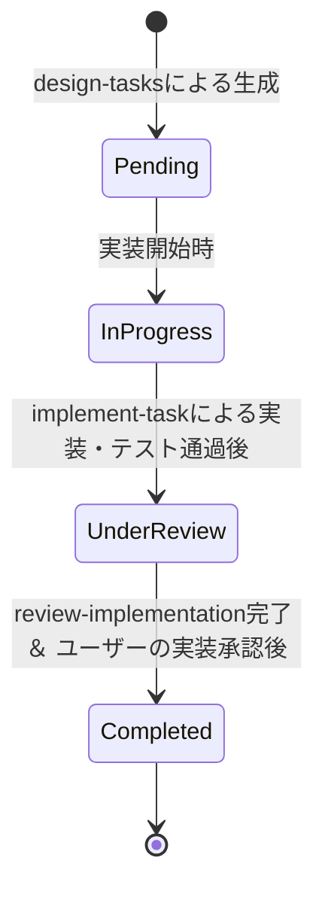

# AI Agent Guidelines (AGENTS.md)

本ドキュメントは、AIエージェントが本リポジトリ (`context-cli`) で開発・設計・レビューする際に厳格に遵守しなければならない共通の原則、設計ルール、およびタスク進行ガイドラインを定義する。

---

## 1. 開発の基本原則 & コーディング規約

### 1.1 全般原則

- **Context Repositoryの尊重**: Context Repositoryを唯一の正本とし、配布先の内容から正本を暗黙に更新しない。
- **既存データ保護**: 既存データとローカル編集を、ユーザーの明示的な許可なく上書きしない。
- **シンプルな設計**: 変更範囲をユーザー成果と責務境界に合わせ、過度な先行抽象化を避ける。標準ライブラリおよび既存依存関係を優先し、新規依存の追加を最小限に抑える。
- **コード内コメント**: **すべてのソースコード（Goファイル）内のコメントは日本語で記述する。**
- **曖昧なパッケージ名の禁止**: `utils`、`common`、`helpers` のような責務の曖昧なパッケージ名は絶対に作成しない。内部モジュールは `internal/` 配下に具体的な責務がわかる名前の独立したパッケージとして配置する。

### 1.2 CLIコマンド実装ルール（5要素テンプレート規則）

- 各コマンドは `pkg/cmd/<command_name>.go` にフラットに配置し、関連する子コマンドも同一ファイルに収める。
- コマンドファイル内は、原則として以下の順序で記述する。
  1.  **Options構造体** (コマンドの実行パラメーターを保持)
  2.  **NewCmd生成関数** (Cobraコマンドの定義とフラグ登録)
  3.  **Completeメソッド** (引数やファクトリからのデータ補完)
  4.  **Validateメソッド** (引数やオプション値の検証)
  5.  **Runメソッド** (実際の実行ロジックの呼び出し)
      ※位置引数やフラグのパース・検証を必要としない単純なコマンドや、子コマンドの登録のみを行うルートコマンドでは、CompleteおよびValidateメソッドを省略できる。

### 1.3 依存注入 (DI)

- CLIの入出力ストリーム（stdin, stdout, stderr）、Config、その他すべての外部・永続化依存は、`Factory`（[factory.go](pkg/cmd/factory.go)）を経由してコマンドに注入する。各コマンドが直接OSのリソースやファイルシステムへグローバルにアクセスしてはならない。

---

## 2. アーキテクチャ境界ルール (レイヤー依存関係)

依存関係の方向性を正しく保ち、密結合を防ぐため、以下のレイヤー構造を厳守する。

```text
  cmd/context (エントリポイント)
       ↓
  pkg/cmd/ (CLI境界 / Cobra / Bubble Tea 等のインポート先)
       ↓
  internal/<package> (コアビジネスロジック / 純粋Go)
```

- **依存方向の厳守**: `internal/` 配下のパッケージが `pkg/cmd/` に依存することを禁止する。
- **循環依存の禁止**: `internal/` 配下のパッケージ間で循環参照が発生してはならない。
- **CLIと対話UIの分離**: Cobra（コマンド解析）およびBubble Tea（対話UI）のインポートは `pkg/cmd/`（および `internal/cli` がある場合はその中）に限定する。ビジネスロジックはこれらに依存せず、抽象インターフェースを通じてUIとやり取りする。

---

## 3. エラーハンドリング・セキュリティ

### 3.1 エラーハンドリング

- 通常の入力エラー、I/Oエラー、競合、キャンセルで `panic` を使用しない。
- `internal/` 配下のパッケージは、エラーが発生した文脈（コンテキスト）を付与しつつ、呼び出し側で判定可能（`errors.Is` や `errors.As`）なエラーを返す。
- CLI境界（`pkg/cmd/`）でエラーを一度だけユーザー向けメッセージと終了コードへ変換し、出力する。
- エラーメッセージには、秘密情報、設定内容全体、不要なユーザーパスを含めない。

### 3.2 セキュリティ & パーミッション

- 初期版はローカル動作のみを想定し、ネットワークアクセスを行わない。
- 設定ディレクトリは新規作成時に `0700`、設定ファイル `config.yaml` と `map.yaml` は `0600` 権限で作成する。
- 既存ファイル・パスの読み書き時は、シンボリックリンクをたどらずに処理を停止（拒否）する。

---

## 4. テスト＆検証ルール

- **TDDの推奨**: 実装前、または実装と同時に、期待する境界条件や失敗経路を検証するテストを追加する。
- **テスト環境の隔離**: テストは独立した一時ディレクトリ（`t.TempDir()` など）を使用し、利用者の実設定や環境を変更してはならない。
- **CLIコマンドの単体テスト**: Cobraオブジェクトを経由せず、コマンドOptionsの `Run` メソッドを直接呼び出すテーブル駆動テスト形式で記述する（標準入力・標準出力・標準エラーをバッファ等に差し替えて検証）。
- **品質ゲート**: コミットやPR作成前、および実装完了時には必ず以下の品質ゲートを実行し、すべてパスすることを確認する。
  - `gofmt`
  - `go vet ./...`
  - `golangci-lint run`
  - `govulncheck ./...`
  - `go test ./...` (または `task test`)

---

## 5. タスクステータス管理フロー

タスク分割によって生成されたタスクファイル（`docs/specs/spec-XXX-<slug>/tasks/XX-xxx.md`）の進捗管理は、以下のステータスとフローに従い、**進行役である親エージェントが制御する**。

- サブエージェントはユーザー承認とステータスを更新しない。
- レビューサブエージェントはファイルを変更せず、指摘と改善案を親エージェントへ報告する。
- `Accepted` はユーザーの承認結果を表す語であり、タスクファイルのステータスとして使用しない。

### 5.1 有効なステータス

- `- **ステータス**: 未着手 (Pending)`
- `- **ステータス**: 仕掛中 (In Progress)`
- `- **ステータス**: レビュー中 (Under Review)`
- `- **ステータス**: 完了 (Completed)`

### 5.2 状態遷移フロー



1.  **設計開始前**: ステータスは `未着手 (Pending)`（`design-tasks` によって具体設計が記述された状態で生成される）。
2.  **実装開始時**: 対象タスクの実装を開始する際、親エージェントがステータスを `仕掛中 (In Progress)` に更新し、実装サブエージェント（`task_implementer`）を起動する。
3.  **実装完了後**: サブエージェントによるテストおよび品質ゲート通過後、ステータスを `レビュー中 (Under Review)` に更新し、レビューサブエージェント（`code_reviewer`）を起動する。
4.  **実装承認後**: コードレビューを通過し、親エージェントがユーザーから最終的な実装承認を得た後、親エージェントがステータスを `完了 (Completed)` に更新する。
