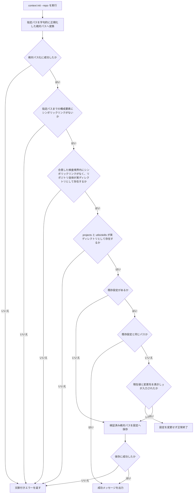
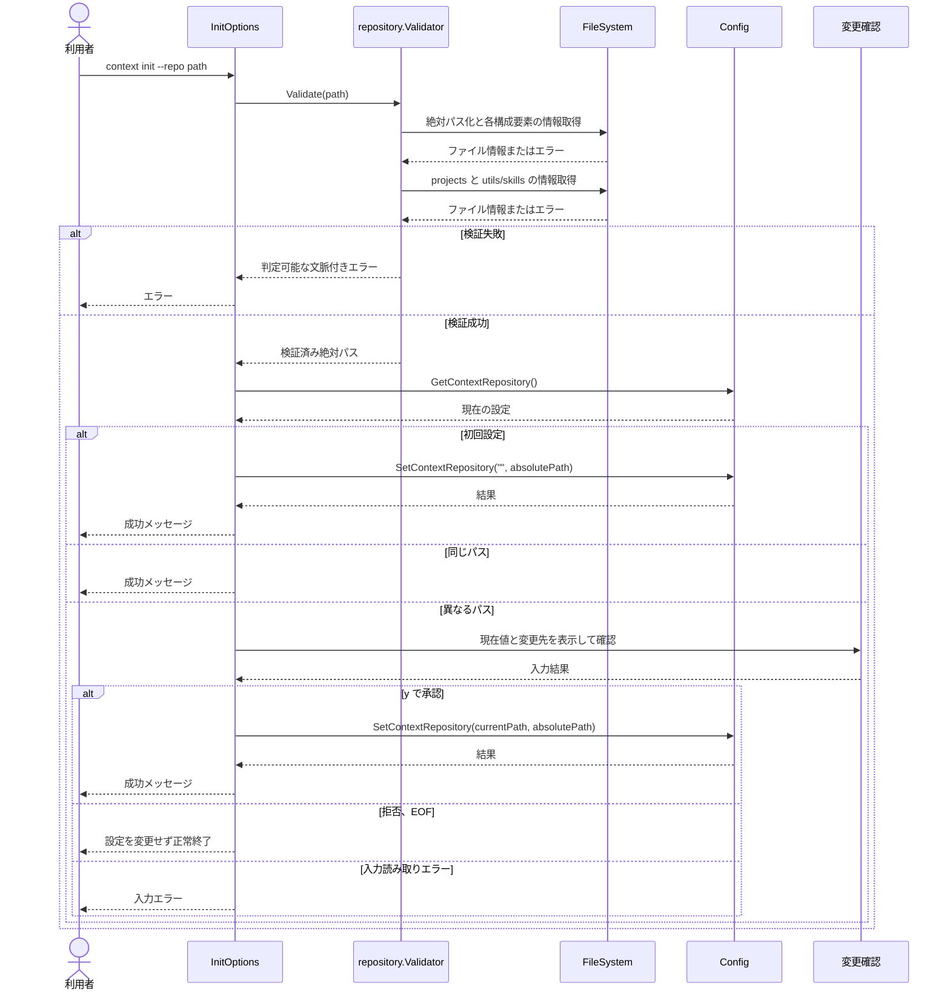

# Context Repository 構造検証

仕様書IDはspec-001-validate-context-repositoryである。

## ゴール

`context init` で指定されたパスが利用可能なContext Repositoryであることを、設定へ保存する前に検証する。

## 課題

Context Repositoryを設定する利用者は、現在の実装では存在しないパス、通常ファイル、必要な構造を持たないディレクトリを指定しても設定できる。その結果、後続コマンドを実行するまで誤設定に気付けない。

## 対象ユーザー

ローカルのContext Repositoryを `context` CLIに設定する個人開発者。

## ユーザー価値

誤ったパスを設定時点で検出でき、後続コマンドを実行可能なContext Repositoryだけを設定できる。

## 成功指標

- 指標: 無効なContext Repositoryが設定へ保存されない
  - 評価方法: 不存在、通常ファイル、構造不足、シンボリックリンクを含むパスについて `InitOptions.Run` のテストで確認する
  - 観測時期: 実装完了時
- 指標: 有効なContext Repositoryの正規化済み絶対パスが保存される
  - 評価方法: 一時ディレクトリに必須構造を作成し、保存値と成功出力をテストで確認する
  - 観測時期: 実装完了時

## スコープ

- `context init --repo <path>` で指定されたパスの存在確認
- 指定パスがディレクトリであることの確認
- Context Repository直下の `projects/` と `utils/skills/` がディレクトリとして存在することの確認
- 指定パスを字句的に正規化した絶対パスへの変換
- 相対パスでは現在の作業ディレクトリを信頼境界として入力に明示された構成要素、絶対パスではボリュームルートを除く各構成要素、および検証対象の `projects/`、`utils/`、`utils/skills/` にシンボリックリンクがないことの確認
- 検証済みの絶対パスの設定への保存
- 検証失敗時に設定を変更しないこと
- 検証失敗の原因を判定可能なエラーとして返すこと
- 既存設定と異なるパスへ変更する場合の対話確認
- 既存設定と同じ正規化済みパスを指定した場合の確認を伴わない成功

## スコープ外

- `config.yaml` の永続化実装
- Context Repositoryの自動作成、クローン、更新
- `projects/` 配下の個別プロジェクトの内容検証
- `utils/skills/` 配下の個別Skillの内容検証
- `AGENTS.md`、`CLAUDE.md`、`SKILL.md` の存在および内容検証
- Gitリポジトリであることの検証
- 検証後に発生するファイルシステム変更への継続的な追跡

## ユーザーストーリー

- ST-001: 利用者として、有効なContext Repositoryを指定し、後続コマンドで利用可能な絶対パスとして設定したい。
- ST-002: 利用者として、無効または安全でないパスを指定した場合、設定を変更せずに原因を確認したい。
- ST-003: 利用者として、既存のContext Repository設定を別の有効なパスへ変更する前に、現在値と変更先を確認して承認または拒否したい。

## 完成条件

- ST-001: 相対パスまたは正規化されていないパスで有効なContext Repositoryを指定すると、字句的に正規化された絶対パスが設定へ保存され、同じパスが成功メッセージに表示される。
- ST-001: Context Repository直下に実ディレクトリとして `projects/` と `utils/skills/` が存在する場合、検証に成功する。
- ST-002: 指定パスが存在しない場合、エラーを返し、設定を変更しない。
- ST-002: 指定パスが通常ファイルの場合、エラーを返し、設定を変更しない。
- ST-002: `projects/` または `utils/skills/` が存在しない、もしくはディレクトリでない場合、欠けている構造を識別できるエラーを返し、設定を変更しない。
- ST-002: 相対パスの入力に明示された構成要素、絶対パスのボリュームルートを除く構成要素、または `projects/`、`utils/`、`utils/skills/` のいずれかがシンボリックリンクの場合、リンクをたどらずエラーを返し、設定を変更しない。相対パスでは現在の作業ディレクトリとその祖先を検査対象に含めない。
- ST-002: 検証中のファイルシステムI/Oエラーは文脈を付与して返し、設定を変更しない。
- ST-002: 検証エラーは `errors.Is` または `errors.As` で原因を判定できる。
- ST-002: 検証エラーは「指定パス不存在」「非ディレクトリ」「必須構造不足」「シンボリックリンク検出」「その他のファイルシステムI/O失敗」に分類でき、対象は安全な表示用識別子として取得できる。
- ST-002: 検証エラーの表示用対象は、リポジトリ自体を `.`、必須構造を `projects`、`utils`、`utils/skills`、指定パスの親構成要素を `repository parent` として表現する。
- ST-002: 型付きエラーはCLIに表示可能な対象と内部原因を分離して保持し、ユーザー向けエラーメッセージに絶対パスを含めない。
- ST-003: 既存設定と検証済みパスが異なる場合、現在値と変更先を表示し、<!-- textlint-disable ja-technical-writing/no-mix-dearu-desumasu -->`変更しますか? [y/N]`<!-- textlint-enable ja-technical-writing/no-mix-dearu-desumasu --> と確認する。
- ST-003: 変更確認で `y` が入力された場合だけ新しいパスを保存する。
- ST-003: 変更確認で `y` 以外またはEOFとなった場合、設定を変更せず、成功メッセージを表示せず正常終了する。
- ST-003: 入力ストリームの読み取りエラーとなった場合、設定を変更せず、元の読み取りエラーを判定可能な文脈付きエラーとして返す。
- ST-003: 現在値と変更先を確認出力へ書き込めない場合、入力を読み取らず、設定を変更せず、元の書き込みエラーを判定可能な文脈付きエラーとして返す。
- ST-003: 既存設定と検証済みパスが同一の場合、変更確認と設定更新を行わず成功する。
- ST-003: 初回設定では変更確認を行わず、検証済みパスを保存する。

## 制約事項

- macOSおよびLinuxのローカルファイルシステムを対象とする。
- ファイルシステム検証の抽象は `internal/repository` が所有する最小インターフェースとし、標準ファイルシステム実装を `Factory` からValidatorへ注入する。
- 変更確認に使用する入力と出力は `Factory` の `IOIn` と `IOOut` を使用する。
- 確認画面と成功メッセージには、利用者が指定・承認する対象として正規化済み絶対パスを表示できる。
- エラー表示には分類名と安全な表示用対象だけを含め、指定パス、親パス、内部I/Oエラー由来の絶対パスを含めない。
- Cobraに依存しない検証ロジックを `internal/` 配下の責務が明確なパッケージへ配置する。
- `internal/` 配下から `pkg/cmd/` へ依存しない。
- 標準ライブラリを優先し、新しい外部依存を追加しない。
- Goソースコード内のコメントは日本語で記述する。

## 非機能要件

- 検証処理はネットワークアクセスを行わない。
- シンボリックリンクを解決して検証や保存はしない。
- シンボリックリンク検証は、単一ユーザーのローカル利用で偶発的なリンクを検出する `Lstat` ベースのベストエフォートとする。相対パスでは現在の作業ディレクトリを信頼境界とし、入力に明示された構成要素だけを検査する。
- 検証中に別プロセスがパス構成を差し替える攻撃への耐性は保証しない。
- 検証がすべて成功するまで設定更新処理を呼び出さない。
- 変更確認が承認されるまで設定更新処理を呼び出さない。
- テストは `t.TempDir()` を利用し、利用者の実設定や実ディレクトリを変更しない。
- Cobra経由のローカルE2Eテストは `test/e2e/` に配置し、有効な相対パス、無効な構造、シンボリックリンク拒否、設定変更の承認と拒否を確認する。
- `test/e2e/README.md` にシナリオID、事前条件、CLI操作、期待結果、対応テスト名、実行方法を記載し、人間がE2Eの処理フローと網羅範囲を確認できるようにする。
- `gofmt`、`go vet ./...`、`golangci-lint run`、`govulncheck ./...`、`go test ./...` が成功する。

## リスク

- `Lstat` による各構成要素の検証中、および検証と後続利用の間にディレクトリ構造が変更されるTOCTOUは完全には防止できず、後続コマンドでも必要な検証が必要になる。
- 必須構造を厳格にしすぎると、将来のContext Repository構造変更時に互換性へ影響する。

## 前提条件

- Context Repositoryは利用者が事前にローカルへ用意する。
- Context Repositoryの最小必須構造は `projects/` と `utils/skills/` である。
- Configが返す既存のContext Repositoryは、`context init` が検証後に保存した字句的に正規化済みの絶対パスである。永続化未実装の初期版では、旧形式の相対パスや未正規化パスとの互換性は扱わない。
- `cli/` はContext Repositoryの必須構造に含めない。
- 個別プロジェクトやSkillの妥当性は、それらを利用する後続処理で検証する。

## 未解決事項

- なし。

## 技術設計ドラフト

### 処理フローチャート (Flowchart)

### シーケンス図 (Sequence Diagram)

### ファイル配置・責務定義

- `[NEW]` `internal/repository/validator.go`: Context Repositoryパスの正規化、必須構造、シンボリックリンクを検証する。ファイルシステム操作の最小インターフェースを所有し、検証済み絶対パスを返す。
- `[NEW]` `internal/repository/error.go`: 不存在、非ディレクトリ、必須構造不足、シンボリックリンク、I/O失敗を分類し、安全な表示用対象と内部原因を分離して保持する型付きエラーを定義する。
- `[NEW]` `internal/repository/validator_test.go`: 一時ディレクトリを使い、正常系、構造不足、非ディレクトリ、シンボリックリンク、I/Oエラーを検証する。
- `[MODIFY]` `pkg/cmd/factory.go`: 標準ファイルシステム実装から `repository.Validator` を生成する依存と、変更確認に使用する入出力を注入する。
- `[MODIFY]` `pkg/cmd/init.go`: 設定更新前に検証処理を呼び出す。既存設定と異なる場合だけ現在値と変更先を表示して確認し、承認後に検証済み絶対パスを保存・表示する。拒否時は設定を変更せず正常終了する。
- `[MODIFY]` `pkg/cmd/init_test.go`: `InitOptions.Run` を直接呼び、検証成功時の保存・出力、検証失敗時の非更新、同一パスの再設定、変更の承認・拒否・EOFを確認する。
- `[NEW]` `test/e2e/init_test.go`: Cobraコマンドを経由し、有効な相対パス、無効な構造、シンボリックリンク拒否、設定変更の承認と拒否をローカル環境内で検証する。
- `[NEW]` `test/e2e/README.md`: E2Eシナリオの事前条件、操作、期待結果、対応テスト名、実行方法を人間向けに記録する。
