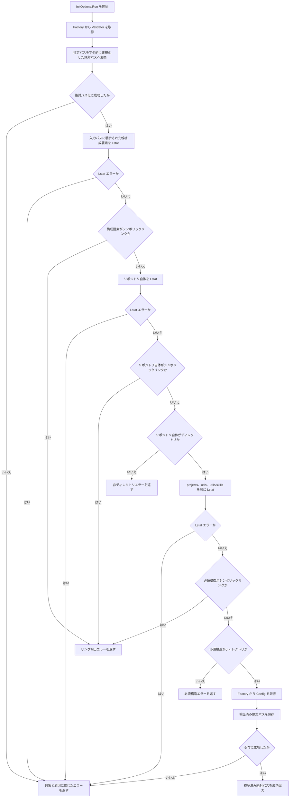
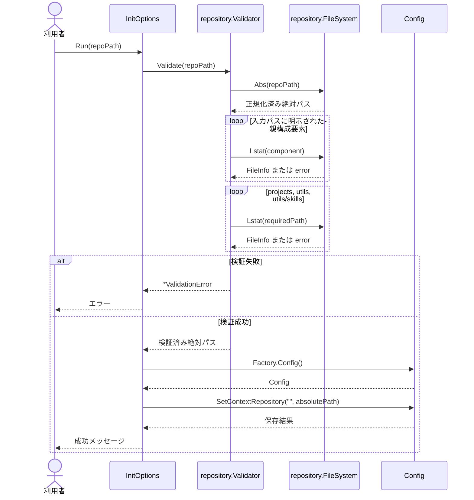

# Context Repository を検証する

- **ステータス**: 完了 (Completed)
- **対象ストーリー**: ST-001, ST-002

## 1. 処理フローチャート (Flowchart)

各 `Lstat` のI/O失敗は、対象を安全な表示用識別子へ変換し、内部原因を `Unwrap` 可能な検証エラーとして返す。検証が完了するまでConfigの取得および更新は行わない。

### パス構成要素の検査境界

- 相対パスでは、現在の作業ディレクトリを信頼境界とし、入力に明示された構成要素だけを順に `Lstat` する。現在の作業ディレクトリとその祖先は検査対象に含めない。
- 絶対パスでは、ボリュームルート自体を除き、入力に明示された各構成要素を順に `Lstat` する。
- `.` と `..` は字句的に正規化してから検査対象を組み立てる。シンボリックリンクを解決して正規化しない。
- macOSの一時ディレクトリなど、OSが管理する祖先リンクをテストfixtureが暗黙に含む場合は、テストfixtureの基点だけを事前に `filepath.EvalSymlinks` で実体パスへ変換する。Validator自体は `EvalSymlinks` を使用しない。

### エラー分類

| 検査対象                                 | `os.ErrNotExist` | 非ディレクトリ | シンボリックリンク | その他の I/O 失敗 |
| ---------------------------------------- | ---------------- | -------------- | ------------------ | ----------------- |
| リポジトリ自体 (`.`)                     | 指定パス不存在   | 非ディレクトリ | リンク検出         | I/O 失敗          |
| 入力に明示された親 (`repository parent`) | I/O 失敗         | I/O 失敗       | リンク検出         | I/O 失敗          |
| `projects`、`utils`、`utils/skills`      | 必須構造不足     | 必須構造不足   | リンク検出         | I/O 失敗          |

親構成要素の走査はリポジトリ自体を含めず、リポジトリ自体は専用の判定で分類する。

## 2. シーケンス図 (Sequence Diagram)

## 3. ファイル配置・責務定義

- `[NEW]` `internal/repository/validator.go`: `Abs(path)` と `Lstat(path)` のみを持つ最小の `FileSystem` インターフェース、標準ファイルシステム実装、具象型 `Validator` と `NewValidator(fs FileSystem) *Validator` を定義する。指定パスを字句的に正規化した絶対パスへ変換し、入力に明示された親構成要素、リポジトリ、`projects`、`utils`、`utils/skills` をリンク解決せず検証する。
- `[NEW]` `internal/repository/error.go`: 不存在、非ディレクトリ、必須構造不足、シンボリックリンク、その他のI/O失敗を表す分類と、表示用対象、内部原因を保持する `ValidationError` を定義する。`errors.Is`、`errors.As`、`errors.Unwrap` で判定可能にする。
- `[NEW]` `internal/repository/validator_test.go`: `t.TempDir()` と差し替え可能な `FileSystem` を使い、正常系、パス正規化、各失敗分類、安全な表示用対象、親および必須構造のシンボリックリンク、I/Oエラーのラップを検証する。
- `[MODIFY]` `pkg/cmd/factory.go`: `Validate(path string) (string, error)` を持つCLI側の最小インターフェース `RepositoryValidator` と、`Factory.RepositoryValidator RepositoryValidator` を追加する。`NewFactory` で標準ファイルシステムを使う `repository.NewValidator` を一度生成する。生成自体は失敗せず、テストでは偽物へ直接差し替える。
- `[MODIFY]` `pkg/cmd/init.go`: Configを取得する前にValidatorを呼び、成功時だけ検証済み絶対パスを保存して表示する。検証、Config読み込み、保存の各エラーへ一度だけ文脈を付与する。
- `[MODIFY]` `pkg/cmd/init_test.go`: `InitOptions.Run` を直接呼び、正規化済みパスの保存・出力、検証失敗時のConfig非取得・非更新、Config読み込み失敗、保存失敗をテーブル駆動で検証する。
- `[NEW]` `test/e2e/init_test.go`: `e2e_test` パッケージから公開されたCLI境界だけを使用し、Cobraコマンドを経由して、有効な相対パス、必須構造不足、リポジトリおよび必須構造のシンボリックリンク拒否をテーブル駆動で検証する。
- `[NEW]` `test/e2e/harness_test.go`: E2Eテスト専用の一時ディレクトリ、Context Repository fixture、CLI入出力、Configのテストダブルを構築する共通補助を配置する。プロダクションコードの内部実装へ依存しない。
- `[NEW]` `test/e2e/README.md`: 人間がE2Eの処理フローを確認できるよう、シナリオID、事前条件、CLI操作、期待結果、対応するGoテスト名、個別実行コマンドを一覧化する。シナリオ追加・変更時は対応テストと同じ変更で更新する。
- `[MODIFY]` `Taskfile.yml`: `format` と `format:check` の `gofmt` 対象へ `internal test` を追加する。`go test ./test/e2e/...` を実行する `test:e2e` タスクを追加し、人間がE2Eのみを確認・実行できる入口を提供する。

## 4. 実装チェックリスト

- [x] `repository.ValidationError` の失敗分類テストを先に作成する
- [x] Validatorの正常系、境界条件、I/O失敗テストを先に作成する
- [x] `FileSystem`、標準実装、Validator、型付きエラーを実装する
- [x] FactoryからValidatorを注入する
- [x] `InitOptions.Run` を検証成功後のみ設定更新する構造へ変更する
- [x] `InitOptions.Run` の成功・失敗テストを更新する
- [x] `test/e2e` にCobra経由のローカルE2Eテストと共通テスト補助を追加する
- [x] `test/e2e/README.md` にシナリオと対応テストを記録する
- [x] `Taskfile.yml` のGoフォーマット対象へ `internal test` を追加し、`test:e2e` タスクを追加する
- [x] `gofmt`、`go vet ./...`、`golangci-lint run`、`govulncheck ./...`、`go test ./...`、`task test:e2e` を実行する
- [x] レビュー指摘に基づき、相対パス先頭の `..` を検査対象の親構成要素数から除外する
- [x] `errors.Unwrap` と内部 `*os.PathError` の `errors.As` 契約を直接検証する
- [x] 相対入力、正規化済み絶対パス、内部I/OパスがValidatorとCLIのエラー表示へ漏洩しないことを検証する
- [x] E2EテストをシナリオID単位のテーブル駆動テストへ統一する
- [x] E2E異常系でstdout・stderrが空であり、全出力へ秘匿対象パスが漏洩しないことを検証する

## 5. テスト・検証計画

- **単体テスト配置**: 対象コードと同じディレクトリへ `_test.go` を配置する。`internal/repository` のテストは `internal/repository/`、`InitOptions.Run` のテストは `pkg/cmd/` に置く。
- **単体テスト対象**: `internal/repository` で、相対パスと `.` / `..` の正規化、リポジトリ・`projects`・`utils`・`utils/skills` の存在とディレクトリ判定、入力に明示された親構成要素を含むシンボリックリンク拒否を確認する。
- **検査境界テスト**: 相対パスでは現在の作業ディレクトリと祖先を検査せず入力構成要素だけを検査すること、絶対パスではルートを除く入力構成要素を検査することを、記録型の偽 `FileSystem` で確認する。
- **エラー契約**: 各失敗が `errors.Is` または `errors.As` で分類でき、表示用対象が `.`、`projects`、`utils`、`utils/skills`、`repository parent` のいずれかであり、内部原因を `errors.Unwrap` で取得できることを確認する。`ValidationError.Error()` に入力パス、正規化済み絶対パス、内部I/Oエラー由来のパスが含まれないことも確認する。
- **CLI 単体テスト**: `InitOptions.Run` を直接実行し、検証完了前にConfigを取得・更新しないこと、成功時に検証済み絶対パスだけを保存・表示することを確認する。
- **E2E/結合テスト方法**: `test/e2e` の外部テストパッケージから `NewCmdRoot` を呼び、`context init --repo <path>` 相当の引数を設定して実行する。シナリオID、fixture準備、期待エラー、保存・出力条件、秘匿対象パスをテーブル要素として宣言し、有効な相対パス、構造不足、シンボリックリンク拒否を一時ディレクトリ内で確認する。一時ディレクトリの基点だけはfixture作成時に実体パスへ変換し、macOSとLinuxの祖先構造差に依存させない。利用者の実設定と実ディレクトリは使用しない。Cobraが返す利用者向けエラーにも入力パス、絶対パス、内部I/Oエラー由来のパスが含まれないことを確認する。
- **E2E の実行分離**: 相対パスのシナリオではテストプロセスの作業ディレクトリを一時的に変更するため、`test/e2e` のテストでは `t.Parallel()` を使用せず直列実行する。
- **人間向けフロー確認**: `test/e2e/README.md` のシナリオ表を正本として、各行から対応する `TestE2E_<Command>/<Scenario-ID>` 形式のサブテスト名と `task test:e2e` または `go test ./test/e2e/... -run '<サブテスト名>' -v` を確認できるようにする。
- **品質ゲート**: `gofmt -w cmd pkg internal test`、`go vet ./...`、`golangci-lint run`、`govulncheck ./...`、`go test ./...`、`task test:e2e`。

## 6. タスク境界

このタスクでは既存設定との差分確認はせず、検証成功後は既存設定の有無にかかわらず保存する。同一パス判定、変更確認、拒否・EOF・キャンセルの扱いはタスク02で実装する。

## 7. 変更ファイル

- `internal/repository/error.go`
- `internal/repository/validator.go`
- `internal/repository/validator_test.go`
- `pkg/cmd/factory.go`
- `pkg/cmd/init.go`
- `pkg/cmd/init_test.go`
- `test/e2e/init_test.go`
- `test/e2e/harness_test.go`
- `test/e2e/README.md`
- `Taskfile.yml`
- `docs/specs/spec-001-validate-context-repository/tasks/01-validate-context-repository.md`

## 8. 検証結果

- `gofmt -w internal/repository/error.go internal/repository/validator.go internal/repository/validator_test.go pkg/cmd/factory.go pkg/cmd/init.go pkg/cmd/init_test.go test/e2e/harness_test.go test/e2e/init_test.go`: 成功
- `gofmt -l cmd pkg internal test`: 差分なし
- `go vet ./...`: 成功
- `golangci-lint run`: 成功、指摘なし
- `govulncheck ./...`: 成功、呼び出し可能な脆弱性なし
- `go test ./...`: 成功
- `task test:e2e`: 成功

### コードレビュー修正後

- `gofmt -w cmd pkg internal test`: 成功
- `gofmt -l cmd pkg internal test`: 差分なし
- `go vet ./...`: 成功
- `golangci-lint run`: 成功、指摘なし
- `govulncheck ./...`: 成功、呼び出し可能な脆弱性なし
- `go test ./...`: 成功
- `task test:e2e`: 成功

### E2E テーブル駆動化後

- `gofmt -w test/e2e/harness_test.go test/e2e/init_test.go`: 成功
- `gofmt -l cmd pkg internal test`: 差分なし
- `go vet ./...`: 成功
- `golangci-lint run`: 成功、指摘なし
- `govulncheck ./...`: 成功、呼び出し可能な脆弱性なし
- `go test ./...`: 成功、37テスト
- `task test:e2e`: 成功
- `go test ./test/e2e/... -run 'TestE2E_Init/INIT-001' -v`: 成功
- コード再レビュー: 指摘なし
