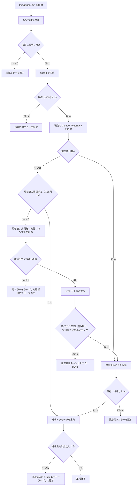
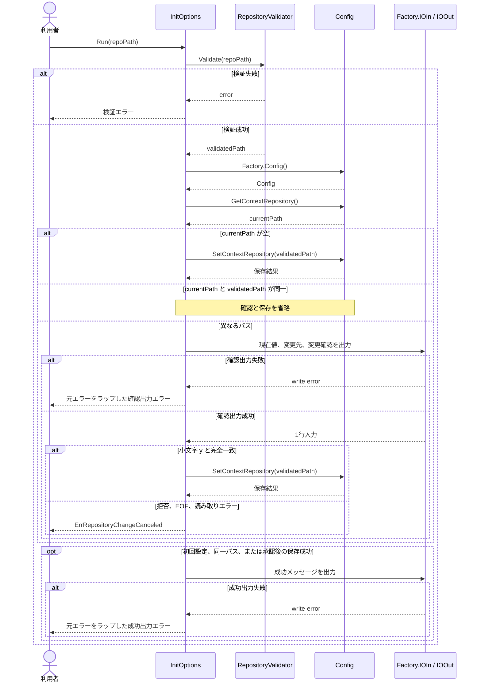

# Context Repository の設定変更を確認する

- **ステータス**: レビュー中 (Under Review)
- **対象ストーリー**: ST-003

## 1. 処理フローチャート (Flowchart)

- 承認入力は、前後の空白と改行を除去した結果が小文字の `y` と完全一致する場合だけ有効とする。
- `Y`、`yes`、空入力、その他の入力、EOF、読み取りエラーはすべて設定変更キャンセルとして扱う。
- EOF時に改行なしの `y` が読み取れていても承認しない。
- 初回設定では確認せず保存する。同一パスでは確認や設定更新を行わず、成功メッセージだけを出力する。
- 既存設定値は、タスク01の検証後に保存された字句的に正規化済み絶対パスであることをConfigの契約とする。旧形式の相対パスや未正規化パスとの互換処理は行わない。

## 2. シーケンス図 (Sequence Diagram)

## 3. ファイル配置・責務定義

- `[MODIFY]` `pkg/cmd/init.go`: 設定取得後に現在値と検証済みパスを比較する。異なる既存値がある場合だけ確認内容を `Factory.IOOut` へ表示し、書き込み成功後に `Factory.IOIn` から1行を読み取る。小文字の `y` だけを承認し、拒否、EOF、読み取りエラーでは判定可能な `ErrRepositoryChangeCanceled` を返す。同一パスでは `SetContextRepository` を呼ばず成功扱いにする。確認出力と成功出力の書き込みエラーを無視せず、安全な固定文言と内部原因を分離する非公開エラー型で返す。この型の `Error()` はパスを含まない固定文言、`Unwrap()` は元エラーを返す。
- `[MODIFY]` `pkg/cmd/init_test.go`: `InitOptions.Run` を直接呼ぶ既存テーブルを拡張し、初回設定、同一パス、変更承認、`Y`、`yes`、空入力、任意入力、EOF、読み取りエラー、確認出力失敗、保存失敗、成功出力失敗を検証する。確認出力、入力呼び出し有無、保存呼び出し回数、成功出力、`errors.Is` によるキャンセルおよびI/Oエラー判定も確認する。書き込みエラーには絶対パスを持つ `*os.PathError` を使用し、`errors.Is` が成立しつつ表示文字列へパスが漏れないことを確認する。
- `[MODIFY]` `test/e2e/harness_test.go`: テーブル要素から初期設定値と標準入力を注入できるようにし、保存呼び出し回数を記録する。利用者の実設定や標準入力は使用しない。
- `[MODIFY]` `test/e2e/init_test.go`: 既存のテーブル駆動E2Eに、異なる設定からの変更承認、変更拒否、同一パス再指定のシナリオを追加する。確認表示、保存結果、保存回数、成功またはキャンセルを公開CLI境界から検証する。
- `[MODIFY]` `test/e2e/README.md`: 追加するシナリオID、事前条件、入力、期待結果、対応サブテスト名、個別実行方法を追記し、人間が設定変更フローを一覧で確認できるようにする。

## 4. 実装チェックリスト

- [x] `InitOptions.Run` の設定変更分岐をテーブル駆動テストへ先に追加する
- [x] `ErrRepositoryChangeCanceled` の `errors.Is` 契約をテストする
- [x] 初回設定では確認せず保存する処理を維持する
- [x] 同一パスでは確認と保存を省略する
- [x] 異なるパスでは現在値、変更先、<!-- textlint-disable ja-technical-writing/no-mix-dearu-desumasu -->`変更しますか? [y/N]`<!-- textlint-enable ja-technical-writing/no-mix-dearu-desumasu --> を出力する
- [x] 小文字の `y` だけを承認し、承認後だけ保存する
- [x] 拒否、EOF、読み取りエラーでは設定を変更せずキャンセルエラーを返す
- [x] 確認出力の失敗時は入力と保存をせず、安全な固定文言と元の書き込みエラーを分離して返す
- [x] 成功出力の失敗時は保存結果を戻さず、安全な固定文言と元の書き込みエラーを分離して返す
- [x] 出力エラーの表示文字列へ内部I/Oエラー由来のパスが漏洩しないことを検証する
- [x] E2Eテーブルへ承認、拒否、同一パスのシナリオを追加する
- [x] `test/e2e/README.md` の人間向けフロー一覧を更新する
- [x] `gofmt`、`go vet ./...`、`golangci-lint run`、`govulncheck ./...`、`go test ./...`、`task test:e2e` を実行する

## 5. テスト・検証計画

- **単体テスト配置**: CLI単体テストは対象と同じ `pkg/cmd/init_test.go` に配置し、Cobraを経由せず `InitOptions.Run` を直接呼ぶ。
- **単体テスト形式**: 初期設定値、入力文字列または入力エラー、期待エラー、期待出力、保存値、保存呼び出し回数をテーブル要素として宣言する。
- **正常系**:
  - 初回設定は確認出力なしで検証済みパスを1回保存する。
  - 同一パスは確認出力なし、保存0回で成功する。
  - 異なるパスへ `y\n` または前後に空白を含む `y` を入力すると、現在値と変更先を表示して1回保存する。
- **異常系・境界条件**:
  - `Y`、`yes`、空行、その他の文字列は保存0回で `ErrRepositoryChangeCanceled` を返す。
  - 入力が空のEOF、または改行なしの `y` とEOFの場合も保存0回でキャンセルする。
  - `IOIn` の読み取りエラーは保存0回でキャンセルし、`errors.Is(err, ErrRepositoryChangeCanceled)` が成立する。
  - 確認出力の書き込みエラーでは入力0回、保存0回となり、元エラーを `errors.Is` で判定できる。元エラーが保持する絶対パスは表示文字列に含めない。
  - 確認出力後の保存失敗は既存の設定保存エラー契約を維持し、成功メッセージを出力しない。
  - 初回設定、同一パス、承認後の成功出力が失敗した場合は元エラーを `errors.Is` で判定でき、元エラーが保持する絶対パスは表示文字列に含めない。保存が先に成功した場合は設定値をロールバックしない。
- **E2E/結合テスト方法**: `test/e2e` のテーブル駆動テストから公開された `NewCmdRoot` を呼び、初期設定と `Factory.IOIn` をテストごとに注入する。承認、拒否、同一パスを `TestE2E_Init/INIT-005` 以降のサブテストとして実行する。
- **人間向けフロー確認**: `test/e2e/README.md` のシナリオ表へ、現在値、変更先、入力、保存有無、終了結果を記載する。`task test:e2e` と `go test ./test/e2e/... -run 'TestE2E_Init/<Scenario-ID>' -v` で全体・個別に確認できるようにする。
- **品質ゲート**: `gofmt -w cmd pkg internal test`、`go vet ./...`、`golangci-lint run`、`govulncheck ./...`、`go test ./...`、`task test:e2e`。

## 6. エラー・出力契約

- キャンセルは公開センチネルエラー `ErrRepositoryChangeCanceled` とし、呼び出し側が `errors.Is` で判定できるようにする。
- 拒否、EOF、読み取りエラーのいずれでも、設定値と成功メッセージは変更・出力しない。
- 確認時は `Factory.IOOut` へ <!-- textlint-disable ja-technical-writing/no-mix-dearu-desumasu -->`Current context repository: <現在値>\nNew context repository: <変更先>\n変更しますか? [y/N] `<!-- textlint-enable ja-technical-writing/no-mix-dearu-desumasu --> を出力する。
- 確認出力の書き込みに失敗した場合、入力と保存はせず、安全な固定文言を返す。内部原因は `Unwrap()` で取得可能にし、`Error()` へ内部原因の文字列を連結しない。
- 成功メッセージの書き込みに失敗した場合も、安全な固定文言と内部原因を分離して返す。既に保存済みの場合はロールバックしない。
- 確認出力失敗の固定文言は `failed to write repository change confirmation`、成功出力失敗の固定文言は `failed to write initialization success message` とする。
- 確認画面のパスは利用者が承認する対象なので表示を許可する。キャンセルエラー自体にはパスを含めない。

## 7. タスク境界

- Context Repositoryの構造検証とパス正規化はタスク01の `RepositoryValidator` をそのまま利用し、このタスクでは変更しない。
- Configの永続化方式、排他制御、ファイル権限はスコープ外とする。
- 対話UIライブラリは使用せず、単一行の確認を標準ライブラリで実装する。

## 8. 実装結果

### 変更ファイル

- `pkg/cmd/init.go`: 既存設定との比較、変更確認、小文字 `y` の承認、キャンセルセンチネル、出力エラーの安全なラップを実装した。
- `pkg/cmd/init_test.go`: 初回設定、同一パス、承認、拒否、EOF、入力エラー、出力エラー、保存エラーをテーブル駆動で検証した。
- `test/e2e/harness_test.go`: 初期設定値と標準入力の注入、保存呼び出し回数の記録に対応した。
- `test/e2e/init_test.go`: `INIT-005` 変更承認、`INIT-006` 変更拒否、`INIT-007` 同一パス再指定を追加した。
- `test/e2e/README.md`: 設定変更フロー3件の人間向けシナリオ一覧を追加した。
- `docs/specs/spec-001-validate-context-repository/tasks/02-confirm-context-repository-change.md`: チェックリスト、変更ファイル、検証結果を更新した。

### 検証結果

- `rtk gofmt -w pkg/cmd/init.go pkg/cmd/init_test.go test/e2e/harness_test.go test/e2e/init_test.go`: 成功
- `rtk go vet ./...`: 成功（問題なし）
- `rtk golangci-lint run`: 成功（問題なし）
- `rtk govulncheck ./...`: 成功（呼び出し可能な脆弱性0件）
- `rtk go test ./...`: 成功（5パッケージ、54テスト）
- `rtk task test:e2e`: 成功（`test/e2e`）
- `rtk git diff --check`: 成功
