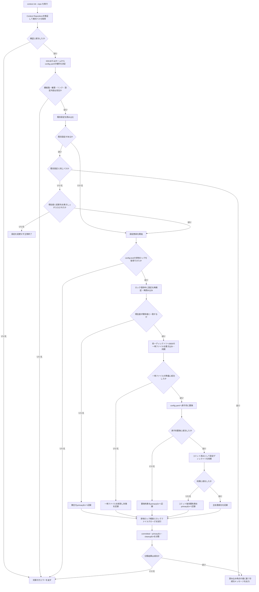
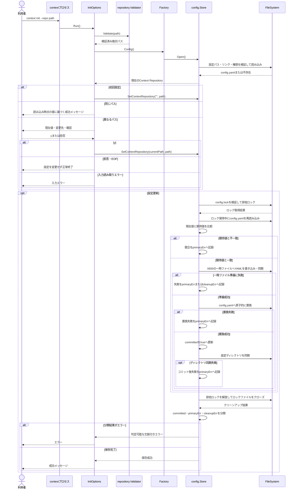

# Context Repository 設定の永続化

仕様書ID: spec-002-persist-context-repository-config。

## ゴール

`context init` で検証済みのContext Repositoryパスをユーザー設定へ安全に永続化し、別プロセスで再実行した場合も既存設定を読み込めるようにする。

## 課題

Context Repositoryを設定する利用者は、現在の `NewFactory()` がプロセスごとに空のメモリ内設定を生成するため、以前に設定した値を再実行時に利用できない。その結果、異なるパスを指定しても初回設定として扱われ、既存値の表示と変更確認を経ずに設定したように見える。

## 対象ユーザー

ローカルのContext Repositoryを `context` CLIに設定する個人開発者。

## ユーザー価値

一度設定したContext Repositoryを後続のCLIプロセスでも利用でき、設定変更時は現在値と変更先を確認したうえで明示的に更新できる。

## 成功指標

- 指標: 別プロセス間でContext Repository設定が維持される
  - 評価方法: 一時的な `XDG_CONFIG_HOME` を指定してCLIを別プロセスで複数回実行し、初回保存、同一パス、変更承認、変更拒否をE2Eテストで確認する
  - 観測時期: 実装完了時
- 指標: 設定の保存と読み込みが安全要件を満たす
  - 評価方法: 権限、シンボリックリンク、スキーマ検証、排他制御、原子的更新を `internal/config` の単体テストで確認する
  - 観測時期: 実装完了時

## スコープ

- `XDG_CONFIG_HOME/context/config.yaml` へのContext Repository設定の読み書き
- `XDG_CONFIG_HOME` が未設定の場合の `~/.config/context/config.yaml` の使用
- 空の `XDG_CONFIG_HOME` の未設定扱いと、相対的な `XDG_CONFIG_HOME` の拒否
- 初期スキーマとして `schema_version: 1` と `context_repository` を保存
- 旧実装の `version: 1` と `repository_path` を読み込み、次回更新時は現行スキーマで保存
- 設定ファイルが存在しない場合の空設定としての読み込み
- 不正なYAML、未知フィールド、未対応スキーマバージョン、空または相対的なContext Repositoryパスの拒否
- 設定ディレクトリの新規作成時の権限 `0700`
- 設定ファイル、ロックファイル、一時ファイルの新規作成時の権限 `0600`
- 既存の設定ディレクトリまたは設定ファイルの権限が広すぎる場合の拒否
- 設定ディレクトリまでの既存の親経路、設定ディレクトリ、設定ファイル、ロックファイルがシンボリックリンクの場合の拒否
- 設定ディレクトリ、設定ファイル、ロックファイルのファイル種別検証
- `config.lock` に対する待機なしの排他ロック
- 同一ディレクトリの一時ファイルと原子的置換による設定更新
- `Factory.Config` の永続設定実装への接続
- 利用者の実設定を使用しない単体テスト
- 実バイナリを別プロセスで実行する `context init` のE2Eテスト
- `test/e2e/README.md` への永続設定フローと実行方法の追記

## スコープ外

- `map.yaml` の実装
- 未対応バージョン間の自動マイグレーション
- Windows対応
- ネットワーク上のファイルシステムにおけるロック動作の保証
- 複数設定ファイルを対象とするトランザクション
- 設定ファイルの手動修復やバックアップ管理
- Context Repositoryパス以外の設定項目
- `context init` のContext Repository構造検証および変更確認ロジックの再設計

## ユーザーストーリー

- ST-001: 利用者として、検証済みのContext Repositoryを設定し、後続のCLIプロセスでも同じ設定を利用したい。
- ST-002: 利用者として、既存設定を異なるContext Repositoryへ変更する前に、現在値と変更先を確認して承認または拒否したい。
- ST-003: 利用者として、不正または安全でない設定ファイルを検出した場合、既存データを変更せずに処理を停止してほしい。
- ST-004: 利用者として、同時実行や書き込み失敗が発生しても、設定ファイルが途中状態や破損状態にならないようにしたい。

## 完成条件

- ST-001: 初回の `context init` で検証済みの絶対パスが `config.yaml` へ保存される。
- ST-001: `XDG_CONFIG_HOME` が設定されている場合、`$XDG_CONFIG_HOME/context/config.yaml` を使用する。
- ST-001: `XDG_CONFIG_HOME` が未設定または空文字の場合は未設定として扱い、ホームディレクトリ配下へフォールバックする。
- ST-001: `XDG_CONFIG_HOME` が相対パスの場合は設定探索エラーとして拒否し、ホームディレクトリへ暗黙にフォールバックしない。
- ST-001: `XDG_CONFIG_HOME` が未設定の場合、OSから取得したホームディレクトリ配下の `~/.config/context/config.yaml` を使用する。
- ST-001: ホームディレクトリを取得できない場合は判定可能な設定探索エラーを返し、設定を読み書きしない。
- ST-001: 別プロセスで `context init` を再実行すると、保存済みのContext Repositoryが既存設定として読み込まれる。
- ST-001: 保存されるYAMLは `schema_version: 1` と検証済み絶対パスの `context_repository` を含む。
- ST-001: 旧実装の `version: 1` と絶対パスの `repository_path` は既存設定として読み込み、更新時は現行スキーマで保存する。
- ST-001: 設定ファイルが存在しない場合は未設定として扱い、読み込みだけではディレクトリやファイルを作成しない。
- ST-001: 既存設定と同じパスを指定した場合は確認と設定ファイル更新をせず、成功する。
- ST-002: 既存設定と異なるパスを指定した場合は現在値と変更先を表示し、変更確認プロンプトを表示する。
- ST-002: 変更確認で `y` が入力された場合だけ、新しいパスを設定ファイルへ保存する。
- ST-002: 変更確認の拒否またはEOFでは既存設定を維持し、成功メッセージを表示せず正常終了する。
- ST-002: 変更確認の入力読み取りに失敗した場合は既存設定を維持し、入力エラーとして失敗終了する。
- ST-003: 不正なYAML、未知フィールド、未対応の `schema_version`、空または相対的な `context_repository` を読み込みエラーとして拒否し、既存ファイルを変更しない。
- ST-003: 設定ディレクトリを新規作成する場合は `0700`、設定ファイルを新規作成する場合は `0600` とする。
- ST-003: 既存の設定ディレクトリまたは設定ファイルにグループまたはその他ユーザーの権限が含まれる場合、暗黙に権限を変更せず処理を停止する。
- ST-003: 設定ディレクトリまでの既存の親経路、設定ディレクトリ、設定ファイル、またはロックファイルがシンボリックリンクの場合、リンクをたどらず処理を停止する。
- ST-003: 既存の設定ディレクトリは実ディレクトリだけを許可し、設定ファイルとロックファイルは通常ファイルだけを許可する。異なる種別の場合は、開く前に判定可能なエラーとして拒否する。
- ST-003: 既存のロックファイルにグループまたはその他ユーザーの権限が含まれる場合、暗黙に権限を変更せず処理を停止する。
- ST-003: 設定探索、読み込み、検証、保存のエラーは、原因を `errors.Is` または `errors.As` で判定できる文脈付きエラーとして返す。
- ST-003: ユーザー向けエラーメッセージへ設定内容全体や不要なユーザーパスを含めない。
- ST-004: 設定更新前に `config.lock` へ `LOCK_EX | LOCK_NB` の排他ロックを取得し、競合時は待機せず設定を変更しない。
- ST-004: 設定更新APIは、確認または初回判定に使用した期待値と新しい値を受け取る比較更新とする。
- ST-004: 排他ロックを保持した状態で既存設定を再読み込みし、現在値が期待値と異なる場合は判定可能な競合エラーを返して保存しない。
- ST-004: 初回設定同士と変更確認中の競合を検出し、別プロセスが保存した値を上書きしない。
- ST-004: 設定更新は同一ディレクトリに `0600` の一時ファイルを作成し、内容を同期した後に原子的に `config.yaml` へ置換する。
- ST-004: 一時ファイルの作成、書き込み、同期、クローズ、または原子的置換のいずれかが失敗した場合、既存の `config.yaml` を維持する。作成済みの一時ファイルは可能な範囲で削除する。
- ST-004: 原子的置換の成功を設定更新のコミット点とし、それ以降は旧設定の維持またはロールバックを保証しない。
- ST-004: コミット後に設定ディレクトリの同期が失敗した場合は、新しい値へ更新済みだが永続性を保証できないことを表す専用エラーを返す。
- ST-004: コミット後エラーでは通常の成功メッセージを表示せず、呼び出し側が更新済みの可能性を判別できる。
- ST-004: 排他ロックの解放とロックファイルのクローズは、保存処理の成否にかかわらず必ず試行する。
- ST-004: コミット前に主処理とロック解放またはクローズの両方が失敗した場合は、主処理エラーを返し、クリーンアップ失敗を付加情報として保持する。
- ST-004: 一時ファイルへの書き込みと同期が成功しても、原子的置換前の一時ファイルクローズに失敗した場合は、設定未更新のクリーンアップエラーとして返す。
- ST-004: コミット後にロック解放またはクローズが失敗した場合は、設定更新済みであることを判定できるコミット後エラーとして返す。
- ST-004: 一時ファイル作成からロック解放・クローズまでの各失敗地点について、返すエラーと更新後のディスク状態を失敗注入テストで確認する。
- 品質ゲート: `gofmt`、`go vet ./...`、`golangci-lint run`、`govulncheck ./...`、`go test ./...` が成功する。

## 制約事項

- macOSおよびLinuxのローカルファイルシステムを対象とする。
- YAMLの読み書きには既存の技術選定である `go.yaml.in/yaml/v3` を使用し、Viperは使用しない。
- 排他ロックには `golang.org/x/sys/unix` の `Flock` を使用する。
- 設定の探索、スキーマ、検証、ロック、永続化は `internal/config` が担当し、Cobraへ依存しない。
- `pkg/cmd` は `internal/config` を `Factory` 経由で注入し、設定ファイルへ直接アクセスしない。
- `internal/config` は `pkg/cmd` に依存しない。
- `pkg/cmd.Config` はコマンドが必要とする最小インターフェースに限定し、Context Repositoryの設定更新では期待値および新しい値を受け取る比較更新APIに変更する。
- 環境変数、ホームディレクトリ取得、ファイルシステム操作はテストで利用者環境から隔離できる境界を設ける。
- Goソースコード内のコメントは日本語で記述する。

## 非機能要件

- 設定処理はネットワークアクセスを行わない。
- 読み込みだけの操作では設定ディレクトリ、設定ファイル、ロックファイルを作成しない。
- ファイルシステム権限およびシンボリックリンクの検証は、単一ユーザーのローカル利用を対象にベストエフォートで実施する。
- シンボリックリンク検証と後続のファイル操作の間に発生する経路差し替えへの完全な耐性は保証しない。
- 同一マシン上の協調する `context` プロセス間では、排他ロックにより設定更新を直列化する。
- テストは `t.TempDir()` とテスト専用の `XDG_CONFIG_HOME` またはホームディレクトリを使用し、利用者の実設定を読み書きしない。
- 単体テストは正常系に加えて、権限違反、シンボリックリンク、破損YAML、未知フィールド、未対応バージョン、ロック競合、書き込み失敗を確認する。
- E2Eテストはテーブル駆動とし、実バイナリを別プロセスで実行して初回設定、同一パス、変更承認、変更拒否、EOFを確認する。
- E2Eテストは各ケースで独立した一時設定ディレクトリを使用する。
- E2Eの子プロセスにはテスト専用の絶対パスである `XDG_CONFIG_HOME` と、実行に必要な最小限の環境変数を明示的に渡し、利用者環境を継承しない。
- E2E用バイナリはテストスイート内で一度だけ一時ディレクトリへビルドし、各ケースから同じバイナリを実行する。
- 1つの永続化シナリオ内では同じ設定ディレクトリを複数プロセスで共有し、異なるテストケース間では設定ディレクトリを共有しない。

## リスク

- 設定の保存実装に不備があると既存設定の破損や意図しない上書きを起こすため、排他ロック、原子的置換、権限、シンボリックリンク拒否を一体として検証する必要がある。
- `Flock` とディレクトリ同期の詳細はOSやファイルシステムに依存するため、正式対応するmacOSとLinuxの双方でテストする必要がある。
- 設定ディレクトリの親経路にシンボリックリンクが含まれる一般的な環境では、安全要件により設定利用を拒否する可能性がある。
- `config.yaml` の厳格なデコードにより、利用者が手動で追加した未知フィールドは受け入れられない。

## 前提条件

- Context Repositoryパスの構造検証と正規化は `spec-001-validate-context-repository` に従って `internal/repository` が完了している。
- `InitOptions.Run` の初回設定、同一パス、変更承認、変更拒否の分岐は既存実装を維持し、Config実装の差し替えによって別プロセス間の動作を成立させる。
- `InitOptions.Run` は読み込んだ現在値を比較更新APIの期待値として渡し、保存時に他プロセスとの競合を検出する。同一パスでは読み込み時点の値に基づいて書き込みなしで成功し、その後の他プロセスによる更新との線形化は保証しない。
- `context_repository` に保存される値は、検証済みかつ字句的に正規化された絶対パスである。
- 初期版の設定更新者は `context` CLIだけであり、外部プロセスがロック規約を無視して直接書き換える場合の整合性は保証しない。
- 設定ファイルが存在しない状態は正常な未設定状態である。

## 未解決事項

- なし。

## 技術設計ドラフト

### 処理フローチャート (Flowchart)

### シーケンス図 (Sequence Diagram)

### ファイル配置・責務定義

- `[NEW]` `internal/config/store.go`: XDG準拠の設定パス決定、設定の読み込み、Context Repositoryの取得、比較更新を提供する。ロック保持中の再読み込み、競合検出、保存、クリーンアップ結果の分類を統括する。
- `[NEW]` `internal/config/schema.go`: `schema_version: 1` と `context_repository` のYAMLスキーマ、厳格なデコード、値の検証を定義する。
- `[NEW]` `internal/config/filesystem.go`: 設定経路のシンボリックリンク検証、権限検証、ディレクトリ作成、排他ロック、一時ファイル、原子的置換、同期を担当する最小ファイルシステム境界と標準実装を定義する。
- `[NEW]` `internal/config/error.go`: 設定探索、形式不正、未対応バージョン、権限違反、シンボリックリンク、ロック競合、I/O失敗を判定可能にする型付きエラーを定義する。
- `[NEW]` `internal/config/store_test.go`: `t.TempDir()` を使用し、初回保存、再読み込み、同一値、値の更新、XDGとホームの探索、利用者環境からの隔離を検証する。
- `[NEW]` `internal/config/schema_test.go`: 正常なYAML、不正YAML、未知フィールド、未対応バージョン、空または相対パスを検証する。
- `[NEW]` `internal/config/filesystem_test.go`: ディレクトリとファイルの種別・権限、親経路と各設定ファイルのシンボリックリンク拒否、ロック競合、原子的置換、アンロック、クローズを含む各失敗地点のディスク状態を検証する。
- `[MODIFY]` `pkg/cmd/factory.go`: `dummyConfig` を削除し、Configインターフェースを比較更新APIへ変更する。標準環境と標準ファイルシステムを使用する `internal/config` の永続設定実装を `Factory.Config` から生成する。
- `[MODIFY]` `pkg/cmd/factory_test.go`: `Factory.Config` がテスト用の設定環境で永続設定を生成し、別インスタンスから保存値を読み込めることを検証する。
- `[MODIFY]` `pkg/cmd/init.go`: 読み込んだ現在値を期待値として比較更新APIへ渡し、競合エラーとコミット後エラーでは成功メッセージを表示しない。同一パスでは読み込み時点の値に基づき更新せず成功する。
- `[MODIFY]` `pkg/cmd/init_test.go`: Configモックを同一値確認と比較更新APIへ追従させ、期待値の受け渡し、競合エラー、コミット後エラーで設定成功を表示しないことを検証する。
- `[MODIFY]` `test/e2e/harness_test.go`: 実バイナリのビルド、独立した一時 `XDG_CONFIG_HOME`、標準入力・標準出力・標準エラーを指定して別プロセスを実行できるE2Eハーネスを提供する。
- `[MODIFY]` `test/e2e/init_test.go`: 実Configと別プロセスを使用するテーブル駆動テストへ拡張し、初回設定、同一パス、変更承認、変更拒否、EOF、永続値を検証する。
- `[MODIFY]` `test/e2e/README.md`: 永続設定を使用するプロセス間シナリオ、テストの隔離方法、実行方法を記載する。
- `[MODIFY]` `go.mod`: `go.yaml.in/yaml/v3` を直接依存として追加し、`golang.org/x/sys` を排他ロック実装で使用する直接依存として整理する。
- `[MODIFY]` `go.sum`: 依存関係のチェックサムを更新する。
