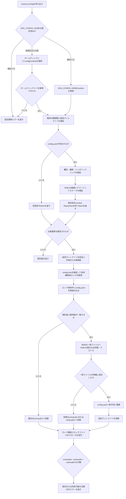
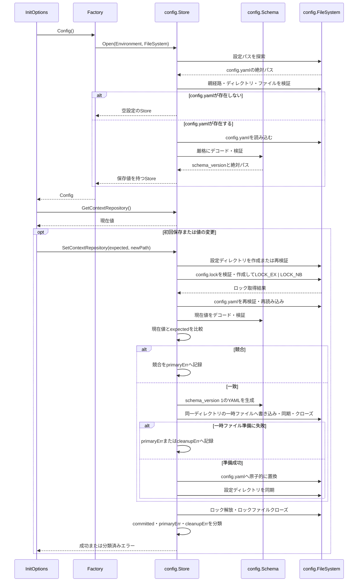

# 01-persist-context-repository-config

- **ステータス**: 完了 (Completed)
- **対象ストーリー**: ST-001, ST-003, ST-004

このタスクは永続StoreとCLI接続を完成させる。ST-002の対話仕様そのものは変更せず、既存の変更確認後に比較更新APIへ期待値を渡せるようにする。実バイナリを別プロセスで実行するST-002の受け入れ確認はタスク02が担当する。

## 1. 処理フローチャート (Flowchart)

## 2. シーケンス図 (Sequence Diagram)

## 3. ファイル配置・責務定義

- `[NEW]` `internal/config/store.go`: 設定探索結果からStoreを開き、現在値の参照と `SetContextRepository(expected, newPath)` による比較更新を統括する。
- `[NEW]` `internal/config/schema.go`: `schema_version: 1` と `context_repository` のYAML表現、旧実装の `version: 1` と `repository_path` の読み込み互換、未知フィールドを拒否するデコード、絶対パスなどの値検証を担当する。
- `[NEW]` `internal/config/filesystem.go`: `Environment`、`FileSystem`、`File` の境界と標準実装を定義する。`Environment` は `LookupEnv(key) (string, bool)` と `UserHomeDir() (string, error)` を提供する。`FileSystem` はパス検証、ディレクトリ作成、ファイル操作、排他ロックに必要な操作を提供する。OS実装は `File` の内部で保持する `Fd()` を `unix.Flock` へ渡し、テスト実装はファイル記述子を使わず失敗注入できる。`File` は `Write`、`Sync`、`Close`、`Chmod`、`Name`、`Fd` を提供する。
- `[NEW]` `internal/config/error.go`: 探索、形式、スキーマ、権限、シンボリックリンク、種別、ロック競合、比較更新競合、コミット前後のI/O失敗を `errors.Is` / `errors.As` で判定可能にする。公開される `Error()` は操作種別だけを示し、設定内容、設定ファイルの絶対パス、一時ファイル名を含めない。内部原因は `Unwrap()` で保持する。
- `[NEW]` `internal/config/store_test.go`: `t.TempDir()` を使い、XDG・ホーム探索と不存在時の非作成を検証する。初回保存、再読み込み、比較更新、競合も検証する。
- `[NEW]` `internal/config/schema_test.go`: 正常YAML、不正YAML、未知フィールド、未対応バージョン、空・相対Context Repositoryを検証する。
- `[NEW]` `internal/config/filesystem_test.go`: 権限、ファイル種別、親経路・設定ディレクトリ・設定ファイル・ロックファイルのシンボリックリンク、ロック競合、失敗注入の各地点とディスク状態を検証する。
- `[MODIFY]` `pkg/cmd/factory.go`: メモリ内 `dummyConfig` を廃止し、Configインターフェースを比較更新APIへ変更する。`NewFactory` 内で `config.NewOSEnvironment()` と `config.NewOSFileSystem()` を生成し、`Factory.Config` のクロージャから `config.Open(environment, fileSystem)` を呼び出す。
- `[NEW]` `pkg/cmd/factory_test.go`: テスト用環境を設定したプロセス内でFactoryの別インスタンスを生成し、1つ目から保存した値を2つ目から再読込できることを検証する。
- `[MODIFY]` `pkg/cmd/init.go`: 読み込んだ現在値を期待値として比較更新APIへ渡す。既存の変更確認フロー自体は維持する。
- `[MODIFY]` `pkg/cmd/init_test.go`: Configモックを比較更新APIへ追従させ、初回保存と変更保存で期待値・新値が正しく渡ること、保存エラー時に成功表示しないことを検証する。
- `[MODIFY]` `go.mod`: `go.yaml.in/yaml/v3` と `golang.org/x/sys` を直接依存として整理する。
- `[MODIFY]` `go.sum`: 依存関係のチェックサムを更新する。

タスク02で、実バイナリを別プロセスとして実行するE2Eハーネス、初回・同一パス・変更承認・変更拒否・EOFのシナリオ、および `test/e2e/README.md` を扱う。

### 比較更新の結果分類

| committed | primaryErr | cleanupErr | `config.yaml` の状態 | 返却結果                                                                           |
| --------- | ---------- | ---------- | -------------------- | ---------------------------------------------------------------------------------- |
| false     | nil        | nil        | 更新なし             | この組み合わせは原子的置換前には成功扱いにせず、処理を継続する                     |
| false     | あり       | なし       | 更新なし             | 主処理の文脈付きエラー                                                             |
| false     | あり       | あり       | 更新なし             | 主処理エラーを返し、クリーンアップ失敗を付加情報として保持                         |
| false     | nil        | あり       | 更新なし             | 原子的置換前の一時ファイルクローズ等を表すクリーンアップエラー                     |
| true      | nil        | nil        | 新しい値へ更新済み   | 成功                                                                               |
| true      | あり       | 任意       | 新しい値へ更新済み   | ディレクトリ同期失敗などのコミット後エラー。クリーンアップ失敗も付加情報として保持 |
| true      | nil        | あり       | 新しい値へ更新済み   | ロック解放またはロックファイルクローズ失敗を表すコミット後エラー                   |

`committed` は `Rename` が成功した直後にだけ `true` とする。原子的置換前の失敗では既存 `config.yaml` を維持し、一時ファイルを可能な範囲で削除する。ロック解放とロックファイルクローズは主処理の成否と `committed` にかかわらず必ず試行する。

### 設定ディレクトリ作成方針

読み込み時は `$XDG_CONFIG_HOME/context`、`~/.config/context` のいずれも作成しない。初回保存時に必要な基底ディレクトリが存在しない場合は、最も近い既存の祖先まで遡り、その祖先から設定ディレクトリまでの既存要素が実ディレクトリかつシンボリックリンクでないことを検証する。その後、不足する各階層を `0700` で1階層ずつ作成し、作成直後に種別と権限を再検証する。既存ディレクトリの権限は変更しない。作成途中で失敗した場合は設定ファイルを書き込まず、今回作成した空ディレクトリだけを末端から可能な範囲で削除する。

## 4. 実装チェックリスト

- [x] `internal/config` の探索・スキーマ・安全検証・比較更新テストを先に追加する
- [x] 設定不存在時に読み込みだけではファイルやディレクトリを作成しないStoreを実装する
- [x] 初回保存時だけ不足する設定基底階層を安全に `0700` で作成する
- [x] 権限・種別・シンボリックリンクを検証するファイルシステム境界を実装する
- [x] 非待機Flock、ロック中再読込、期待値比較、原子的置換を実装する
- [x] コミット前後とクリーンアップ失敗を判定可能なエラーへ分類する
- [x] 公開エラー文字列から設定内容・絶対パス・一時ファイル名を除外し、内部原因を保持する
- [x] `Factory.Config` を永続Storeへ接続し、CLIのConfigインターフェースを比較更新APIへ変更する
- [x] `InitOptions` と既存単体テストを比較更新APIへ追従させる
- [x] `gofmt`、`go vet ./...`、`golangci-lint run`、`govulncheck ./...`、`go test ./...` を実行する

## 5. テスト・検証計画

- **結合テスト方法**: `pkg/cmd/factory_test.go` で一時XDG設定を使うFactoryを複数生成し、1つ目が保存した値を2つ目が再読込できることを確認する。
- **単体テスト対象**: XDG未設定・空・相対パス、ホーム取得失敗、設定不存在、XDG基底または `~/.config` が存在しない初回保存、安全な階層作成の途中失敗、不正YAML、未知フィールド、未対応バージョン、空・相対Repositoryパス、過剰権限、異種ファイル、各シンボリックリンク、ロック競合、比較更新競合を対象とする。
- **失敗注入テスト**: `Environment`、`FileSystem`、`File` のテスト実装を使い、一時ファイルの作成・書き込み・同期・クローズ、置換、ディレクトリ同期、アンロック、ロックファイルクローズの失敗について、返却エラーの分類と `config.yaml` の更新状態を確認する。
- **情報漏洩テスト**: 不正YAML、`os.PathError` 相当、一時ファイル操作の内部エラーを発生させ、CLIへ返るエラー文字列に設定内容、設定ファイルの絶対パス、一時ファイル名が含まれず、`errors.Is` / `errors.As` では原因を判定できることを確認する。
- **回帰テスト**: `pkg/cmd/init_test.go` を実行し、初回設定、同一値、変更承認・拒否、Config読込・保存エラー、出力エラーの既存動作を維持する。
- **E2Eの扱い**: 別プロセスE2Eと対話確認シナリオはタスク02で実装する。

## 6. 実際の変更ファイル

- `[NEW]` `internal/config/error.go`
- `[NEW]` `internal/config/filesystem.go`
- `[NEW]` `internal/config/filesystem_test.go`
- `[NEW]` `internal/config/schema.go`
- `[NEW]` `internal/config/schema_test.go`
- `[NEW]` `internal/config/store.go`
- `[NEW]` `internal/config/store_test.go`
- `[MODIFY]` `pkg/cmd/factory.go`
- `[NEW]` `pkg/cmd/factory_test.go`
- `[MODIFY]` `pkg/cmd/init.go`
- `[MODIFY]` `pkg/cmd/init_test.go`
- `[MODIFY]` `test/e2e/harness_test.go`
  - `cmd.Config` の比較更新API変更により既存E2Eテストをビルド可能に保つため、メモリConfigのメソッド署名のみ追従した。別プロセスE2Eへの変更はタスク02へ残す。
- `[MODIFY]` `go.mod`
- `[MODIFY]` `go.sum`
- `[MODIFY]` `docs/specs/spec-002-persist-context-repository-config/tasks/01-persist-context-repository-config.md`

### コードレビュー対応

- 短い書き込みを注入し、`io.ErrShortWrite`、コミット前失敗、既存設定維持を検証した。
- ロック作成、既存ロックオープン、ロック権限設定、Flock、ロック中再読込の失敗を個別に注入し、`ErrIO` と内部原因を `errors.Is` / `errors.As` で判定できることを検証した。
- 一時ファイル削除失敗とディレクトリ作成後cleanup失敗について、主原因を維持しながらcleanup原因を `Error.Cleanup` とエラーチェーンへ保持することを検証した。
- ロック、置換、cleanup失敗へ秘密パスや一時ファイル名を含む `os.PathError` を注入し、公開 `Error()` に内部情報が含まれず、内部原因は `errors.As` で取得できることを検証した。
- 利用者環境に残る旧形式の `version: 1` と `repository_path` を読み込み、更新時に現行スキーマへ置換する互換テストを追加した。
- 実環境の旧形式設定を使用した `context init` が正常終了することを確認した。
- 各コミット前失敗で既存設定が維持されることを再読込で確認した。

## 7. 検証結果

- `rtk gofmt -w cmd pkg internal test`: 成功
- `rtk go vet ./...`: 成功、問題なし
- `rtk golangci-lint run`: 成功、問題なし
- `rtk govulncheck ./...`: 成功、呼び出し可能な脆弱性0件
- `rtk go test ./...`: 成功、6パッケージ121テスト通過
- `rtk go test -race ./internal/config`: 成功、66テスト通過
- 対象別確認:
  - `rtk go test ./internal/config`: 66テスト通過
  - `rtk go test ./pkg/cmd`: 21テスト通過
  - `rtk go test ./test/e2e/...`: 8テスト通過
