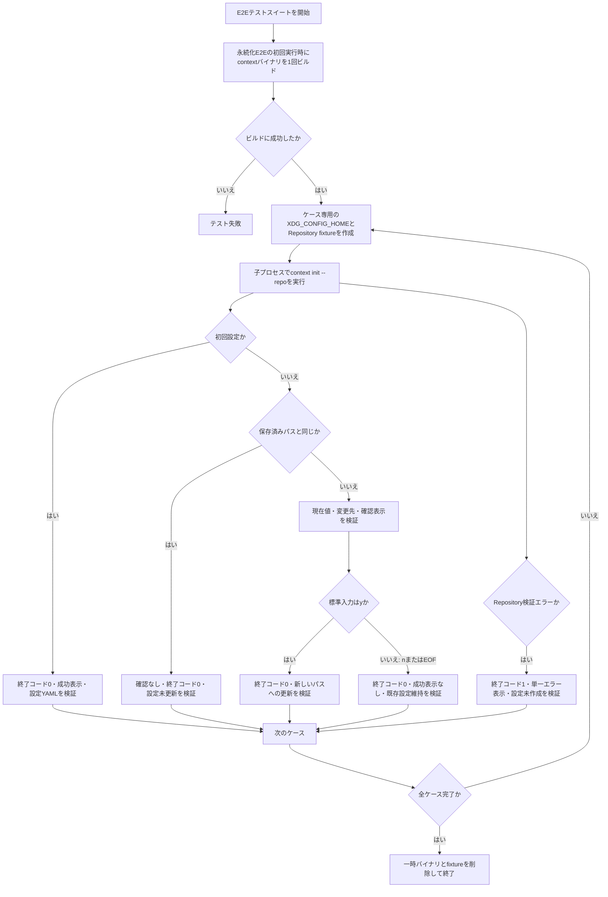
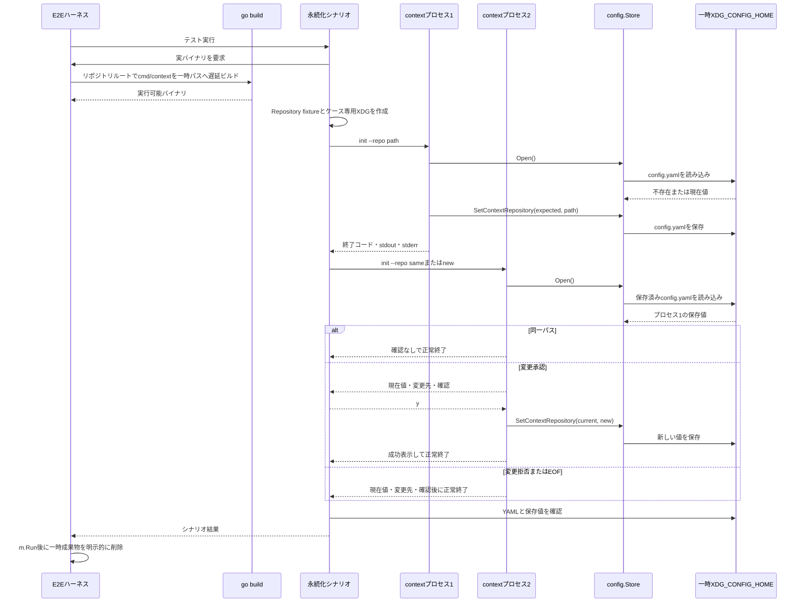

# 02-confirm-and-update-context-repository

- **ステータス**: 完了 (Completed)
- **対象ストーリー**: ST-001, ST-002

タスク01で完成した永続Storeを利用し、`context init` の初回設定、同一パス、変更承認、変更拒否、EOFを実バイナリの別プロセスE2Eで検証する。設定ファイルの安全性、比較更新、原子的保存の実装責務はタスク01に置く。

## 1. 処理フローチャート (Flowchart)

## 2. シーケンス図 (Sequence Diagram)

## 3. ファイル配置・責務定義

- `[MODIFY]` [`test/e2e/harness_test.go`](../../../../test/e2e/harness_test.go): 既存のインプロセス用ハーネスとfixture生成を維持しつつ、永続化E2Eから最初に要求された時だけ `sync.Once` で実バイナリをビルドする補助、`TestMain` による明示的な一時ファイルの削除、ケースごとに環境・stdin・作業ディレクトリを明示して別プロセスを実行する補助、終了コード・stdout・stderrを保持する結果型を追加する。ビルド時は `runtime.Caller` でこのテストファイルの位置を取得してリポジトリルートを確定し、`exec.Cmd.Dir` をルートへ設定する。子プロセスにはケース専用の絶対 `XDG_CONFIG_HOME` だけを含む必要最小限の環境を渡し、利用者の設定環境を継承しない。
- `[MODIFY]` [`test/e2e/init_test.go`](../../../../test/e2e/init_test.go): 既存のメモリConfigによるCobra境界テストを回帰テストとして残し、実バイナリと同じ設定ディレクトリを複数プロセスで共有するテーブル駆動E2Eを追加する。初回設定、別プロセスでの同一パス、変更承認、変更拒否、EOF、Repository検証エラーについて、終了コード、stdout、stderr、確認表示、成功表示、最終YAMLまたは設定未作成を検証する。
- `[MODIFY if required]` [`pkg/cmd/root.go`](../../../../pkg/cmd/root.go) / [`cmd/context/main.go`](../../../../cmd/context/main.go): 実バイナリE2EでCobraと `main` が同じエラーを重複表示することが確認された場合に限り、CLI境界でエラーを一度だけstderrへ出力し、利用者入力エラーでUsageを重ねない設定へ修正する。
- `[MODIFY]` [`test/e2e/README.md`](../../../../test/e2e/README.md): インプロセスE2Eと別プロセス永続化E2Eの責務を分けて説明し、追加シナリオの事前条件、複数プロセスの操作、入力、期待する終了結果、保存結果、対応テスト名、全体および個別の実行方法を記載する。

プロダクションコードは変更しない。別プロセスE2Eで不具合が判明した場合に限り、原因となる既存実装および単体テストを最小範囲で修正する。

## 4. 実装チェックリスト

- [x] 実バイナリを永続化E2Eの初回実行時だけビルドし、スイート終了時に明示的に削除する
- [x] リポジトリルートをテストファイルの位置から確定し、そのルートを `go build` の作業ディレクトリにする
- [x] macOSの `/var` シンボリックリンクに依存しないよう、一時基底パスを実体パスへ変換する
- [x] 子プロセスへケース専用の `XDG_CONFIG_HOME`、stdin、作業ディレクトリだけを明示的に渡す
- [x] 別プロセス間で初回保存値を読み込めることを検証する
- [x] 同一パスでは確認と設定更新を行わず、設定ファイルの内容とファイル実体を維持して正常終了することを検証する
- [x] 異なるパスの変更承認で新しい値へ更新されることを検証する
- [x] 変更拒否とEOFで成功表示を行わず、既存値を維持して正常終了することを検証する
- [x] 無効なRepositoryで終了コード1、単一のstderrエラー、設定未作成となることを検証する
- [x] 子プロセスへケース単位のタイムアウトを設け、停止時は診断可能なハーネスエラーにする
- [x] stdout全文、stderr全文、終了コード、厳格にデコードした最終YAMLをシナリオごとに検証する
- [x] 既存のインプロセスE2Eを維持し、永続化E2Eとの責務をREADMEへ記録する
- [x] `gofmt`、`go vet ./...`、`golangci-lint run`、`govulncheck ./...`、`go test ./...`、`task test:e2e` を実行する

## 5. テスト・検証計画

- **E2Eハーネス**: 永続化E2Eから初めて要求された時に、`sync.Once` で `go build -o <temp>/context ./cmd/context` を一度だけ実行する。`runtime.Caller` で `test/e2e/harness_test.go` の絶対パスを取得してリポジトリルートを導出し、実体パスであることを確認して `exec.Cmd.Dir` へ設定する。ルート特定またはビルド失敗時は、標準出力と標準エラーを含むハーネスエラーとして対象テストを失敗させる。既存インプロセスE2Eだけを `-run` で選択した場合はビルドしない。
- **一時成果物の削除**: `TestMain` は `code := m.Run()` の後に、遅延ビルドで一時ディレクトリが作成されていれば `os.RemoveAll` を明示的に実行し、その後 `os.Exit(code)` を呼ぶ。テスト成功後の削除失敗はstderrへ固定メッセージを出して終了コード1とし、既存のテスト失敗がある場合は元の非0終了コードを維持する。
- **子プロセス結果**: `context.WithTimeout` と `exec.CommandContext` を使用し、各プロセスにケース単位の短い期限を設定する。`Run` 成功はCLI終了コード0として扱い、`*exec.ExitError` は `ExitCode()`、stdout、stderrを通常の実行結果として返す。バイナリの起動自体に失敗した場合、または期限超過で強制終了した場合だけをハーネスエラーとして区別し、CLIの非0終了と混同しない。期限超過エラーには固定メッセージと収集済みstdout・stderrを診断情報として保持する。
- **ケース分離**: 各永続化シナリオは独立した `t.TempDir()` を `filepath.EvalSymlinks` で実体パスへ変換し、その配下にRepository fixtureと絶対パスの `XDG_CONFIG_HOME` を作成する。これによりmacOSの `/var` から `/private/var` へのリンクを設定Storeの親経路検証へ持ち込まない。同じシナリオ内の複数プロセスだけが同じ設定ディレクトリを共有し、シナリオ間では共有しない。テストは利用者の実設定を読み書きしない。
- **子プロセス環境**: 各子プロセスは `os/exec` で起動し、`Env` をケース専用の絶対 `XDG_CONFIG_HOME` だけに明示設定して、親プロセスの `XDG_CONFIG_HOME`、`HOME`、その他の利用者環境を継承しない。Repositoryを相対指定するケースでは `exec.Cmd.Dir` もfixtureの親ディレクトリへ明示する。
- **初回設定**: プロセス1が有効なRepositoryを指定して終了コード0となり、stderrが空、成功表示があり、`config.yaml` に `schema_version: 1` と正規化済み絶対パスが保存されることを確認する。
- **同一パス**: 初回設定後のプロセス2で同じRepositoryを指定し、終了コード0、stderr空、確認表示なし、成功表示あり、設定値が維持されることを確認する。実行前後の設定ファイルについて、バイト列、`os.FileInfo.ModTime()`、`os.SameFile()` を比較し、同内容の再書き込みや原子的置換も発生していないことを確認する。
- **変更承認**: 初回設定後のプロセス2で異なる有効なRepositoryと `y\n` を渡し、現在値・変更先・確認・成功表示、終了コード0、stderr空、新しい保存値を確認する。
- **変更拒否**: 初回設定後のプロセス2で異なる有効なRepositoryと `n\n` を渡し、現在値・変更先・確認を表示する一方、成功表示とエラー表示を行わず終了コード0となり、既存値を維持することを確認する。
- **EOF**: 初回設定後のプロセス2で標準入力を空のまま閉じ、変更拒否と同様に成功表示なし、stderr空、終了コード0、既存値維持となることを確認する。
- **Repository検証エラー**: 必須構造を欠く一時Repositoryを実バイナリへ指定し、stdout空、終了コード1、パスを含まない固定されたstderr全文、`Error:` の出現が1回だけ、設定ディレクトリと設定ファイルが未作成であることを確認する。このシナリオで実バイナリの非0終了とハーネスエラーの区別、およびCLI境界での単一エラー出力を保証する。
- **出力検証**: 各シナリオは期待するstdout全文、stderr全文、終了コードをテーブル要素として定義し、完全一致で比較する。これにより成功表示、現在値、変更先、確認プロンプト、重複したCobraエラー表示の有無を同時に確認する。
- **設定YAML検証**: 保存ファイルはテスト専用構造体へ `yaml.Decoder.KnownFields(true)` でデコードし、2回目のDecodeが `io.EOF` になることを確認する。これにより未知フィールドと複数YAML文書を許容せず、`schema_version` の整数値、`context_repository` の文字列値、期待する絶対パスを比較する。文字列全体の完全一致には依存しない。
- **既存回帰テスト**: `TestE2E_Init` はCobra境界、Config呼び出し回数、検証エラー時のパス秘匿を高速に確認するインプロセステストとして維持する。
- **実行方法**: 全体は `task test:e2e` または `go test ./test/e2e/...`、個別シナリオは `go test ./test/e2e/... -run 'TestE2E_InitPersistence/<Scenario-ID>' -v` で実行する。
- **品質ゲート**: `gofmt -w test/e2e`、`go vet ./...`、`golangci-lint run`、`govulncheck ./...`、`go test ./...`、`task test:e2e`。

## 6. 実装結果

- 実バイナリを遅延ビルドし、ケース専用の `XDG_CONFIG_HOME` で別プロセス実行するE2Eハーネスを追加した。
- 実バイナリのビルドにもタイムアウトを設け、一時ディレクトリ解決失敗時の回収経路を追加した。
- 初回保存、同一パス、変更承認、変更拒否、EOF、無効Repositoryを検証し、設定YAMLと未更新状態を確認した。
- Cobraの自動エラー・Usage出力を抑止し、`main` でエラーを一度だけ表示するCLI境界へ修正した。
- 未知コマンド、未知フラグ、必須フラグ不足でも単一エラー表示となる実バイナリE2Eを追加した。
- インプロセスE2Eと永続化E2Eの責務、シナリオ、個別実行方法を `test/e2e/README.md` へ記録した。

## 7. 検証結果

- `gofmt`: 成功
- `go vet ./...`: 成功
- `golangci-lint run`: 成功（0 issues）
- `govulncheck ./...`: 成功（呼び出し可能な脆弱性なし）
- `go test ./...`: 成功（132 tests）
- `task test:e2e`: 成功
- `git diff --check`: 成功
