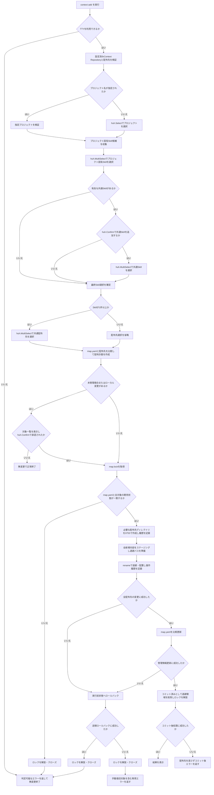
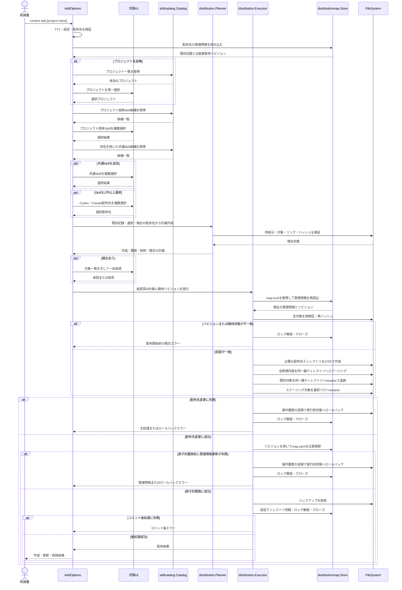

# Skillの選択と配布

仕様書ID: spec-003-add-skills。

## ゴール

`context add` でContext Repositoryのプロジェクト固有Skillと共通Skillを対話的に選択し、カレントディレクトリのCodexまたはClaude向けSkillディレクトリへ安全に配布、再配布、選択解除できるようにする。

## 課題

複数の開発リポジトリでAIコーディングエージェントを利用する個人開発者は、必要なSkillをContext Repositoryから手作業で探し、エージェントごとの配置先へコピーしている。この作業では、プロジェクト固有Skillの選択漏れ、同名の共通Skillとの取り違え、ローカル編集の意図しない上書き、過去に配布した不要なSkillの残存が発生する。

## 対象ユーザー

ローカルのContext Repositoryを設定済みで、カレントディレクトリの開発リポジトリへAIエージェント用Skillを配布する個人開発者。

## ユーザー価値

利用するプロジェクト、Skill、配布先を対話的に選ぶだけで、必要なSkillを正しい場所へ安全に配布できる。再実行時には前回の選択を引き継ぎ、不要になったSkillの解除やプロジェクト変更もローカル編集を保護しながら実施できる。

## 成功指標

- 指標: 選択したSkillだけが選択した配布先へ正しく配布される
  - 評価方法: プロジェクト固有Skill、共通Skill、同名Skill、Codexのみ、Claudeのみ、両方の組み合わせをE2Eテストで確認する
  - 観測時期: 実装完了時
- 指標: 再実行時の選択変更が管理情報と配布先へ一貫して反映される
  - 評価方法: Skill追加、選択解除、配布先変更、プロジェクト変更を別プロセスのE2Eテストで確認する
  - 観測時期: 実装完了時
- 指標: 未管理データとローカル編集を明示的な承認なしに変更しない
  - 評価方法: 未管理の同名Skill、管理対象の編集、削除対象の編集、確認拒否、処理失敗を単体テストとE2Eテストで確認する
  - 観測時期: 実装完了時
- 指標: 配布処理の失敗後、ロールバックが成功した場合は開始前の状態を維持する
  - 評価方法: コピー、削除、置換、管理情報保存の各失敗地点へ失敗を注入し、配布先と `map.yaml` の状態を確認する
  - 観測時期: 実装完了時

## スコープ

- `context add [project-name]` コマンドの追加
- 引数を省略した場合のContext Repository内プロジェクトの単一選択
- 引数で指定したプロジェクトの検証
- プロジェクト固有Skillの複数選択
- 共通Skillを選択するかの確認と、選択する場合の複数選択
- プロジェクト固有Skillと同名の共通Skillを候補から除外
- Codex、Claude、または両方の配布先の複数選択
- 選択した全Skillへの共通の配布先設定
- Skillディレクトリ全体の再帰コピー
- カレントディレクトリを配布先として字句的に正規化した絶対パスで識別
- 配布先ごとのプロジェクト、選択Skill、配布先、配布時ハッシュの `map.yaml` への保存
- 再実行時の前回選択済みSkillの初期選択
- 全Skill選択解除時の管理対象削除と配布先選択の省略
- Skill選択または配布先選択から外れた管理対象の削除
- 別プロジェクトへの変更時の旧プロジェクト由来Skillの置換
- 未管理の同名Skillまたはローカル編集済み管理対象に対する一括上書き確認
- 対話キャンセル、上書き拒否、非TTY実行時の無変更終了
- 配布計画の事前検証、同一ファイルシステム内のステージングと退避、ロールバック、原子的な管理情報更新
- ローカルE2EテストとE2Eシナリオ文書の追加

## スコープ外

- `AGENTS.md` と `CLAUDE.md` の配布
- `context sync` コマンド
- 非対話実行用のSkill、プロジェクト、配布先指定フラグ
- Context Repositoryの自動クローンまたは更新
- Skill内容の生成、変換、マージ
- 配布先からContext Repositoryへの変更取り込み
- 配布先がGitリポジトリかの検証
- 複数のプロジェクトを同一配布先へ同時に紐づける機能
- CodexとClaude以外の配布先
- 配布後に外部プロセスが同時変更する場合の完全な競合防止

## ユーザーストーリー

- ST-001: 利用者として、プロジェクト固有Skillを選び、利用するAIエージェントのSkillディレクトリへ配布したい。
- ST-002: 利用者として、必要な場合だけ共通Skillを追加選択し、プロジェクト固有Skillと合わせて配布したい。
- ST-003: 利用者として、再実行時に前回の選択を確認しながらSkillや配布先を追加または解除したい。
- ST-004: 利用者として、別プロジェクトへ切り替える場合に旧プロジェクトの管理対象を安全に置き換えたい。
- ST-005: 利用者として、未管理の同名Skillやローカル編集がある場合、内容を失う前に確認して処理を中止または承認したい。
- ST-006: 利用者として、配布途中に失敗しても配布先と管理情報を実行前の状態へ戻してほしい。

## 完成条件

- ST-001: `context add <project-name>` は `projects/<project-name>/` が実ディレクトリとして存在する場合、そのプロジェクトを選択する。
- ST-001: `project-name` が空、`.`、`..`、パス区切りを含む、または該当プロジェクトが存在しない場合は判定可能な入力エラーを返し、配布先と管理情報を変更しない。
- ST-001: `context add` のようにプロジェクト名を省略した場合、`projects/` 直下の有効なプロジェクトを名前順で `huh.Select` に表示する。
- ST-001: プロジェクト名省略時に有効なプロジェクトが存在しない場合は判定可能なエラーを返し、変更しない。
- ST-001: 選択したプロジェクトの `skills/` 直下にあり、実ディレクトリで `SKILL.md` を通常ファイルとして含むSkillだけを名前順で `huh.MultiSelect` に表示する。
- ST-001: プロジェクト固有Skillが0件の場合はその選択画面を省略し、共通Skillの選択確認へ進む。
- ST-001: 配布先はCodexの `.codex/skills/` とClaudeの `.claude/skills/` を `huh.MultiSelect` に表示し、1件以上を選択できる。
- ST-001: 選択した全Skillは、選択した全配布先へ同一内容で配布される。
- ST-001: Skill配下の通常ファイルと実ディレクトリを階層ごと再帰コピーし、ファイル内容と実行権限を含む所有者権限を維持する。
- ST-001: Skill配下にシンボリックリンクまたは通常ファイルと実ディレクトリ以外の種別が存在する場合は、リンクをたどらず配布計画を拒否する。
- ST-002: プロジェクト固有Skillの選択後、共通Skillを追加するか `huh.Confirm` で確認する。
- ST-002: 共通Skillを追加する場合、`utils/skills/` 直下の有効なSkillを名前順で `huh.MultiSelect` に表示する。
- ST-002: プロジェクト固有Skillと同名の共通Skillは共通Skillの候補から除外し、常にプロジェクト固有Skillを優先する。
- ST-002: 共通Skillを追加しない場合、前回選択済みの共通Skillは今回の選択から外したものとして扱う。
- ST-002: 有効な共通Skillが0件の場合は共通Skillの追加確認と選択画面を省略する。
- ST-003: 配布先の字句的に正規化した絶対パスをキーとして、選択プロジェクト、Skillごとの供給元、選択した共通配布先、各配布先へ配布した内容のハッシュを `map.yaml` に保存する。
- ST-003: `map.yaml` の現行スキーマは独立した `schema_version: 1` を持ち、未知フィールド、未対応バージョン、不正な絶対パス、不正な相対配置先、重複Skill、不正なハッシュを拒否する。
- ST-003: `map.yaml` の読み込み結果には、正規化した管理情報全体のSHA-256をリビジョンとして付与する。ファイル未作成状態には通常のハッシュと区別できる専用の空リビジョンを使用する。
- ST-003: 同じ配布先で再実行した場合、同じプロジェクトに記録されたプロジェクト固有Skillと共通Skillをそれぞれの複数選択画面の初期選択にする。
- ST-003: 配布先は選択した全Skillで共通とし、Skillが1件以上選択されている場合は前回の配布先を初期選択にする。
- ST-003: Skillが0件の場合は配布先選択を省略し、前回管理していたSkillを削除対象とする。
- ST-003: 前回選択済みだったSkillまたは配布先を今回外した場合、該当する管理対象を削除する。
- ST-003: 選択済みSkillが供給元から消失または無効化している場合、そのSkillは初期選択に含めず削除候補として扱う。
- ST-003: 対話画面で操作をキャンセルした場合は正常なキャンセルとして扱い、配布先と管理情報を変更しない。
- ST-004: 1つの配布先には1つのプロジェクトだけを紐づける。
- ST-004: 同じ配布先で前回と異なるプロジェクトを選択した場合、旧プロジェクト由来の管理対象を削除し、新しい選択内容へ置き換える計画を作成する。
- ST-004: プロジェクト変更時には、新しいプロジェクトのSkill選択を前回値で初期選択しない。共通Skillは現在も有効で同名競合がなくても、明示的な再選択を必要とする。
- ST-005: 配布予定パスに `map.yaml` で管理されていない同名Skillが存在する場合は競合として検出する。
- ST-005: 管理対象の現在のディレクトリ内容から計算したハッシュが前回配布時ハッシュと異なる場合はローカル編集として検出する。
- ST-005: 管理対象の一部または全部が欠落している場合もローカル変更として検出する。
- ST-005: 上書きまたは削除が必要な未管理対象とローカル変更対象を変更前に一覧表示し、`huh.Confirm` で一括承認を求める。
- ST-005: 競合確認を拒否またはキャンセルした場合は一切変更せず正常終了する。
- ST-005: 競合確認を承認した場合に限り、一覧に示した未管理対象を置換し、ローカル変更対象を置換または削除する。
- ST-005: 配布計画は対象ごとに不存在、ファイル種別、内容ハッシュ、保持対象の所有者権限を期待状態として保持する。
- ST-005: 選択確定後に排他ロックを取得し、`map.yaml` と全対象の期待状態を再検証する。承認画面の表示後を含め、計画作成時から状態が変化している場合は再承認や変更をせず競合エラーで終了する。
- ST-005: 配布先ルートまでの既存の各パス構成要素、管理対象への親経路、管理対象自身のいずれかがシンボリックリンクの場合はリンクをたどらず拒否し、確認による上書きも許可しない。
- ST-005: Context Repository内のプロジェクト、`skills/`、Skillディレクトリ、Skill配下の各構成要素がシンボリックリンクの場合はリンクをたどらず拒否する。
- ST-005: `map.yaml` が存在しない配布先は未管理として扱うが、既存のSkillを自動的に管理対象へ取り込まない。
- ST-006: ファイル操作前に、作成、置換、削除、管理情報更新からなる配布計画を確定し、すべての供給元と配布先を検証する。
- ST-006: 最初の破壊的操作前に、全新規Skillを各最終パスと同じ親ディレクトリ内の一時ディレクトリへ完全にコピーして同期し、ステージングを完了する。
- ST-006: `.codex/`、`.codex/skills/`、`.claude/`、`.claude/skills/` が存在しない場合は必要な階層だけを `0755` で作成し、今回作成したディレクトリを実行履歴へ記録する。
- ST-006: 配布先ディレクトリの既存経路がシンボリックリンクまたは実ディレクトリ以外の場合は、リンクをたどらず配布計画を拒否する。
- ST-006: 最初の破壊的操作前に、置換または削除する全既存Skillについて、同じ親ディレクトリ内に衝突しない退避パスを確保する。
- ST-006: 置換または削除する既存Skillは最終パスから退避パスへ `rename` し、新規Skillはステージングパスから最終パスへ `rename` する。同一親ディレクトリ内で同一ファイルシステムの原子的な名前変更を使用する。
- ST-006: 各操作について、ステージング済み、旧対象退避済み、新対象配置済みの状態を実行履歴へ記録する。
- ST-006: 配布計画の途中で失敗した場合は、実行履歴の逆順で今回配置した対象を除去し、退避した対象を元の最終パスへ戻して、実行前状態へのロールバックを試行する。
- ST-006: ロールバックでは今回作成し、かつ空である配布先ディレクトリだけを作成順の逆順で削除する。既存ディレクトリと空でないディレクトリは削除しない。
- ST-006: 配布先の全変更に成功した後だけ `map.yaml` を原子的に更新する。
- ST-006: `map.yaml` の原子的置換前に更新が失敗した場合はコミット前失敗として配布先を実行前状態へロールバックする。
- ST-006: `map.yaml` の原子的置換が成功した後はコミット済みとして扱い、それ以降の設定ディレクトリ同期、ロック解放、ロックファイルクローズ、一時領域削除の失敗では配布先をロールバックしない。
- ST-006: ロールバックにも失敗した場合は、主処理エラー、復元できなかった安全な相対対象、手動復旧が必要なことを判定できる専用エラーとして返す。
- ST-006: 正常終了またはロールバック成功後はステージングと退避領域を削除する。管理情報のコミット後に削除へ失敗した場合は、配布と管理情報が更新済みであることを判定できるコミット後クリーンアップエラーとして扱う。
- ST-006: 主処理とロールバックまたはクリーンアップの両方が失敗した場合は主処理エラーを保持し、付随する失敗を判定可能な形で併記する。主処理成功後の後処理だけが失敗した場合は、コミット済みか否かを判定できる後処理エラーを返す。
- ST-006: 管理情報のコミット前にコマンド処理中で検出したエラーはロールバック対象とする。プロセス強制終了、OSクラッシュ、電源断からの自動復旧は保証しない。
- 全般: `context init` が未実行でContext Repositoryが未設定の場合は判定可能な事前条件エラーを返し、変更しない。
- 全般: 保存済みContext Repositoryを利用時に再検証し、無効または安全でない場合は変更しない。
- 全般: カレントディレクトリの取得や絶対パス化ができない場合、存在しない場合、実ディレクトリではない場合、または安全に検証できない場合は変更しない。
- 全般: `context add` はTTYを必要とし、非TTYでは利用方法を示す判定可能なエラーを返して変更しない。
- 全般: 対話中はロックを保持せず、選択確定後に `map.lock` の待機なしグローバル排他ロックを取得する。ロック取得後から `map.yaml` のコミットまたは配布先のロールバック完了までロックを保持する。
- 全般: ロック取得に失敗した場合は待機せず、配布先と管理情報を変更しない。
- 全般: ロック取得後に `map.yaml` と全配布対象を再読み込み・再ハッシュし、対話開始前に読み込んだリビジョンおよび計画の期待状態と比較する。不一致の場合は配布開始前の競合エラーとして終了する。
- 全般: `map.yaml` の比較更新は、ロック下で現在のリビジョンと期待リビジョンを比較し、対象配布先の記録だけを更新または削除して、他の配布先記録を保持する。
- 全般: `map.yaml` の原子的置換の成功を管理情報のコミット点とする。コミット後の設定ディレクトリ同期、ロック解放、ロックファイルクローズに失敗した場合は、管理情報が更新済みであることを判定できるコミット後エラーを返し、配布先をロールバックしない。
- 全般: 成否とコミット状態にかかわらずロック解放とロックファイルクローズを必ず試行する。
- 全般: エラーには文脈を付与し、`errors.Is` または `errors.As` で入力、構造、競合、ローカル変更、I/O、ロールバック失敗を判定できる。
- 全般: ユーザー向けエラーに設定内容全体、Skill内容、不要なユーザーパスを含めない。
- 品質ゲート: `gofmt`、`go vet ./...`、`golangci-lint run`、`govulncheck ./...`、`go test ./...` が成功する。

## 制約事項

- macOSおよびLinuxのローカルファイルシステムを対象とする。
- 対話UIには既存依存の `github.com/charmbracelet/huh` を使用する。
- プロジェクト選択は `huh.Select`、Skill選択と配布先選択は `huh.MultiSelect`、共通Skill追加と競合承認は `huh.Confirm` を使用する。
- `pkg/cmd` がプロジェクト単一選択、Skill・配布先の複数選択、確認操作を表す `Prompt` インターフェースを所有し、huhアダプターだけが `github.com/charmbracelet/huh` に依存する。
- `AddOptions.Run` には `Prompt` を `Factory` から注入し、単体テストではモックへ差し替える。
- 対話UIの入力、出力、TTY判定は `Factory` から注入し、テストで利用者環境から隔離する。
- 全対話画面で `huh.ErrUserAborted` は配布先と管理情報を変更しない正常キャンセルとして扱い、それ以外の入力・出力エラーは判定可能な対話エラーとして返す。
- `huh.Confirm` の初期値は拒否とし、Skillが1件以上の場合の配布先選択は1件以上を必須とする。
- Context Repository設定と `map.yaml` のStoreは `Factory` から注入し、コマンドがOS環境や設定ファイルへ直接アクセスしない。
- YAMLの読み書きには既存依存の `go.yaml.in/yaml/v3` を使用する。
- `map.yaml` は `config.yaml` と同じ設定ディレクトリに置き、新規作成時は `0600` とする。
- 設定ディレクトリ、ロック、一時領域の権限とシンボリックリンク拒否は `internal/config` の既存安全要件に合わせる。
- 配布先のSkillディレクトリは `.codex/skills/<skill-name>/` と `.claude/skills/<skill-name>/` に限定する。
- Skill名はContext Repository直下のディレクトリ名を使用し、空、`.`、`..`、パス区切りを含む名前を拒否する。
- 配布内容のハッシュは、相対パス、種別、ファイル内容、保持対象の権限を名前順で入力したSHA-256とする。更新時刻、所有者、グループは含めない。
- 複数ファイル操作を扱う配布ロジックはCobraやhuhへ依存せず、`internal/` 配下の責務が明確なパッケージへ配置する。
- 管理情報のロック、再読込、比較更新を表すトランザクションポートは `internal/distribution` が所有し、`internal/distributionmap` が実装する。`pkg/cmd` はFactoryを通じて実装を組み立てるだけとする。
- `internal/` 配下から `pkg/cmd/` へ依存しない。
- Goソースコード内のコメントは日本語で記述する。

## 非機能要件

- 配布処理はネットワークアクセスや外部コマンド実行をしない。
- プロジェクト、Skill、配布先、競合対象は決定的な名前順で表示・処理する。
- 選択画面へ大量のSkillが存在しても、候補収集は各ディレクトリエントリ数と配布内容量に対して線形時間で動作する。
- ハッシュ計算とバックアップに必要な時間およびディスク容量は選択対象と既存管理対象の総容量に比例する。
- 事前検証からコミットまでの間に非協調プロセスが配布先を変更するTOCTOUへの完全な耐性は保証しないが、最終置換直前の再検証と管理情報の比較更新を行う。
- `map.lock` の排他ロックは協調するすべての `context add` で共有し、同一プロセスが操作する配布先が1つであるため複数ロックの取得は行わない。
- テストは `t.TempDir()`、テスト専用の設定ディレクトリ、注入した対話境界を使用し、利用者の実設定と開発リポジトリを変更しない。
- 単体テストは正常系に加え、候補不足・不正名・同名優先・キャンセル・非TTY・未管理競合・ローカル編集・シンボリックリンク・権限違反・ロック競合・各I/O失敗・ロールバック失敗を確認する。
- E2Eテストは実バイナリを別プロセスで擬似TTY上へ起動し、実際のhuhアダプターを用いてプロジェクト選択、Skill選択、共通Skill選択、配布先選択、再実行、選択解除、プロジェクト変更、競合拒否を確認する。
- E2Eテストはケースごとに独立したContext Repository、配布先、`XDG_CONFIG_HOME` を使用する。
- `test/e2e/README.md` にシナリオID、事前条件、対話操作、期待結果、対応テスト名、実行方法を記載する。

## リスク

- 複数のSkillディレクトリを削除・置換する処理やロールバックに不備があると、未管理データまたはローカル編集を失う可能性があるため、変更前バックアップと失敗注入テストが必要になる。
- 内容ハッシュの定義が配布処理と一致しない場合、未編集の対象を編集済みと誤判定する、または編集を見逃す可能性がある。
- 配布先と `map.yaml` は単一のファイルシステムトランザクションにできないため、ロールバックも失敗した場合は手動復旧が必要になる。
- プロセス強制終了、OSクラッシュ、電源断ではステージングまたは退避領域が残り、手動復旧が必要になる可能性がある。
- Skillディレクトリが大きい場合、事前ハッシュ、バックアップ、複数配布先へのコピーに時間と一時ディスク容量を要する。

## 前提条件

- `spec-001-validate-context-repository` と `spec-002-persist-context-repository-config` が実装済みである。
- Context Repositoryの最小構造は `projects/` と `utils/skills/` である。
- プロジェクトは `projects/` 直下の1ディレクトリで表し、プロジェクト固有Skillは `projects/<project-name>/skills/` に配置する。
- 共通Skillは `utils/skills/` に配置する。
- 1つのSkillは `SKILL.md` を含む1ディレクトリであり、補助ファイルと子ディレクトリを含められる。
- `context add` の実行開始時点では、利用者以外のプロセスが同じ配布先を変更しない協調的なローカル利用を想定する。
- `map.yaml` は将来の `context sync` でも選択済みSkillと配布時ハッシュを参照できる形式とするが、本仕様では同期処理を実装しない。

## 未解決事項

- なし。

## 技術設計ドラフト

### 処理フローチャート (Flowchart)

### シーケンス図 (Sequence Diagram)

### ファイル配置・責務定義

- `[NEW]` `pkg/cmd/add.go`: `context add [project-name]` のOptions、Cobra定義、引数補完、検証、対話フロー、内部パッケージの呼び出し、結果表示を担当する。
- `[NEW]` `pkg/cmd/prompt.go`: プロジェクト単一選択、Skill・配布先の複数選択、確認を表す `Prompt` インターフェースと、Factoryの入出力を使用するhuhアダプターを定義する。
- `[NEW]` `pkg/cmd/add_test.go`: `AddOptions.Run` を直接呼び、プロジェクト指定と省略、各選択段階、初期選択、キャンセル、競合承認と拒否、非TTY、内部エラーの変換を検証する。
- `[MODIFY]` `pkg/cmd/root.go`: `context add` をルートコマンドへ登録する。
- `[MODIFY]` `pkg/cmd/factory.go`: カレントディレクトリ取得、TTY判定、対話UI、Skillカタログ、配布計画・実行、管理情報Storeを生成する依存をFactoryへ追加する。
- `[NEW]` `internal/skillcatalog/catalog.go`: プロジェクトとSkillの安全な列挙、名前検証、有効構造の確認、プロジェクト固有Skill優先の候補統合を担当する。
- `[NEW]` `internal/skillcatalog/catalog_test.go`: 名前順、無効名、構造不足、同名優先、シンボリックリンク、I/Oエラーを検証する。
- `[NEW]` `internal/distribution/model.go`: Skill供給元、Codex・Claude配布先、選択、配布計画、処理結果を表す型を定義する。
- `[NEW]` `internal/distribution/hash.go`: Skillディレクトリを安全に走査し、相対パス、種別、内容、保持対象権限から決定的なSHA-256を計算する。
- `[NEW]` `internal/distribution/planner.go`: 現在の管理記録、選択内容、供給元、配布先状態を比較し、作成、置換、削除、競合を含む変更前の配布計画を作成する。
- `[NEW]` `internal/distribution/executor.go`: 承認済み計画のロック下再検証、配布先ディレクトリ作成、ステージング、renameによる退避と配置、操作履歴、管理情報トランザクションポートの呼び出し、逆順ロールバック、コミット前後のクリーンアップを統括する。管理情報トランザクションポートを所有し、永続化実装には依存しない。
- `[NEW]` `internal/distribution/filesystem.go`: 配布元と配布先のリンク・種別・権限検証、再帰コピー、一時配置、原子的置換、同期、バックアップ、復元を提供する最小ファイルシステム境界と標準実装を定義する。
- `[NEW]` `internal/distribution/error.go`: 入力不正、構造不正、安全性違反、未管理競合、ローカル変更、I/O失敗、ロールバック失敗を判定可能にする型付きエラーを定義する。
- `[NEW]` `internal/distribution/hash_test.go`: ファイル内容、階層、権限、順序、シンボリックリンクに対するハッシュの決定性と拒否条件を検証する。
- `[NEW]` `internal/distribution/planner_test.go`: 初回配布、追加、解除、配布先変更、プロジェクト変更、供給元消失、未管理競合、ローカル編集の計画を検証する。
- `[NEW]` `internal/distribution/executor_test.go`: 正常な作成・置換・削除、各失敗地点のロールバック、管理情報の更新失敗、復元失敗、クリーンアップ失敗を検証する。
- `[NEW]` `internal/distributionmap/store.go`: `map.yaml` の探索、読み込み、正規化内容からのリビジョン生成、配布先別記録の取得、`map.lock` のグローバル排他ロック、ロック下の再読込、対象配布先だけの比較更新または削除、原子的保存を担当し、`internal/distribution` が所有する管理情報トランザクションポートへ適合するアダプターとなる。
- `[NEW]` `internal/distributionmap/schema.go`: `schema_version: 1`、配布先、プロジェクト、Skill供給元、共通配布先、配布時ハッシュの厳格なYAMLスキーマと検証を定義する。
- `[NEW]` `internal/distributionmap/error.go`: 管理情報の探索、形式、権限、リンク、ロック、競合、I/Oエラーを判定可能にする。
- `[NEW]` `internal/distributionmap/store_test.go`: 未作成状態、読み書き、複数配布先、厳格デコード、権限、リンク、ロック競合、比較更新、原子的置換を検証する。
- `[NEW]` `internal/distributionmap/schema_test.go`: 正常スキーマ、不正パス、不正配置先、重複Skill、不正ハッシュ、未知フィールド、未対応バージョンを検証する。
- `[NEW]` `test/e2e/add_test.go`: 実バイナリと隔離環境を使用し、プロジェクト選択・各Skill選択・配布先選択・再実行・全解除・プロジェクト変更・競合拒否を検証する。
- `[MODIFY]` `test/e2e/harness_test.go`: `context add` の実際のhuh対話を駆動できる擬似TTYと、配布先カレントディレクトリの指定を追加する。
- `[MODIFY]` `test/e2e/README.md`: `context add` のシナリオ、対話入力、期待する配布先と管理情報、実行方法を追記する。
