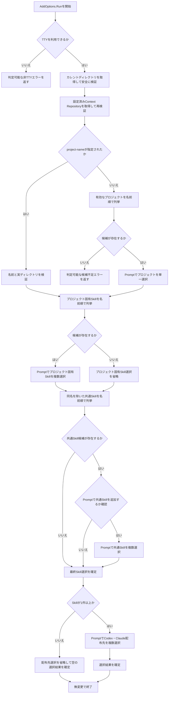
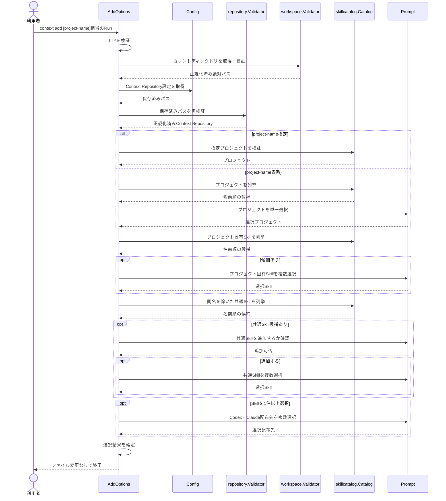

# プロジェクトとSkillを対話選択する

- **ステータス**: 完了 (Completed)
- **対象ストーリー**: ST-001, ST-002（選択フローの内部前提。ストーリーの完了判定はタスク02）

このタスクは、ユーザー承認によりタスク02の配布フローから分離した内部前提タスクである。単独ではST-001、ST-002を完了扱いにせず、利用者へ `context add` を公開しない。タスク02で初回配布、管理情報保存、ルート登録、E2Eまで接続した時点で、ST-001、ST-002の縦スライスが完成する。

## 1. 処理フローチャート (Flowchart)



すべての対話段階でキャンセルは正常終了として扱い、選択結果を確定せず、ファイルシステムと管理情報を変更しない。その他の対話エラーは判定可能なエラーとして返す。

## 2. シーケンス図 (Sequence Diagram)



## 3. ファイル配置・責務定義

- `[NEW]` `internal/skillcatalog/catalog.go`: Context Repository直下のプロジェクト、プロジェクト固有Skill、共通Skillを安全に列挙する。名前検証、実ディレクトリと通常ファイルの確認、シンボリックリンク拒否、名前順の整列、プロジェクト固有Skillと同名の共通Skill除外を担当する。
- `[NEW]` `internal/skillcatalog/error.go`: 不正名、候補不足、不正構造、シンボリックリンク、I/O失敗を `errors.Is` または `errors.As` で判定できるエラーとして定義する。
- `[NEW]` `internal/skillcatalog/catalog_test.go`: プロジェクトとSkillの名前順、不正名、存在しないプロジェクト、通常ファイルやリンクであるディレクトリエントリ、`SKILL.md` 不足・リンク・非通常ファイル、同名共通Skill除外、I/O失敗を検証する。
- `[NEW]` `internal/workspace/validator.go`: カレントディレクトリ取得、字句的な絶対パス化、既存パス構成要素の `Lstat`、実ディレクトリ確認、シンボリックリンク拒否を担当する。
- `[NEW]` `internal/workspace/error.go`: カレントディレクトリの取得、絶対パス化、不在、非ディレクトリ、シンボリックリンク、I/O失敗を判定可能にする。
- `[NEW]` `internal/workspace/validator_test.go`: 取得失敗、絶対パス化失敗、正常な実ディレクトリ、不在、非ディレクトリ、各パス構成要素のシンボリックリンク、I/O失敗を検証する。
- `[NEW]` `internal/distribution/model.go`: 後続の配布処理と共有する `Selection`、`SelectedSkill`、`SkillSource`、`Destination` を定義する。ファイル操作、ハッシュ、計画作成は含めない。
- `[NEW]` `pkg/cmd/prompt.go`: プロジェクト単一選択、Skill・配布先の複数選択、共通Skill追加確認を表す `Prompt` インターフェースと、Factoryの入出力を使うhuhアダプターを定義する。`huh.ErrUserAborted` は上位で正常キャンセルへ変換できる形で返す。
- `[NEW]` `pkg/cmd/prompt_test.go`: Factoryから渡した入出力の利用、`huh.ErrUserAborted` の保持、Confirmの初期値が拒否、配布先0件の拒否を検証する。
- `[NEW]` `pkg/cmd/add.go`: `AddOptions`、`NewCmdAdd`、`Complete`、`Validate`、`Run` を5要素テンプレート順で定義する。位置引数は `cobra.MaximumNArgs(1)` で0件または1件に限定する。TTY、カレントディレクトリ、設定済みContext Repository、プロジェクト引数の順で検証し、CatalogとPromptを組み合わせて選択結果を確定する。このタスクでは配布処理、管理情報更新、成功メッセージの出力はしない。
- `[NEW]` `pkg/cmd/add_test.go`: Cobraを経由せず `AddOptions.Run` を直接呼び、指定・省略プロジェクト・候補不足・選択画面の省略・同名優先・共通Skill追加拒否・Skill全解除・配布先必須・各段階のキャンセル・対話エラー・非TTY・未設定および無効なContext Repositoryを検証する。
- `[MODIFY]` `pkg/cmd/factory.go`: TTY判定、Workspace Validator、Prompt、Skill CatalogをFactory経由で注入できるようにする。
- `[MODIFY]` `pkg/cmd/factory_test.go`: 追加した既定依存と差し替え可能性を検証する。
- `[DEFER]` `pkg/cmd/root.go`: 未配布の選択処理だけを利用者へ公開しないため、`context add` のルート登録はタスク02で行う。
- `[DEFER]` `internal/distribution/model.go` を除く配布計画・ハッシュ・実行処理、および `internal/distributionmap/`: 選択結果の配布、ハッシュ、ロールバック、`map.yaml` 永続化はタスク02以降で実装する。

`AddOptions` は確定した結果を `Selection distribution.Selection` フィールドへ格納する。キャンセル時は `Selection` を更新しない。後続タスクは同じ値をPlannerへ渡す。

```go
type SkillSource string

const (
    SkillSourceProject SkillSource = "project"
    SkillSourceCommon  SkillSource = "common"
)

type Destination string

const (
    DestinationCodex  Destination = "codex"
    DestinationClaude Destination = "claude"
)

type SelectedSkill struct {
    Name       string
    Source     SkillSource
    SourcePath string
}

type Selection struct {
    WorkspaceRoot string
    Project       string
    Skills        []SelectedSkill
    Destinations  []Destination
}
```

`skillcatalog` は `Candidate{Name, Path}` の列挙だけを担当し、配布先種別や選択結果を所有しない。`pkg/cmd` がPromptの戻り値を `distribution.Selection` へ変換する。

### 候補エントリの扱い

| 対象                                  | 状態                                                            | 扱い                             |
| ------------------------------------- | --------------------------------------------------------------- | -------------------------------- |
| `projects/` 直下                      | 実ディレクトリ                                                  | プロジェクト候補に含める         |
| `projects/` 直下                      | 通常ファイル・特殊ファイル                                      | 候補から除外する                 |
| `projects/` 直下                      | シンボリックリンク                                              | 安全性エラーで列挙全体を中止する |
| 指定プロジェクト                      | 不在・非ディレクトリ・不正名                                    | 入力または構造エラーを返す       |
| `skills/` または `utils/skills/` 直下 | 実ディレクトリかつ通常ファイルの `SKILL.md` を含む              | Skill候補に含める                |
| Skill候補直下                         | 通常ファイル・特殊ファイル・`SKILL.md` 不足または非通常ファイル | 候補から除外する                 |
| Skill候補または `SKILL.md`            | シンボリックリンク                                              | 安全性エラーで列挙全体を中止する |
| 列挙・`Lstat`                         | 権限不足・その他I/O失敗                                         | I/Oエラーで列挙全体を中止する    |

## 4. 実装チェックリスト

- [x] `skillcatalog` の失敗テストを先に追加する
- [x] プロジェクトとSkillの安全な列挙・検証を実装する
- [x] Workspaceの安全な取得・検証を実装する
- [x] 配布処理と共有する選択結果の値型を実装する
- [x] Prompt境界とhuhアダプターのテストを追加する
- [x] AddOptionsの対話フローテストを追加する
- [x] AddOptions、Factory依存、NewCmdAddを実装する
- [x] 配布や管理情報更新が行われないことを確認する
- [x] `gofmt`、`go vet ./...`、`golangci-lint run`、`govulncheck ./...`、`go test ./...` を実行する

## 5. テスト・検証計画

- **単体テスト対象**: `internal/skillcatalog` で、プロジェクト名とSkill名の境界値、決定的な名前順、有効構造、候補除外、安全性エラー、同名優先、I/O失敗をテーブル駆動テストで検証する。`internal/workspace` でカレントディレクトリ取得、絶対パス化、各構成要素の種別とリンクを検証する。すべて `t.TempDir()` または注入したファイルシステムを使用する。
- **CLI単体テスト対象**: `AddOptions.Run` にConfig、RepositoryValidator、WorkspaceValidator、Catalog、Prompt、TTY判定をモック注入し、`TTY → Workspace → Config → Repository` の検証順、プロジェクト指定・省略から配布先選択までの呼び出し順、入力値、確定した `distribution.Selection` を検証する。`NewCmdAdd` は位置引数0件と1件を受け付け、2件を拒否することを検証する。
- **キャンセル・異常系**: 各Prompt操作のキャンセルが正常終了となること、キャンセル以外の対話エラー、非TTY、未設定Context Repository、再検証失敗、候補不足、不正引数が判定可能なエラーになることを検証する。
- **境界確認**: Skillが0件なら配布先選択を呼ばないこと、Skillが1件以上なら配布先を1件以上要求すること、タスク01では配布先ディレクトリと `map.yaml` を作成・変更しないことを検証する。
- **E2E/結合テスト方法**: このタスクではルート登録をしないため、新規E2Eはタスク02へ延期する。既存回帰として `go test ./...` を実行し、タスク02で実バイナリと擬似TTYを使うE2Eへ接続する。

## 6. 実装結果

### 変更ファイル

- `[NEW]` `internal/distribution/model.go`
- `[NEW]` `internal/skillcatalog/catalog.go`
- `[NEW]` `internal/skillcatalog/error.go`
- `[NEW]` `internal/skillcatalog/catalog_test.go`
- `[NEW]` `internal/workspace/validator.go`
- `[NEW]` `internal/workspace/error.go`
- `[NEW]` `internal/workspace/validator_test.go`
- `[NEW]` `pkg/cmd/add.go`
- `[NEW]` `pkg/cmd/add_test.go`
- `[NEW]` `pkg/cmd/prompt.go`
- `[NEW]` `pkg/cmd/prompt_test.go`
- `[MODIFY]` `pkg/cmd/factory.go`
- `[MODIFY]` `pkg/cmd/factory_test.go`
- `[MODIFY]` `pkg/cmd/init_test.go`

### コードレビュー修正

- Catalogの各コンテナと既存構成要素を`ReadDir`前に`Lstat`し、シンボリックリンクと不正構造を拒否するようにした
- CatalogとWorkspaceへテスト用ファイルシステム注入境界を追加し、絶対化失敗と各I/O失敗を決定的に検証した
- 位置引数の指定有無を保持し、明示された空文字を不正名として扱うようにした
- TTY判定とPrompt生成がFactoryの現在の`IOIn`、`IOOut`へ追従するようにした
- 全Prompt段階のキャンセル、対話エラー、候補と呼び出し順、引数数、候補不足、配布先未選択を追加検証した
- AddOptionsがキャンセル以外の全Promptエラーを`ErrPrompt`で判定可能にした
- `ProjectSkills`でCandidate名を再検証し、Catalogが構築した期待パスと一致しないPathを`ErrInvalidStructure`で拒否するようにした

### 検証結果

- `rtk gofmt -w ...`: 成功
- `rtk go vet ./...`: 成功（指摘なし）
- `rtk proxy golangci-lint run`: 成功（0 issues）
- `rtk govulncheck ./...`: 成功（呼び出し可能な脆弱性なし）
- `rtk go test ./...`: 成功（9パッケージ、207テスト）
