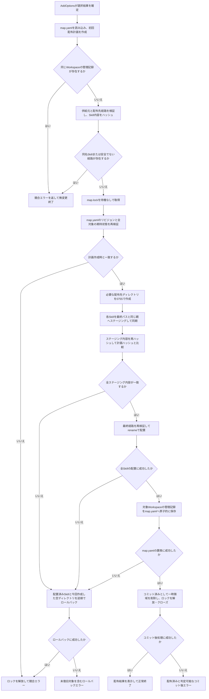
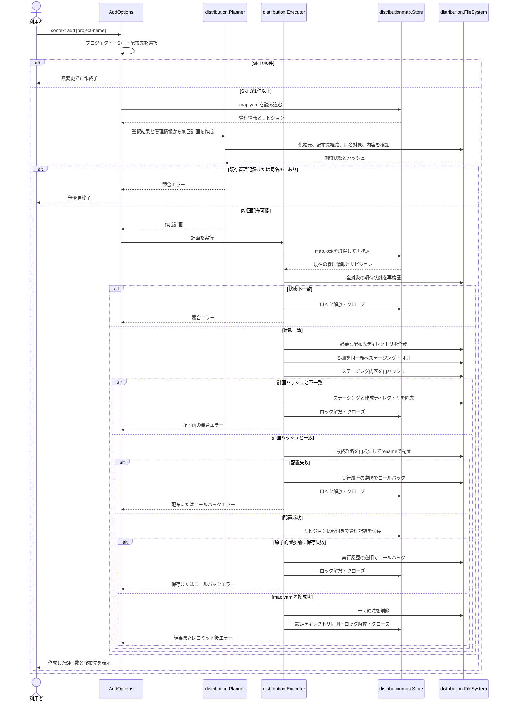

# Skillを安全に配布して管理情報を保存する

- **ステータス**: 完了 (Completed)
- **対象ストーリー**: ST-001, ST-002, ST-003（初回記録のみ）, ST-006

## 1. 処理フローチャート (Flowchart)



タスク02は初回配布だけを扱う。同じWorkspaceの管理記録、または配布予定先の同名Skillが既に存在する場合は上書き確認を行わず、判定可能な競合エラーとして一切変更しない。再実行、選択解除、配布先変更はタスク03、プロジェクト変更はタスク04、競合承認とローカル編集保護はタスク05で実装する。

Skillが0件の選択結果では配布先と管理情報を作成せず、正常終了する。

## 2. シーケンス図 (Sequence Diagram)



## 3. ファイル配置・責務定義

- `[MODIFY]` `internal/distribution/model.go`: 初回配布に必要な管理記録、リビジョン、経路構成要素を含む対象期待状態、作成操作、計画、結果、トランザクションポートの型を追加する。後続タスクで置換・削除操作を拡張できる形にするが、未使用の動作は先行実装しない。
- `[NEW]` `internal/distribution/hash.go`: Skillディレクトリを名前順で安全に走査し、相対パス、種別、通常ファイル内容、所有者権限からSHA-256を計算する。シンボリックリンクと未対応ファイル種別を拒否する。
- `[NEW]` `internal/distribution/filesystem.go`: 配布元・配布先の `Lstat` 検証、再帰コピー、権限維持、同期、同一親ディレクトリ内のステージングとrename、作成済み対象の除去を提供する最小境界とOS実装を定義する。
- `[NEW]` `internal/distribution/planner.go`: 選択結果、管理情報、配布先の現在状態から初回作成計画を構築する。同じWorkspaceの既存記録、同名Skill、安全でない経路、供給元の変化を競合または構造エラーとして拒否する。ファイルシステムルートから最終配布対象まで、およびContext Repositoryルートから選択Skillまでの各構成要素について、不在または実ディレクトリ・通常ファイルであること、権限、既存要素のデバイス番号とinodeを期待状態として固定する。
- `[NEW]` `internal/distribution/executor.go`: ロック下での再検証、必要ディレクトリの作成、全Skillのステージング、配置、管理情報コミット、逆順ロールバック、コミット前後の後処理を統括する。
- `[NEW]` `internal/distribution/error.go`: 構造不正、安全性違反、競合、I/O、ロック、ロールバック失敗、コミット後失敗を `errors.Is` / `errors.As` で判定可能にする。
- `[NEW]` `internal/distribution/hash_test.go`: ハッシュの決定性、内容・階層・権限差分、シンボリックリンク、特殊ファイル拒否を検証する。
- `[NEW]` `internal/distribution/planner_test.go`: Codexのみ、Claudeのみ、両方、複数Skill、同名Skill、既存管理記録、安全でない配布先経路、供給元変化を検証する。
- `[NEW]` `internal/distribution/executor_test.go`: 初回作成、ディレクトリ作成、ステージング、複数対象配置、各失敗地点のロールバック、管理情報の保存失敗、ロールバック失敗、コミット後失敗を失敗注入で検証する。
- `[NEW]` `internal/distributionmap/schema.go`: `schema_version: 1` とWorkspace別のプロジェクト、Skill供給元、配布先、配置先相対パス、配布時ハッシュを表す厳格なYAMLスキーマを定義する。
- `[NEW]` `internal/distributionmap/store.go`: `map.yaml` の安全な探索・読込、正規化内容のリビジョン生成、`map.lock` の待機なし取得、ロック下再読込、期待リビジョン付き初回記録保存、`0600` 一時ファイルによる原子的置換を実装する。
- `[NEW]` `internal/distributionmap/error.go`: スキーマ、権限、シンボリックリンク、ロック、比較更新、I/O、コミット後処理のエラー分類を定義する。
- `[NEW]` `internal/distributionmap/schema_test.go`: 未対応バージョン、未知フィールド、不正Workspace絶対パス、不正な相対配置先、重複Skill、不正供給元・配布先・ハッシュを拒否する。
- `[NEW]` `internal/distributionmap/store_test.go`: 未作成状態、空リビジョン、読込、厳格な権限・リンク検証、ロック競合、比較更新、複数Workspace保持、原子的保存、各後処理失敗を検証する。
- `[MODIFY]` `pkg/cmd/factory.go`: `distribution.Planner`、`distribution.Executor`、`distributionmap.Store` を生成する依存をFactoryへ追加する。
- `[MODIFY]` `pkg/cmd/add.go`: 選択確定後に管理情報を読み込み、計画作成と実行を呼び出し、結果を `IOOut` へ表示する。Skillが0件なら永続化依存を呼ばず終了する。
- `[MODIFY]` `pkg/cmd/add_test.go`: `AddOptions.Run` を直接呼び、選択結果からPlanner・Executorへ渡す値、Skill 0件の無変更、競合、ロック、ロールバック、コミット後エラー、成功出力を検証する。
- `[MODIFY]` `pkg/cmd/root.go`: `NewCmdAdd` をルートコマンドへ登録する。
- `[MODIFY]` `pkg/cmd/root_test.go`: `add` サブコマンドが登録されることを検証する。
- `[NEW]` `test/e2e/add_test.go`: 実バイナリと隔離したContext Repository、Workspace、`XDG_CONFIG_HOME` を使用し、Codex、Claude、両方への初回配布と `map.yaml` 保存、同名Skill拒否を検証する。
- `[MODIFY]` `test/e2e/harness_test.go`: 子プロセスの作業ディレクトリ指定と、`github.com/creack/pty` で実huh対話を操作するmacOS/Linux共通の擬似TTY基盤を追加する。固定sleepではなく、期待するプロンプト文字列の出力を待ってキー入力する。
- `[MODIFY]` `test/e2e/README.md`: タスク02で実装する初回配布シナリオ、事前条件、対話入力、期待結果、テスト名、実行方法を記載する。
- `[MODIFY]` `go.mod`: E2Eテストの擬似TTY制御に `github.com/creack/pty` を追加する。
- `[MODIFY]` `go.sum`: 追加したPTY依存のチェックサムを記録する。

`internal/distribution` が配布トランザクションのポートとドメイン型を所有し、`internal/distributionmap` はその永続化アダプターとして一方向に依存する。`pkg/cmd` はFactoryから両者を受け取り、対話と結果表示だけを制御する。

### 初回管理情報

管理情報はWorkspaceの字句的に正規化した絶対パスをキーとし、少なくとも次を保持する。

```yaml
schema_version: 1
workspaces:
  /absolute/workspace:
    project: example
    destinations:
      - codex
    skills:
      - name: project-skill
        source: project
        destination: codex
        relative_path: .codex/skills/project-skill
        hash: <64桁の小文字SHA-256>
```

Skillと配布先の組み合わせごとに記録を持ち、名前、配布先、相対配置先の順で正規化する。Skill記録の一意キーは `(name, destination)` とし、同じSkill名をCodexとClaudeへ1件ずつ記録することは許可するが、同じ名前・同じ配布先の重複は拒否する。Workspace直下の `destinations` はSkill記録に含まれる配布先の重複なし集合と完全一致しなければならない。リビジョンは正規化済み管理情報全体のSHA-256とし、未作成状態はハッシュ値と衝突しない専用値で表す。

### ハッシュ正規化形式

Skillルート自身を `.` として含め、配下の実ディレクトリと通常ファイルを `/` 区切りの相対パス順で処理する。SHA-256への入力は次の長さ付きバイナリレコードとし、単純な文字列連結はしない。

```text
固定ヘッダー "context-skill-hash-v1\0"
各エントリ:
  種別 1 byte                         # 0x01: directory, 0x02: regular file
  相対パス長 unsigned 64-bit big-endian
  UTF-8相対パス
  mode.Perm() unsigned 32-bit big-endian
  内容長 unsigned 64-bit big-endian   # directoryは0
  ファイル内容                         # directoryはなし
```

相対パスは `filepath.ToSlash` で正規化し、`.` を除く空パス、`..`、絶対パス、重複パスを拒否する。権限は特殊ビットを除く `mode.Perm()` をコピーとハッシュの双方で使用する。ルートと空ディレクトリもレコード化し、ファイル名や内容の境界が異なる構造を同一入力にしない。

### 管理情報トランザクションポート

`internal/distribution` は永続化実装に依存しない次の意味のポートを所有する。実際のGo名はこの契約を維持する範囲で調整できる。

```go
type MapStore interface {
    Load() (MapSnapshot, error)
    Begin(expected Revision) (MapTransaction, MapSnapshot, error)
}

type MapTransaction interface {
    Commit(workspace WorkspaceRecord) (CommitResult, error)
    Close() error
}

type CommitResult struct {
    Committed bool
}
```

- `Begin` は待機なしで `map.lock` を取得し、ロック下で再読込したリビジョンを `expected` と比較する。不一致ならトランザクションを返さず競合エラーにする。
- `Commit` は対象Workspaceだけを追加し、他Workspaceの記録を保持する。`map.yaml` へのrename成功時点で `Committed=true` とし、その後の設定ディレクトリ同期失敗をエラーと併記する。
- Executorは `CommitResult.Committed` または `errors.Is(err, ErrCommitted)` でコミット済みを判定できる。コミット済みなら配布先をロールバックしない。
- `Close` は成否とコミット状態にかかわらずunlockとロックファイルcloseを両方試行し、複合エラーを返す。
- Executorは主処理エラー、Commitエラー、Closeエラーを結合して保持する。主処理失敗時のClose失敗は主処理分類を失わせず、コミット後のClose失敗はコミット後エラーとして返す。

### 経路期待状態

Plannerは各配布先について、ファイルシステムルートからWorkspace、`.codex` / `.claude`、`skills`、最終Skillパスまでの各構成要素を順番付きで計画へ保持する。さらに、Context Repositoryルートから `projects/<project>/skills/<skill>` または `utils/skills/<skill>` までの供給元の構成要素も同じ形式で保持する。

- 既存要素: `Lstat` でシンボリックリンクでない期待種別であること、`mode.Perm()`、デバイス番号、inodeを記録する。
- 不在要素: 不在を期待状態として記録する。
- 最終Skillパス: 初回配布では不在だけを許可する。
- Executorはロック取得後、ディレクトリ作成前に配布先と供給元の全構成要素を再検証する。
- ディレクトリ作成直後にも `Lstat` し、実ディレクトリ、非リンク、権限 `0755` を確認してから履歴へ記録する。
- 作成済み親経路が計画後にリンク、通常ファイル、権限違反、または別inodeへ変わった場合は、配置前の競合エラーとして終了する。
- 全ステージング完了後、最初のrename直前にステージング内容を計画と同じ方式で再ハッシュする。不一致なら最終配置を開始せず、ステージングと今回作成した空ディレクトリだけを除去して競合エラーにする。

### トランザクション境界

- 対話中はロックを取得しない。
- Plannerは供給元と配布先の期待状態を計画へ固定する。
- Executorは `map.lock` 取得後に管理情報リビジョン、供給元ハッシュ、Workspaceから最終対象までの全経路の期待状態を再検証する。
- 全新規Skillのステージングが完了するまで最終配置を開始しない。
- ステージング内容の再ハッシュと最終経路の再検証が成功するまでrenameを開始しない。
- `map.yaml` の原子的な置換の成功をコミット点とする。
- コミット前失敗では配布先を逆順で復元する。
- コミット後失敗では配布先を戻さず、更新済みであることを判定可能なエラーを返す。
- ロールバックは今回作成した対象だけを除去し、既存対象には触れない。
- `Commit` と `Close` の双方が失敗してもコミット状態と主エラーを保持し、コミット済みならロールバックしない。

## 4. 実装チェックリスト

- [x] 配布モデル、型付きエラー、トランザクションポートのテストを作成する
- [x] Skill内容ハッシュと安全な再帰走査のテスト・実装を追加する
- [x] 初回配布Plannerのテスト・実装を追加する
- [x] ステージング、配置、ロールバックを行うExecutorのテスト・実装を追加する
- [x] `map.yaml` スキーマとStoreのテスト・実装を追加する
- [x] FactoryとAddOptionsへ配布・永続化依存を接続する
- [x] `context add` をルートコマンドへ登録する
- [x] 実バイナリの初回配布E2Eテストとシナリオ文書を追加する
- [x] gofmt、go vet、golangci-lint、govulncheck、go testを実行する

## 5. テスト・検証計画

- **単体テスト**: `internal/distribution/hash_test.go` で決定的ハッシュ、安全な走査、空ファイル、空ディレクトリ、パス区切り正規化、名前と内容の境界が異なる構造の識別を検証する。`planner_test.go` で初回作成計画と無変更競合を検証する。`executor_test.go` ではファイルシステムと管理情報トランザクションを失敗注入可能なモックへ差し替え、各操作順、逆順ロールバック、コミット境界を検証する。
- **経路再検証テスト**: 計画後にファイルシステムルートからWorkspaceまで、Workspace配下、Context Repositoryから供給元Skillまでの各親経路をシンボリックリンク、通常ファイル、権限違反、または別inodeの実ディレクトリへ変更し、配置前の競合として無変更終了することを確認する。同一inodeを指すシンボリックリンクへの置換も拒否する。不在だった経路の作成直後に期待外の種別・権限となる失敗も注入する。
- **ステージング再検証テスト**: コピー中に供給元内容を変更した場合と、コピー完了後にステージング内容を改変した場合に、計画ハッシュとの不一致を検出し、最終パスへ1件も配置せずクリーンアップすることを確認する。
- **管理情報テスト**: `internal/distributionmap/schema_test.go` と `store_test.go` で厳格YAML、空リビジョン、複数Workspace保持、`0700` / `0600`、シンボリックリンク拒否、待機なしロック、比較更新、原子的置換、同期・クローズ失敗を検証する。`(name, destination)` の重複を拒否し、同名SkillのCodex・Claude各1件を許可し、`destinations` とSkill記録の配布先集合の不一致を拒否する。特に「保存成功＋unlock失敗」「rename成功＋設定ディレクトリsync失敗」「主処理失敗＋unlock/close失敗」でコミット状態と主エラーが保持されることを確認する。
- **CLI単体テスト**: Cobraを経由せず `AddOptions.Run` を呼び、PlannerとExecutorへの値、Skill 0件時の依存未呼出し、成功出力、各分類エラーの伝播を検証する。`root_test.go` では `add` 登録だけを確認する。
- **E2Eテスト**: `go test ./test/e2e -run TestAdd` で実バイナリを `github.com/creack/pty` の擬似TTY上に起動し、プロジェクト固有Skill、共通Skill、同名候補優先、Codexのみ、Claudeのみ、両方、複数ファイルと実行権限、`map.yaml` の内容と権限、同名既存Skillの無変更拒否を確認する。ハーネスはプロンプト文字列をタイムアウト付きで待ってからキー入力し、ANSI出力を許容して照合し、PTYを必ず閉じて子プロセスを回収する。固定端末サイズを設定し、macOS/Linuxで同じ操作列を使用する。
- **ロールバック検証**: ディレクトリ作成、ステージングコピー、ファイル同期、rename、管理情報一時ファイル作成・書込・同期・renameの各地点へ失敗を注入し、ロールバック成功時にWorkspaceと `map.yaml` が開始前状態であることを確認する。ロールバック失敗時は未復旧の安全な相対対象を専用エラーから取得できることを確認する。
- **品質ゲート**: `gofmt`、`go vet ./...`、`golangci-lint run`、`govulncheck ./...`、`go test ./...` をすべて成功させる。

## 後続タスクとの境界

- タスク03: 既存管理記録から初期選択を復元し、Skill追加・解除・配布先変更を計画する。
- タスク04: 同じWorkspaceを別プロジェクトへ切り替え、旧プロジェクト由来の管理対象を置換する。
- タスク05: 未管理の同名Skillとローカル編集を一覧表示し、明示承認後に置換または削除する。

ST-003のうち、スキーマ、初回記録保存、リビジョン、他Workspace記録の保持までをタスク02で実装する。既存Workspace記録の更新・削除ポートはタスク03で追加し、タスク02の初回追加APIは既存記録を更新しない。

## 6. 実変更・検証結果

### 実変更

- `internal/distribution` に配布モデル、型付きエラー、決定的ハッシュ、経路期待状態、初回Planner、ステージング・rename・逆順ロールバックを行うExecutorとOSファイルシステム実装を追加した。
- `internal/distributionmap` に厳格な`schema_version: 1`、正規化リビジョン、`0700` / `0600`、シンボリックリンク拒否、待機なし`map.lock`、原子的な初回記録保存を追加した。
- `pkg/cmd` のFactory DI、`AddOptions.Run`、ルートコマンドを接続し、Skill 0件時は管理情報依存を呼ばず、成功時は作成件数と配布先を表示するようにした。
- `test/e2e` に固定端末サイズのPTYハーネスと、Codex・Claude双方への初回配布、共通Skill、実行権限、`map.yaml`、未管理同名Skill拒否の実バイナリテストを追加した。
- `github.com/creack/pty v1.1.24` を直接依存へ追加した。チェックサムは既存`go.sum`に記録済みだったため`go.sum`の変更は発生しなかった。

### 検証結果

- `gofmt`: プロジェクト管理下のGoファイルに未整形なし。
- `go vet ./...`: 成功。
- `golangci-lint run`: 成功、`0 issues`。
- `govulncheck ./...`: 成功。呼び出し可能な脆弱性`0`。
- `go test ./...`: 成功、`230 passed in 10 packages`。
- `go test ./test/e2e -run TestAdd -v`: 成功、`2 passed`。
