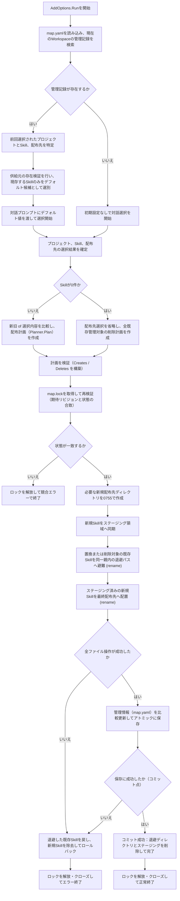
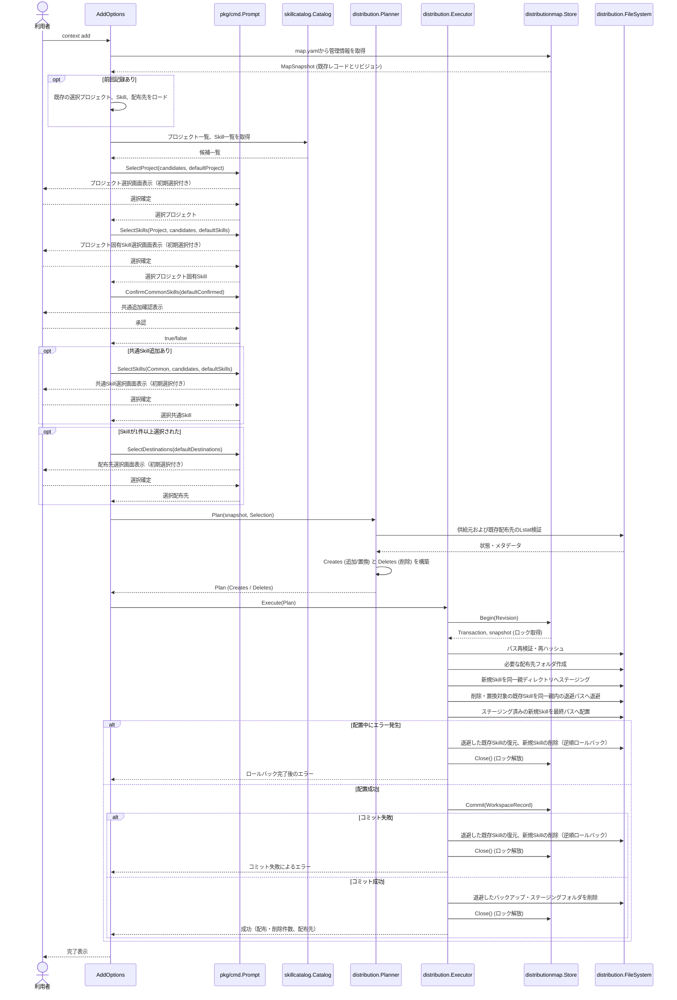

# 前回選択を復元して配布内容を更新する

- **ステータス**: 完了 (Completed)
- **対象ストーリー**: ST-003, ST-006

## 1. 処理フローチャート (Flowchart)



## 2. シーケンス図 (Sequence Diagram)



## 3. ファイル配置・責務定義

### internal/distribution

- **[MODIFY] [model.go](file:///Users/yukihito/Documents/github_projects/context-cli/internal/distribution/model.go)**
  - `DeleteOperation` 構造体を新規追加する。
    ```go
    type DeleteOperation struct {
        Name             string
        Destination      Destination
        RelativePath     string
        FinalPath        string
        TargetPathStates []PathExpectation // ロック下での検証用
    }
    ```
  - `Plan` 構造体に `Deletes []DeleteOperation` スライスを追加する。

- **[MODIFY] [planner.go](file:///Users/yukihito/Documents/github_projects/context-cli/internal/distribution/planner.go)**
  - 既存レコードが存在する場合の `ErrManaged` による即時エラー返却を削除する。
  - 現在の選択結果（`Selection`）と前回の管理情報（`WorkspaceRecord`）を比較し、新旧の差分から `Creates` (新規追加および更新) と `Deletes` (削除) を算出する。
    - `Selection` にあり `WorkspaceRecord` にない、またはハッシュ値が異なるSkill $\rightarrow$ `CreateOperation`
    - `WorkspaceRecord` に存在し、今回の `Selection.Skills` または `Selection.Destinations` から外れたSkill $\rightarrow$ `DeleteOperation`
  - `Deletes` に追加する各要素について、ファイルシステム上の `TargetPathStates`（既存Skillの実在・メタデータ情報）を `Inspect` で収集し固定する。
  - `validateSelection` を拡張し、`Skills` が0件の場合は `Destinations` が0件であることを許容する（すべて削除されるケース）。

- **[MODIFY] [executor.go](file:///Users/yukihito/Documents/github_projects/context-cli/internal/distribution/executor.go)**
  - 削除対象の検証、退避、およびロールバックとコミット時の破棄処理を追加する。
  - `Execute`:
    1. `revalidatePlan`: 削除対象（`Deletes`）の既存パスメタデータ（`TargetPathStates`）も再検証する。
    2. `backupAll`: `Deletes` と `Creates` (置換対象) に含まれる既存Skillディレクトリを、同一の親ディレクトリ内に衝突しない名前（例: `.context-backup-*`）で一時的に `rename` 退避する。
    3. `stageAll`: 通常通り新規Skillをステージング。
    4. `placeAll`: ステージングしたフォルダを最終パスに `rename` 配置。
    5. `Commit`: 管理情報を保存。
    6. **コミット成功後**: 退避ディレクトリとステージングディレクトリを `RemoveAll` で破棄する。
    7. **エラー発生時（ロールバック）**:
       - 新規配置したSkillを `RemoveAll` で削除。
       - 退避ディレクトリから元の最終パスへ `rename` で復元。
       - ロールバックが成功した場合のみ一時領域を削除。

### internal/distributionmap

- **[MODIFY] [store.go](file:///Users/yukihito/Documents/github_projects/context-cli/internal/distributionmap/store.go)**
  - `Commit` メソッドで、既存Workspaceレコードの有無による競合チェック（`ErrConflict`）を削除し、常に最新のレコードでマップを上書きするように変更する。
  - もし `len(workspace.Skills) == 0`（すべてのSkillが解除された）の場合は、マップからそのWorkspaceレコードのキーを削除（`delete`）して `map.yaml` をアトミックに保存する。

### pkg/cmd

- **[MODIFY] [prompt.go](file:///Users/yukihito/Documents/github_projects/context-cli/pkg/cmd/prompt.go)**
  - `Prompt` インターフェースのシグネチャを以下のように拡張し、初期選択値を渡せるようにする。
    ```go
    type Prompt interface {
        SelectProject(candidates []skillcatalog.Candidate, defaultName string) (skillcatalog.Candidate, error)
        SelectSkills(kind SkillKind, candidates []skillcatalog.Candidate, defaultNames []string) ([]skillcatalog.Candidate, error)
        ConfirmCommonSkills(defaultConfirmed bool) (bool, error)
        SelectDestinations(defaultDestinations []distribution.Destination) ([]distribution.Destination, error)
    }
    ```
  - `huhPrompt` アダプターの実装で、引数に渡されたデフォルト値に一致する項目を `huh` の各フィールドのValueや初期値へ設定する。
    - `SelectProject`: `huh.NewSelect` の初期値
    - `SelectSkills`: `huh.NewMultiSelect` の初期選択値 (`Value` に指定するスライスの初期要素として設定)
    - `ConfirmCommonSkills`: `huh.NewConfirm` のデフォルト可否
    - `SelectDestinations`: `huh.NewMultiSelect` の初期選択値

- **[MODIFY] [add.go](file:///Users/yukihito/Documents/github_projects/context-cli/pkg/cmd/add.go)**
  - `Run` メソッドの開始時に `MapStore.Load()` で現在の管理Snapshotを読み込む。
  - Workspaceがすでに存在する場合は、前回選択情報を抽出する：
    - 前回プロジェクト名
    - 前回選択Skill名（プロジェクト固有、共通それぞれ）
    - 前回配布先（`destinations`）
  - 抽出した情報と、Catalogから現存していることが確認できた項目だけを抽出し、`Prompt` メソッドの引数へ初期値として引き渡す（消失したSkillは初期選択から除外する）。

## 4. 実装チェックリスト

- [x] `Prompt` インターフェースのデフォルト選択対応と `huhPrompt` 実装・テストof修正
- [x] `distribution.Plan` および `DeleteOperation` モデル定義の追加
- [x] `Planner` における差分抽出（Creates/Deletes）のロジック実装と単体テスト作成
- [x] `Executor` での削除検証、既存フォルダ退避・復元（ロールバック）ロジックの実装と失敗注入テスト作成
- [x] `Store.Commit` におけるレコード上書きおよび空Skillレコード時のWorkspace削除ロジックの実装とテスト
- [x] `AddOptions.Run` での `map.yaml` 読み込みと対話UIデフォルト値引き渡し処理の実装
- [x] CLI単体テスト (`add_test.go`) で前回選択の復元、削除処理、初期化処理の検証ケースを追加
- [x] E2Eテストへの追加シナリオ接続（再実行による追加、解除、削除）の検証

## 5. テスト・検証計画

### 単体テスト対象

- **`Planner`**:
  - 既存管理情報がある中で、一部のSkillを解除した際に正しい `Deletes` が生成されること。
  - 既存配布先（Destination）を外した際に、その配布先上のすべてのSkillが `Deletes` に並ぶこと。
  - 供給元から消失したSkillが計画時点で検知され、初期選択から漏れ、かつ削除計画に入ることを検証。
- **`Executor`**:
  - `Deletes` に対する退避（backup）およびコミット成功時の破棄が正しく動作すること。
  - コミット前失敗（管理情報の保存失敗など）が発生した際に、退避フォルダから元の配置先へ正しく復旧（ロールバック）すること。
- **`Store`**:
  - 空のSkill選択時に、マップからWorkspaceレコードが完全に消え、`map.yaml` のファイルサイズが減少・正常保存されること。

### E2E/結合テスト方法

- `go test ./test/e2e -run TestAdd` を拡張し、以下の再実行シナリオを追加：
  1. 初回配布の成功（Skill A, Bを配布）
  2. 再度 `context add` を実行し、前回選択が初期値として再現されていることを確認。Skill Bを解除し、Skill Cを追加。
  3. 完了後、配置先でSkill Bが削除され、Skill Cが新たに配置されていること、`map.yaml` の記録が更新されていることを検証。
  4. さらにすべてのSkillを解除して再実行し、配置先のすべてのSkillが削除され、`map.yaml` 内のWorkspaceレコードが削除されることを検証。
