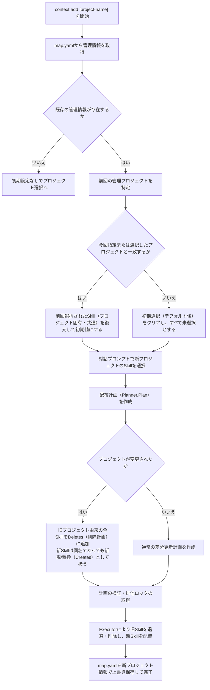
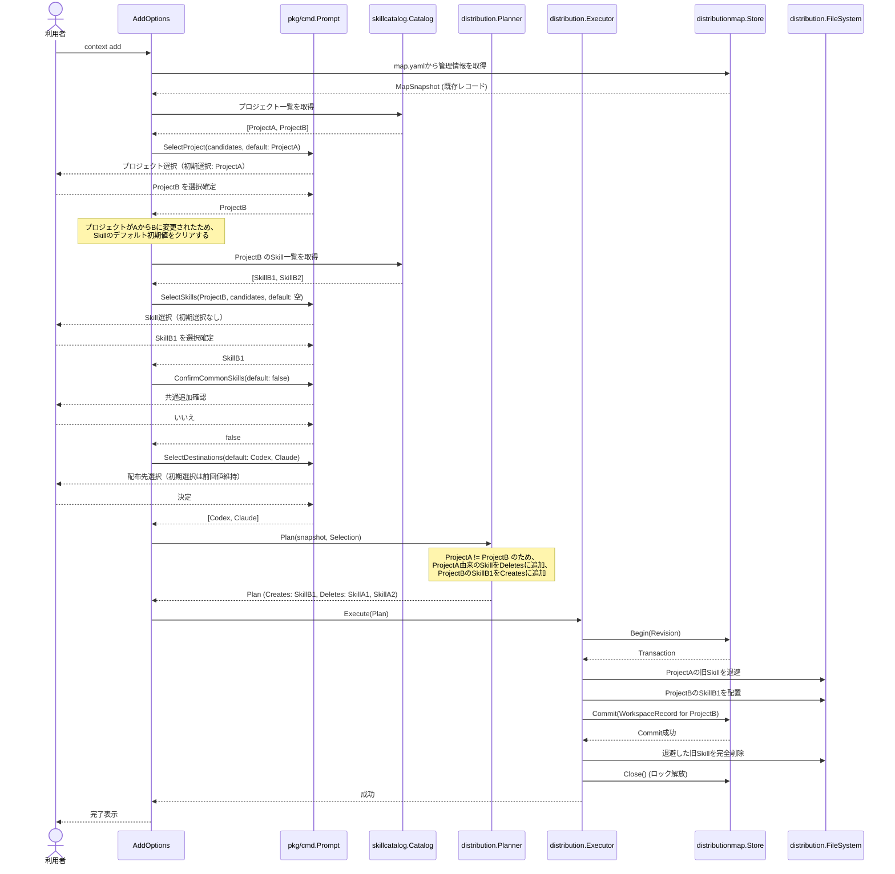

# 管理対象のプロジェクトを切り替える

- **ステータス**: 完了 (Completed)
- **対象ストーリー**: ST-004, ST-006

## 1. 処理フローチャート (Flowchart)

## 2. シーケンス図 (Sequence Diagram)

## 3. ファイル配置・責務定義

本タスクのビジネスロジックはすでに `internal/distribution/planner.go` および `pkg/cmd/add.go` に実装されている。したがって、本タスクでの主な変更は検証用テストコードの追加である。

### テストコード

- **[MODIFY] [planner_test.go](file:///Users/yukihito/Documents/github_projects/context-cli/internal/distribution/planner_test.go)**
  - `TestPlannerHandlesProjectSwitch` を追加。プロジェクト変更時に、旧プロジェクトのSkillがすべて `Deletes` に分類され、新しいプロジェクトのSkillが `Creates` に入ることを検証する。

- **[MODIFY] [add_test.go](file:///Users/yukihito/Documents/github_projects/context-cli/pkg/cmd/add_test.go)**
  - `TestAddOptionsRunClearsDefaultSkillsOnProjectSwitch` を追加。前回のプロジェクトと異なるプロジェクトが対話UIで選択された際に、Skill選択プロンプトに渡される初期選択値（`defaultNames`）が空であることをモックプロンプト経由で検証する。

- **[MODIFY] [add_test.go](file:///Users/yukihito/Documents/github_projects/context-cli/test/e2e/add_test.go)**
  - `TestAddSwitchProject` E2Eテストを新規追加。
  - プロジェクトAのSkillを配布した状態から、再度 `context add` を実行してプロジェクトBに切り替えた際、配布先の旧Skillがすべて消去され新Skillのみが配置されること、および `map.yaml` が更新されることを実端末対話プロセスを起動して検証する。

## 4. 実装チェックリスト

- [x] プロジェクト切り替え時のビジネスロジックの実装状況（`planner.go`, `add.go`）のコード確認
- [x] `Planner` 単体テストへのプロジェクト切り替え検証ケースの追加とパス
- [x] CLI単体テスト (`add_test.go`) への初期選択クリア検証ケースの追加とパス
- [x] E2Eテストへのプロジェクト切り替え検証ケースの追加とパス
- [x] 品質ゲートの実行（`golangci-lint run`, `go test ./...`）

## 5. テスト・検証計画

### E2E/結合テスト方法

- `go test -v ./test/e2e -run TestAddSwitchProject` を実行し、以下のシナリオを検証する：
  1. プロジェクトA의 Skill（例: `project-skill`）と共通Skill（例: `common-skill`）をCodex/Claudeへ配布。
  2. 再度 `context add` を実行し、対話プロンプトで別プロジェクトB（例: `project-b`）を選択。
  3. Skill選択プロンプトで初期チェックが外れていることを確認し、プロジェクトBのSkillを選択して決定。
  4. 完了後、配置先でプロジェクトAのSkillおよび前回の共通Skillが削除され、プロジェクトBのSkillのみが配置されていること、`map.yaml` の記録がプロジェクトBへ更新されていることを検証。

### 単体テスト対象

- **`Planner`**: プロジェクト切り替え時に、前回のSkillレコードが同一名の別Skillであっても `Deletes` と `Creates` の両方に正しく算出されること。
- **`AddOptions`**: プロジェクトが変更された場合に、`selectAllSkills` がプロンプト呼び出し時に渡すデフォルトSkill名のスライスを空にすること。
