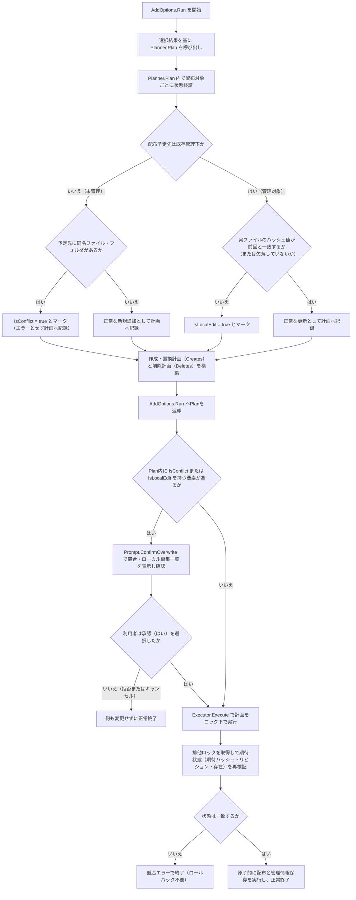
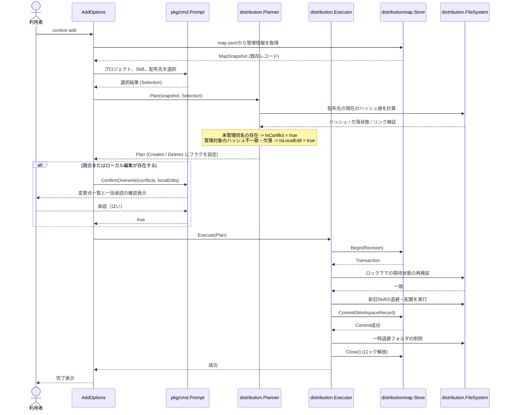

# 競合とローカル編集を保護する

- **ステータス**: 完了 (Completed)
- **対象ストーリー**: ST-005, ST-006

## 1. 処理フローチャート (Flowchart)

## 2. シーケンス図 (Sequence Diagram)

## 3. ファイル配置・責務定義

### internal/distribution

- **[MODIFY] [model.go](file:///Users/yukihito/Documents/github_projects/context-cli/internal/distribution/model.go)**
  - `CreateOperation` 構造体に `IsConflict bool` および `IsLocalEdit bool` フィールドを追加。
  - `DeleteOperation` 構造体に `IsLocalEdit bool` フィールドを追加。

- **[MODIFY] [planner.go](file:///Users/yukihito/Documents/github_projects/context-cli/internal/distribution/planner.go)**
  - `Plan` メソッドにおける `ErrConflict` による即時エラー返却ロジックを削除。
  - `fileSystem.HashSkill` を用いて、配布予定先に存在する実ファイルのハッシュ値と、前回の配布記録上のハッシュ値を比較し、不一致または欠落がある場合に `IsLocalEdit` を `true` に設定する。
  - 未管理の同名フォルダが存在する場合に `IsConflict` を `true` に設定する。
  - `Deletes` 計画構築ループ内においても、ディスク上の実ファイルの状態を検証し、前回のハッシュと異なる、あるいは欠落している場合に `DeleteOperation.IsLocalEdit` を `true` に設定する。

- **[MODIFY] [planner_test.go](file:///Users/yukihito/Documents/github_projects/context-cli/internal/distribution/planner_test.go)**
  - `TestPlannerDetectsConflictsAndLocalEdits` を追加。未管理の同名Skillが存在する場合に `IsConflict` が、ローカルでの変更・欠落がある場合に `IsLocalEdit` が正しく検出され、エラーにならず計画が返ることを検証する。

### pkg/cmd

- **[MODIFY] [prompt.go](file:///Users/yukihito/Documents/github_projects/context-cli/pkg/cmd/prompt.go)**
  - `Prompt` インターフェースに `ConfirmOverwrite(conflicts []string, localEdits []string) (bool, error)` を追加。
  - `huhPrompt` で `ConfirmOverwrite` メソッドを実装。`huh.NewConfirm` を用いて、衝突または変更のあるパスを一覧表示し、初期選択を「いいえ」（拒否）とした一括承認を求める。

- **[MODIFY] [add.go](file:///Users/yukihito/Documents/github_projects/context-cli/pkg/cmd/add.go)**
  - `Planner` から計画を受け取った後、`Creates` および `Deletes` 内に `IsConflict` または `IsLocalEdit` が設定された要素があるかスキャンする。
  - 該当要素がある場合、`Prompt.ConfirmOverwrite` を呼び出す。
  - ユーザーが承認しなかった場合（「いいえ」の選択、または対話キャンセル時）は、変更を適用せず正常終了（`return nil`）とする。

- **[MODIFY] [add_test.go](file:///Users/yukihito/Documents/github_projects/context-cli/pkg/cmd/add_test.go)**
  - `stubPrompt` に `ConfirmOverwrite` メソッドの実装を追加。
  - `TestAddOptionsRunPromptsForConflictsAndLocalEdits` を追加。モックプロンプトとMapStoreを用いて、競合やローカル編集が検出された際の承認・拒否に伴う実行可否、およびキャンセル時の無変更終了を検証する。

### test/e2e

- **[MODIFY] [add_test.go](file:///Users/yukihito/Documents/github_projects/context-cli/test/e2e/add_test.go)**
  - `TestAddProtectsConflictsAndLocalEdits` を追加。未管理の同名Skillがある場合の一括承認/拒否、およびローカル編集がある場合の一括承認/拒否のシナリオを、実端末対話プロセスを起動して検証する。

## 4. 実装チェックリスト

- [x] `model.go` へのフラグフィールド追加
- [x] `Planner` での競合・ローカル編集・欠落の検出ロジックの実装と単体テストのパス
- [x] `Prompt` への `ConfirmOverwrite` の追加と `huhPrompt` 実装の修正
- [x] `add.go` での承認フロー接続の実装とCLI単体テストのパス
- [x] E2Eテストへの競合・ローカル編集保護テストケースの追加とパス
- [x] 品質ゲートの実行（`golangci-lint run`, `go test ./...`）

## 5. テスト・検証計画

### E2E/結合テスト方法

- `go test -v ./test/e2e -run TestAddProtectsConflictsAndLocalEdits` を実行し、以下のシナリオを検証する：
  1. **未管理競合（拒否）**: 配布予定先に未管理の同名Skillが存在する状態で `context add` を実行。競合警告画面が表示されることを確認し、「いいえ」を選択。exitCode == 0で、配布先および `map.yaml` が変更されないことを検証。
  2. **未管理競合（承認）**: 同様の状態で実行し、競合警告に「はい」を選択。正常に上書き配布され、`map.yaml` が更新されることを検証。
  3. **ローカル編集（拒否）**: 配布済みSkillのファイルをローカル編集した状態で `context add` を実行。変更警告が表示されることを確認し、「いいえ」を選択。配布先が元の編集状態を維持していること、および `map.yaml` が変更されないことを検証。
  4. **ローカル編集（承認）**: 同様の状態で実行し、「はい」を選択。正常に新Skillで上書き再配布され、`map.yaml` が更新されることを検証。

### 単体テスト対象

- **`Planner`**: 衝突、ローカル編集、および欠落が検出されたときに、即時エラーではなく対応するフラグが `true` に設定された計画が正しく生成されること。
- **`AddOptions`**: 競合が検出された場合に `ConfirmOverwrite` が呼び出され、承認されたときのみ `Executor` が実行されること。
