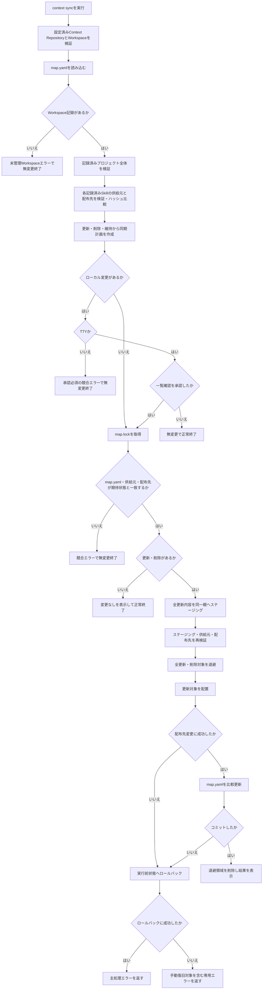
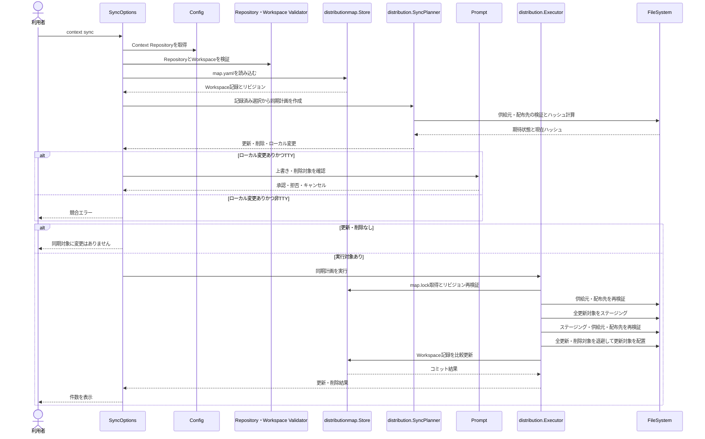

# 選択済みSkillの同期

仕様書IDはspec-004-sync-skillsである。

## ゴール

`context sync` で、カレントディレクトリに選択済みのSkillだけをContext Repositoryの現在の内容へ安全に更新し、供給元から消失したSkillを安全に削除できるようにする。

## 課題

複数の開発リポジトリでAIコーディングエージェントを利用する個人開発者は、`context add` で配布したSkillの正本が更新された後、配布先を手作業で再コピーする必要がある。この作業では更新漏れ、選択していないSkillの追加、ローカル編集の意図しない上書き、正本から削除されたSkillの残存が発生する。

## 対象ユーザー

ローカルのContext Repositoryを設定済みで、`context add` によりカレントディレクトリへSkillを配布済みの個人開発者。

## ユーザー価値

配布済みの選択内容を変更せずに、正本の更新と削除だけをカレントディレクトリへ反映できる。ローカル編集がある場合は明示的な承認なしに上書きまたは削除されないため、安全に繰り返し同期できる。

## 成功指標

- 指標: 選択済みSkillだけがContext Repositoryの現在内容へ同期される
  - 評価方法: プロジェクト固有Skill、共通Skill、Codexのみ、Claudeのみ、両方の配布先について、更新対象と未選択対象をE2Eテストで確認する
  - 観測時期: 実装完了時
- 指標: Context Repositoryから消失した選択済みSkillが管理情報と配布先から削除される
  - 評価方法: プロジェクト固有Skillと共通Skillの消失を単体テストとE2Eテストで確認する
  - 観測時期: 実装完了時
- 指標: ローカル編集を明示的な承認なしに上書きまたは削除しない
  - 評価方法: TTYでの承認、拒否、キャンセルと、非TTYでの停止を単体テストとE2Eテストで確認する
  - 観測時期: 実装完了時
- 指標: 同期処理の失敗後、ロールバックが成功した場合は開始前の状態を維持する
  - 評価方法: ステージング、退避、配置、管理情報保存の失敗を注入し、配布先と `map.yaml` の状態を確認する
  - 観測時期: 実装完了時

## スコープ

- `context sync` コマンドの追加
- 実行時のカレントディレクトリに対応する `map.yaml` のWorkspace記録の読み込み
- 記録済みプロジェクト、Skill供給元、配布先を維持した同期
- Context Repository上で有効な選択済みSkillの内容更新
- Context Repositoryから消失または無効化した選択済みSkillの配布先と管理情報からの削除
- 同期元と配布先の内容ハッシュが前回配布時から変化していない対象のスキップ
- 配布先のローカル編集、欠落、ファイル種別変更に対する上書き・削除確認
- ファイル読み込み・ハッシュ計算・ステージング時のシンボリックリンク差し替え防止
- 競合がない場合のTTYおよび非TTY実行
- 競合がある場合のTTY確認と、非TTYでの無変更エラー終了
- 更新・削除件数または差分なしを示す結果出力
- 配布計画の再検証、ステージング、退避、ロールバック、`map.yaml` の比較更新
- ローカルE2EテストとE2Eシナリオ文書の追加

## スコープ外

- Skill、プロジェクト、配布先の選択変更
- Context Repositoryに新規追加されたSkillの自動選択
- `AGENTS.md` と `CLAUDE.md` の同期
- Context Repositoryの自動クローン、`git pull`、その他のネットワークアクセス
- 配布先からContext Repositoryへの変更取り込み
- ローカル編集と正本内容の自動マージ
- 複数Workspaceの一括同期
- `--force`、`--dry-run`、JSON出力などの追加フラグ
- プロセス強制終了、OSクラッシュ、電源断からの自動復旧

## ユーザーストーリー

- ST-001: 利用者として、選択済みSkillを正本の現在内容へ一括更新したい。
- ST-002: 利用者として、正本から消失した選択済みSkillを配布先と管理情報から削除したい。
- ST-003: 利用者として、ローカル編集がある場合は内容を失う前に確認し、承認または中止したい。
- ST-004: 利用者として、同期対象に変更がないことを明確に確認したい。
- ST-005: 利用者として、同期途中に失敗しても配布先と管理情報を実行前の状態へ戻してほしい。

## 完成条件

- ST-001: `context sync` は引数とフラグを受け取らず、実行時のカレントディレクトリだけを同期対象とする。
- ST-001: `map.yaml` にカレントディレクトリのWorkspace記録が存在する場合、記録済みプロジェクト、Skill名、供給元、配布先から同期選択を再構成する。
- ST-001: 記録済みプロジェクト固有Skillは `projects/<project>/skills/<skill-name>/`、共通Skillは `utils/skills/<skill-name>/` を供給元とする。
- ST-001: 有効な供給元Skillの現在ハッシュが前回配布時ハッシュと異なる場合、記録済みの各配布先を更新対象とする。
- ST-001: 供給元ハッシュが前回配布時ハッシュと同一で、配布先も前回配布時ハッシュと同一の場合は変更対象にしない。
- ST-001: 供給元ハッシュが前回配布時ハッシュと同一である場合も、配布先が欠落しているとき、前回配布時ハッシュと異なるとき、あるいは安全なSkillディレクトリとして検証できないときはローカル変更付きの更新対象とする。
- ST-001: Context Repositoryに新規追加された未選択Skillは、候補の収集や配布はしない。
- ST-001: 同期によってプロジェクト、Skill供給元、配布先の選択を変更しない。
- ST-001: 同一SkillがCodexとClaudeの両方に記録されている場合、各配布先を更新するが、正常終了メッセージの更新件数は一意なSkill名単位で数える。
- ST-002: 基底Skillディレクトリが正常で、記録済みの個別Skillパスが存在しない場合は、そのSkillを消失した供給元として削除対象にする。
- ST-002: 個別Skillパスが実ディレクトリで、`SKILL.md` が存在しない場合は、そのSkillを無効化した供給元として削除対象にする。
- ST-002: 個別Skillパスがシンボリックリンクまたは実ディレクトリ以外の場合は削除対象にせず、判定可能なRepository構造エラーで停止する。
- ST-002: `SKILL.md` が存在するがシンボリックリンクまたは通常ファイル以外の場合は削除対象にせず、判定可能なRepository構造エラーで停止する。
- ST-002: Skill配下にシンボリックリンク、通常ファイルと実ディレクトリ以外の種別、または安全に走査できない構成要素がある場合は削除対象にせず、判定可能なRepository構造エラーで停止する。
- ST-002: 消失または無効化したSkillは、そのSkillに対応する全配布先を削除対象とし、Workspace記録からも除外する。
- ST-002: 同一Skillが複数配布先に記録されている場合、正常終了メッセージの削除件数は一意なSkill名単位で数える。
- ST-002: すべての記録済みSkillが消失した場合は全管理対象を削除し、`map.yaml` から当該Workspace記録を削除する。
- ST-002: `projects/<project>/` または `projects/<project>/skills/` が存在しない、実ディレクトリでない、または安全に検証できない場合は、プロジェクト固有Skillを一括削除せず判定可能なRepository構造エラーで停止する。
- ST-002: 共通Skillが記録されている場合、`utils/skills/` が存在しない、実ディレクトリでない、または安全に検証できない場合は、共通Skillを一括削除せず判定可能なRepository構造エラーで停止する。
- ST-002: プロジェクト固有または共通の基底Skillディレクトリが正常な場合だけ、その直下にある個別Skillディレクトリの消失または無効化を削除対象として扱う。個別Skillの削除とRepository構造の破損を区別する。
- ST-003: 更新または削除対象の配布先ハッシュが前回配布時ハッシュと異なる場合、欠落している場合、または通常のSkillディレクトリとして安全に検証できない場合はローカル変更として検出する。
- ST-003: 配布先経路または対象自身にシンボリックリンクがある場合は、確認による上書きを許可せず処理を拒否する。
- ST-003: 配布先の親経路が安全な実ディレクトリで、対象自身が通常ファイル、FIFO、ソケット、デバイスなどシンボリックリンク以外の種別へ変化している場合はローカル変更として検出する。TTYで承認された場合だけ、対象自身を同一親ディレクトリの退避パスへ `rename` して更新または削除し、失敗時は元の種別のまま復元する。
- ST-003: 配布先対象が欠落している場合はローカル変更として確認対象に含めるが、承認後の退避は行わず、更新では新しいSkillを配置し、削除では管理記録だけを除外する。
- ST-003: Context Repositoryの供給元経路またはSkill配下にシンボリックリンクや未対応ファイル種別がある場合は処理を拒否する。
- ST-003: macOSおよびLinuxでは、検証後のパス差し替えによってシンボリックリンクを追跡しないよう、取得済みディレクトリファイルディスクリプタを起点とする `openat` 系操作と `O_NOFOLLOW`、または同等にリンク追跡を拒否できるOS APIを使用して、供給元と配布先のディレクトリ走査、通常ファイル読み込み、ハッシュ計算、ステージングコピーをする。
- ST-003: 安全なファイルディスクリプタ起点の操作に切り替えた後も、各構成要素の種別と同一性を検証し、途中で差し替えを検出した場合は競合エラーとして停止する。
- ST-003: ローカル変更がなく、その他の競合もない場合はTTYを要求せず、TTYと非TTYのどちらでも同期を実行できる。
- ST-003: TTYでローカル変更を検出した場合は、上書きまたは削除する相対パスを決定的な名前順で一覧表示し、拒否を初期値とする一括確認を行う。
- ST-003: 確認を拒否またはキャンセルした場合は一切変更せず正常終了する。
- ST-003: 確認を承認した場合だけ、一覧表示したローカル変更対象を上書きまたは削除する。
- ST-003: 供給元が前回配布時から不変で配布先だけがローカル変更されている場合、TTYで承認された後は供給元の内容を再配布し、正常終了メッセージの更新件数へ含める。
- ST-003: 非TTYでローカル変更を検出した場合は、承認が必要であることを示す判定可能な競合エラーを返し、一切変更しない。
- ST-003: 計画確定後に `map.lock` を取得し、`map.yaml`、供給元、配布先の期待状態を再検証する。状態が変化していた場合は再確認や変更をせず競合エラーで終了する。
- ST-004: 更新対象と削除対象のどちらもない場合は終了コード `0` で `同期対象に変更はありません` と標準出力へ表示し、配布先と `map.yaml` を更新しない。
- ST-004: 更新または削除に成功した場合は、`<更新件数>件のSkillを更新し、<削除件数>件を削除しました` と標準出力へ表示する。
- ST-004: 更新件数または削除件数が0件の場合も同一形式で `0件` と表示する。
- ST-005: 同期開始前に、更新、削除、管理情報更新からなる計画を確定し、すべての供給元と配布先を検証する。
- ST-005: 全更新対象を最終パスと同じ親ディレクトリへ完全にステージングし、ステージング内容of再ハッシュと全供給元・配布先の期待状態の再検証が成功した後に限り、既存対象の退避を開始する。
- ST-005: 全対象の処理順は、全更新対象のステージング、全対象の再検証、全更新・削除対象の退避、更新対象の配置、`map.yaml` のコミットとする。
- ST-005: 削除対象は同じ親ディレクトリの退避パスへ `rename` し、管理情報のコミット成功後に退避領域を削除する。
- ST-005: 複数対象の退避途中で失敗した場合は、既に退避した対象を削除せず、退避履歴の逆順で元の最終パスへ復元する。
- ST-005: 配布先変更または `map.yaml` のコミット前に失敗した場合は、実行履歴の逆順で実行前状態へのロールバックを試行する。
- ST-005: `map.yaml` の原子的な置換の成功をコミット点とし、コミット後の同期、クローズ、ロック解放、退避領域削除に失敗しても配布先をロールバックしない。
- ST-005: ロールバックにも失敗した場合は、主処理エラー、復元できなかった `.codex/skills/<skill-name>` または `.claude/skills/<skill-name>` 形式の安全な相対対象、手動復旧が必要なことを判定できる専用エラーを返す。
- 全般: Context Repositoryが未設定の場合は判定可能な事前条件エラーを返し、変更しない。
- 全般: 保存済みContext Repositoryを利用時に再検証し、無効または安全でない場合は変更しない。
- 全般: カレントディレクトリを字句的に正規化した絶対パスとして検証し、存在しない、実ディレクトリでない、または安全に検証できない場合は変更しない。
- 全般: `map.yaml` にカレントディレクトリのWorkspace記録が存在しない場合は判定可能な未管理Workspaceエラーを返し、変更しない。
- 全般: `map.yaml` の未知フィールド、未対応スキーマ、不正な記録は既存の厳格検証により拒否する。
- 全般: 対話中はロックを保持せず、同期計画の承認後に `map.lock` の待機なしグローバル排他ロックを取得する。
- 全般: `map.yaml` の比較更新では対象Workspace記録だけを更新または削除し、他Workspaceの記録を保持する。
- 全般: エラーには文脈を付与し、`errors.Is` または `errors.As` で事前条件、Repository構造、未管理Workspace、競合、ローカル変更、I/O、コミット済み、ロールバック失敗を判定できる。
- 全般: ユーザー向けエラーに設定内容全体、Skill内容、不要な絶対パスを含めない。
- 品質ゲート: `gofmt`、`go vet ./...`、`golangci-lint run`、`govulncheck ./...`、`go test ./...` が成功する。

## インターフェース・入出力仕様

### CLIコマンド / 引数 / フラグ

- `context sync`
- 引数: なし。位置引数が指定された場合はCobraの引数検証エラーとする。
- フラグ: 本仕様で追加するフラグはない。

### 入力 (標準入力 / ファイル / 対話UI)

- **標準入力 (stdin)**: 通常は使用しない。TTYでローカル変更が検出された場合だけ確認入力に使用する。
- **設定ファイル**: `config.yaml` からContext Repositoryの絶対パスを読み込む。`map.yaml` からカレントディレクトリのプロジェクト、選択済みSkill、供給元、配布先、前回配布時ハッシュを読み込む。
- **Context Repository**: 記録済みのプロジェクト固有Skillと共通Skillの現在内容を読み込む。未選択Skillは読み込まない。
- **対話UI (TTY)**: ローカル変更がある場合だけ `huh.Confirm` で一括承認を求める。拒否を初期値とし、対象相対パスと上書き・削除の別を表示する。

### 出力 (標準出力 / 標準エラー出力 / 終了コード / ファイル変更)

- **標準出力 (stdout)**:
  - 差分なし: `同期対象に変更はありません`
  - 同期成功: `<更新件数>件のSkillを更新し、<削除件数>件を削除しました`
  - 競合確認拒否またはキャンセル: 追加の成功メッセージを表示せず正常終了する。
- **標準エラー出力 (stderr)**: CLI境界で既存のエラー出力規約に従い、判定可能なエラーをユーザー向けメッセージへ一度だけ変換する。スタックトレースとSkill内容は表示しない。
- **終了コード (Exit Code)**:
  - `0`: 同期成功、差分なし、競合確認の拒否またはキャンセル
  - `1`: 引数不正、未管理Workspace、非TTYで承認が必要な競合、Repository構造不正、同時変更などの実行失敗
  - コミット済み後処理エラーとロールバック失敗も非0とし、エラー型からコミット状態または手動復旧要否を判定可能にする。
- **ファイル変更 / ディレクトリ操作**:
  - `.codex/skills/<skill-name>/`: 記録済みCodex向けSkillの更新または削除
  - `.claude/skills/<skill-name>/`: 記録済みClaude向けSkillの更新または削除
  - `$XDG_CONFIG_HOME/context/map.yaml` または `~/.config/context/map.yaml`: 更新後のハッシュ保存、消失Skillの記録削除、全Skill消失時のWorkspace記録削除
  - 各Skill親ディレクトリ内の一時ステージング・退避領域: 処理中だけ作成し、正常終了またはロールバック成功後に削除

## 制約事項

- macOSおよびLinuxのローカルファイルシステムを対象とする。
- `pkg/cmd/sync.go` はCobra境界、依存注入、TTY判定、確認、結果出力だけを担当する。
- 同期計画と実行はCobraおよびhuhへ依存せず、`internal/distribution` の既存モデル、ハッシュ、ファイルシステム、トランザクション処理を再利用または責務を明確に拡張する。
- `internal/skillcatalog` は記録済みプロジェクト、基底Skillディレクトリ、個別Skill供給元の構造検証と供給元パス解決を担当する。
- `internal/distribution.SyncPlanner` は検証済み供給元とWorkspace記録を受け取り、供給元・配布先ハッシュの比較、更新・削除・維持、ローカル変更、操作件数を決定する。`pkg/cmd` は供給元構造や同期差分を再判定しない。
- `pkg/cmd` が同期確認に必要なPrompt境界を所有し、huhアダプターだけが `github.com/charmbracelet/huh` に依存する。
- Config、Workspace検証、Repository検証、MapStore、Planner、Executor、入出力、TTY判定は `Factory` から注入する。
- 配布先は既存記録にある `.codex/skills/<skill-name>/` と `.claude/skills/<skill-name>/` に限定する。
- 内容ハッシュは既存の `distribution.HashSkill` と同一定義を使用し、相対パス、種別、ファイル内容、保持対象の権限をSHA-256へ入力する。
- 設定経路、Context Repository、配布先のシンボリックリンクをたどらない。
- 既存の `context add` を含む配布処理でも、安全なファイルディスクリプタ起点の走査・読み込み・コピーへ切り替え、検証と使用の間に差し替えられたシンボリックリンクを追跡しない。
- `map.lock` は `context add` と共有し、待機せず取得する。
- `internal/` 配下から `pkg/cmd/` へ依存しない。
- Goソースコード内のコメントは日本語で記述する。

## 非機能要件

- 同期処理はネットワークアクセスや外部コマンド実行をしない。
- 対象の検証、表示、処理はWorkspace記録に依存せず決定的な名前順とする。
- 候補探索をせず、処理時間と一時ディスク容量は記録済みSkillと更新・削除対象の総容量に比例する。
- `map.yaml` のリビジョンと最終配置パスに対する非協調プロセスのあらゆる競合を完全には防止しないが、供給元・配布先の読み込みとコピーではファイルディスクリプタ起点のリンク追跡拒否をし、ロック取得後と最終配置前に期待状態を再検証する。
- テストは `t.TempDir()`、テスト専用の設定ディレクトリ、注入した入出力と対話境界を使用し、利用者の実設定と開発リポジトリを変更しない。
- 単体テストでは更新や削除、差分なし、および複数配布先を検証する。供給元が不変で配布先のみ編集された場合も検証する。さらに、全Skillの消失や基底Skillディレクトリの消失、未管理Workspaceの検証も行う。また、Repository全体不正やTTYの各種確認、非TTY競合を検証する。さらに、走査・ハッシュ・コピーの直前におけるシンボリックリンク差し替えやロック競合も検証する。各I/O失敗、コミット後失敗、退避途中の失敗時における逆順復元、ロールバック失敗も確認する。
- シンボリックリンク差し替えの単体テストは、ディレクトリエントリ列挙後かつ `openat` 前、`openat` 後かつ `fstat` 前、通常ファイル読み込み・コピー開始前に同期できる低レベルファイル操作境界を注入し、タイミング依存の待機や試行回数に依存せず決定的に実行する。
- E2Eテストは実バイナリを別プロセスで起動し、競合なしの非TTY同期、差分なし、供給元消失による削除、および擬似TTYでのローカル編集承認・拒否を確認する。
- E2Eテストは、プロジェクト固有Skillと共通Skill、Codex向けやClaude向け、ならびに両方の配布先について検証する。プロジェクト固有Skillと共通Skillそれぞれの消失、未選択Skillの非追加・内容不変・管理記録不変、また擬似TTYでのキャンセルもシナリオとして網羅する。
- E2Eテストはケースごとに独立したContext Repository、Workspace、`XDG_CONFIG_HOME` を使用する。
- `test/e2e/README.md` にシナリオID、事前条件、操作、期待結果、対応テスト名、実行方法を記載する。

## リスク

供給元の一時的な欠落をSkill削除と誤判定すると配布先データを失うため、プロジェクト全体の不正と個別Skillの消失を区別し、ローカル編集確認、退避、比較更新、ロールバックを必須とする。

## 前提条件

- `spec-001-validate-context-repository`、`spec-002-persist-context-repository-config`、`spec-003-add-skills` が実装済みである。
- `map.yaml` の `schema_version: 1` には、Workspaceごとのプロジェクト、Skill名、供給元、配布先、相対配置先、配布時ハッシュが保存されている。
- `context add` が作成した管理対象だけを同期し、未管理の既存Skillを自動的に管理対象へ取り込まない。
- Context Repositoryは利用者がCLIの外部で更新し、`context sync` 実行中は協調しない別プロセスが同じ供給元や配布先を変更しないことを基本運用とする。

## 未解決事項

- なし。

## 技術設計ドラフト（全体概要）

### 処理フローチャート（概要）

### シーケンス図（概要）

### ファイル配置方針

- `[NEW]` [`pkg/cmd/sync.go`](../../../pkg/cmd/sync.go): `SyncOptions`、Cobraコマンド、依存検証、同期計画の確認、TTY/非TTY分岐、結果出力を実装する。
- `[MODIFY]` [`pkg/cmd/root.go`](../../../pkg/cmd/root.go): `context sync` をルートコマンドへ登録する。
- `[MODIFY]` [`pkg/cmd/factory.go`](../../../pkg/cmd/factory.go): 同期Plannerと既存ExecutorをFactoryから注入できる境界を追加する。
- `[MODIFY]` [`pkg/cmd/prompt.go`](../../../pkg/cmd/prompt.go): 同期時の上書き・削除対象を確認するPrompt操作を追加し、既存の確認表示と責務を共有する。
- `[NEW]` [`pkg/cmd/sync_test.go`](../../../pkg/cmd/sync_test.go): Cobraを経由せず `SyncOptions.Run` を呼び、正常系、差分なし、TTY確認、非TTY競合、エラー変換、出力を検証する。
- `[MODIFY]` [`internal/distribution/model.go`](../../../internal/distribution/model.go): 同期計画と更新・削除件数を表すモデルを追加し、既存トランザクションモデルを再利用する。
- `[NEW]` [`internal/distribution/sync_planner.go`](../../../internal/distribution/sync_planner.go): Workspace記録から供給元を復元し、更新・削除・維持とローカル変更を判定する同期専用Plannerを実装する。
- `[NEW]` [`internal/distribution/sync_planner_test.go`](../../../internal/distribution/sync_planner_test.go): 供給元更新、個別消失、全消失、プロジェクト全体不正、複数配布先、ローカル編集、欠落、安全でない経路を検証する。
- `[MODIFY]` [`internal/distribution/filesystem.go`](../../../internal/distribution/filesystem.go): macOS/Linuxでファイルディスクリプタ起点の安全な走査・読み込み・コピーを実装し、検証後に差し替えられたシンボリックリンクを追跡しない。
- `[MODIFY]` [`internal/distribution/hash.go`](../../../internal/distribution/hash.go): ハッシュ計算を安全なファイルディスクリプタ起点の走査へ切り替え、既存ハッシュ定義を維持する。
- `[MODIFY]` [`internal/distribution/executor.go`](../../../internal/distribution/executor.go): 全対象のステージングと再検証を退避前に完了し、退避途中の失敗を逆順復元するよう既存配布処理を修正する。同期計画でも更新・削除・比較更新・ロールバック処理を利用し、結果に更新・削除した一意Skill数を返す。退避履歴は安全な相対対象を保持する。
- `[MODIFY]` [`internal/distribution/executor_test.go`](../../../internal/distribution/executor_test.go): 既存addと同期について、処理順、退避途中失敗の逆順復元、更新、削除、Workspace記録削除、コミット前後の失敗、ロールバックを検証する。
- `[MODIFY]` [`internal/skillcatalog/catalog.go`](../../../internal/skillcatalog/catalog.go): 記録済みプロジェクト、プロジェクト固有・共通の基底Skillディレクトリ、個別Skill供給元を検証して供給元パスを返すAPIを追加する。未選択候補の列挙責務は追加しない。
- `[MODIFY]` [`internal/skillcatalog/catalog_test.go`](../../../internal/skillcatalog/catalog_test.go): 基底Skillディレクトリの欠落・不正をRepository構造エラーとし、個別Skillの欠落・無効化を削除候補として区別することを検証する。
- `[MODIFY]` [`internal/distributionmap/store.go`](../../../internal/distributionmap/store.go): 全Skill消失時に対象Workspace記録を削除し、他Workspaceを保持する既存の比較更新契約を明確化または拡張する。
- `[MODIFY]` [`internal/distributionmap/store_test.go`](../../../internal/distributionmap/store_test.go): 対象Workspace記録削除と他Workspace保持を検証する。
- `[NEW]` [`test/e2e/sync_test.go`](../../../test/e2e/sync_test.go): 実バイナリによる非TTY同期、差分なし、供給元消失、TTYでのローカル編集承認・拒否を検証する。
- `[MODIFY]` [`test/e2e/README.md`](../../../test/e2e/README.md): `context sync` のE2Eシナリオと実行方法を追加する。
