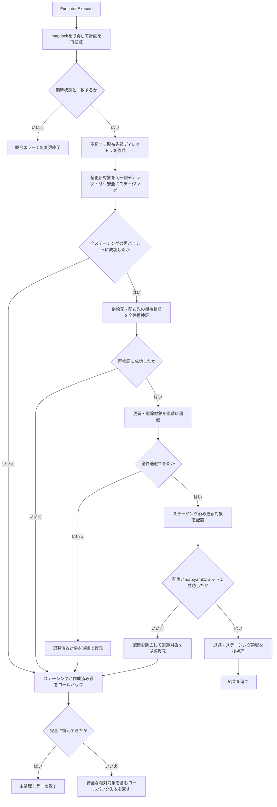
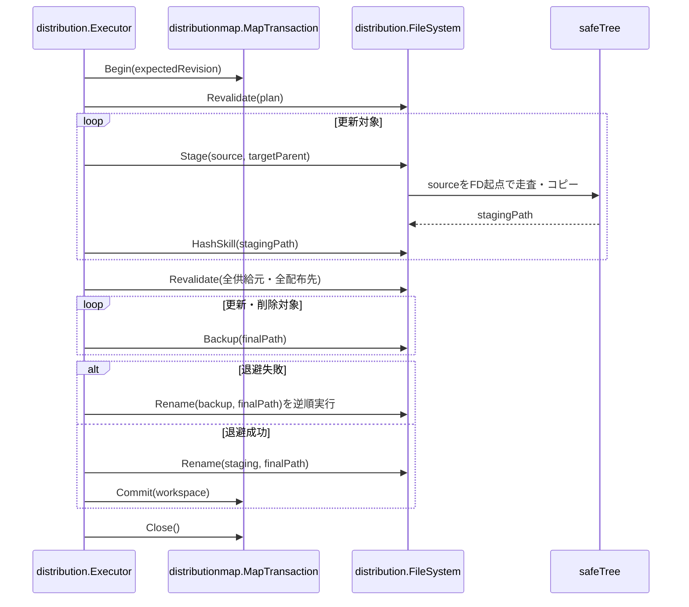

# 安全なファイル操作と配布トランザクションを強化する

- **ステータス**: レビュー中 (Under Review)
- **対象ストーリー**: ST-003, ST-005

## 1. 処理フローチャート (Flowchart)

安全な走査・ハッシュ・コピーは、取得済みディレクトリファイルディスクリプタを起点に各子要素を `openat` と `O_NOFOLLOW` で開く。パス文字列を再度たどって検証済み対象を開き直さない。配布先の親経路は実ディレクトリだけを許可するが、末端対象はシンボリックリンク以外であれば種別を記録し、承認済み計画では同一親への `rename` 退避対象にできる。

## 2. シーケンス図 (Sequence Diagram)

## 3. ファイル配置・責務定義

- `[NEW]` [internal/distribution/safe_tree_unix.go](../../../../internal/distribution/safe_tree_unix.go): macOS/Linux向けに、ディレクトリFDを起点としたリンク非追跡の走査、通常ファイル読み込み、内容コピーを提供する。`openat`、`fstat`、ディレクトリエントリ列挙を小さな低レベル操作境界へ分離し、各要素を開いた後に種別と同一性を確認する。
- `[NEW]` [internal/distribution/safe_tree_unix_test.go](../../../../internal/distribution/safe_tree_unix_test.go): 低レベル操作境界へ同期フックを注入し、列挙後かつ `openat` 前、`openat` 後かつ `fstat` 前、読み込み・コピー開始前の差し替えを決定的に発生させる。シンボリックリンク拒否とリンク先非変更を検証し、sleepや確率的な競合に依存しない。
- `[MODIFY]` [internal/distribution/filesystem.go](../../../../internal/distribution/filesystem.go): `FileSystem` の既存契約を拡張し、親経路の安全検証と末端対象の種別・同一性記録を分離する。末端の通常ファイル、FIFO、ソケット、デバイス等は退避可能な既存対象として扱い、シンボリックリンクだけは拒否する。`Stage` と安全検証を `safeTree` へ委譲し、ステージング先は最終パスと同じ親に作成する。
- `[NEW]` [internal/distribution/filesystem_test.go](../../../../internal/distribution/filesystem_test.go): 安全なステージング、権限保持、未対応の種別拒否、途中失敗時の一時領域削除を検証する。
- `[NEW]` [internal/distribution/filesystem_unix.go](../../../../internal/distribution/filesystem_unix.go): macOS/Linux向けに、検証済み親ディレクトリFDを起点とする `mkdirat`、`openat`、`renameat`、`unlinkat` を実装する。各変更操作の直前に親と末端のDevice/Inode・種別を照合し、文字列パスの再解決によるWorkspace外操作を防ぐ。
- `[MODIFY]` [internal/distribution/hash.go](../../../../internal/distribution/hash.go): 既存のハッシュ入力定義を変えず、安全なFD起点走査から相対パス、種別、権限、内容をSHA-256へ入力する。
- `[MODIFY]` [internal/distribution/hash_test.go](../../../../internal/distribution/hash_test.go): 既存ハッシュ互換性、決定的な名前順、リンク差し替え拒否、通常ファイル以外の拒否を検証する。
- `[MODIFY]` [internal/distribution/executor.go](../../../../internal/distribution/executor.go): 実行順を「全ステージング、全再検証、全退避、全配置、コミット」へ変更する。退避前の末端検査でディレクトリ固定を要求せず、計画時に記録した種別・同一性と一致するシンボリックリンク以外の対象を `rename` する。欠落対象は退避を省略する。退避途中の失敗時は退避済み対象を削除せず逆順復元し、ロールバック対象は操作の相対パスを保持する。
- `[MODIFY]` [internal/distribution/executor_test.go](../../../../internal/distribution/executor_test.go): 退避よりステージングが先行すること、全件再検証後のみ退避すること、通常ファイル・FIFO等の更新と削除、欠落対象の退避省略、シンボリックリンク拒否、2件目以降の退避失敗で元の種別へ逆順復元すること、安全な相対パスで未復元対象を報告すること、コミット後エラーではロールバックしないことを検証する。

## 4. 実装チェックリスト

- [x] 現行 `HashSkill` とステージングの正常系を固定する回帰テストを追加する
- [x] FD起点の安全なツリー走査・通常ファイル読み込みを実装する
- [x] 低レベル操作を注入し、差し替え時点を同期できる決定的なテスト境界を実装する
- [x] ハッシュ計算とステージングコピーを安全な走査へ移行する
- [x] 配布先末端の通常ファイル・FIFO等を種別付きで記録し、リンクだけを拒否する
- [x] Mkdir・ステージング・退避・配置・削除を検証済み親FD起点のat系システムコールへ移行する
- [x] 実行中に作成した各親ディレクトリのDevice/Inodeを記録し、再検証・ステージング・配置・ロールバックで照合する
- [x] 列挙済み要素の消失・ESTALE・種別変化を競合エラーへ分類する
- [x] Executorの処理順を全ステージング・全再検証・全退避・全配置へ変更する
- [x] 退避途中失敗を含む逆順ロールバックと安全な相対対象の保持を実装する
- [x] 供給元祖先と配布先親の差し替え、通常ファイル・FIFO・ソケットの復元、配置途中とロールバック失敗、全再検証順序を決定的に検証する
- [x] 既存 `context add` の配布・更新・削除・競合保護テストを回帰確認する
- [x] `gofmt`、対象パッケージ、Add回帰、全品質ゲートを実行する

## 5. テスト・検証計画

- **結合テスト方法**: `go test ./internal/distribution` を実行し、既存add計画をExecutorへ渡した配布、置換、削除、コミット前後の失敗を確認する。
- **単体テスト対象**: FD起点の走査とコピー、ハッシュ互換性、注入境界を使った決定的なシンボリックリンク差し替え、ステージング失敗の清掃、通常ファイル・FIFO等の退避と復元、退避途中失敗の逆順復元、ロールバック失敗時の相対対象。
- **境界条件**: 空ディレクトリ、深い階層、同名の一時領域、欠落対象、権限差、末端の通常ファイル・FIFO・ソケット・デバイス、親経路または末端のシンボリックリンク、供給元と配布先の同時変更。
- **回帰確認**: `go test ./pkg/cmd ./test/e2e -run Add` で既存 `context add` の利用者フローを維持する。

## 6. 依存関係

- 先行タスクなし。
- タスク02とタスク03は、本タスクで確立する安全な `FileSystem` とExecutorのトランザクション順序に依存する。

## 7. 実際の変更ファイル

- `internal/distribution/safe_tree_unix.go`: 供給元ルートから各要素までを `openat`、`O_NOFOLLOW`、`fstatat` で走査し、列挙済み要素のENOENT・ESTALE・種別変化を競合として扱うハッシュ入力生成とFD相対ステージングコピーを追加した。
- `internal/distribution/safe_tree_unix_test.go`: 列挙後・open後・読み込み前・供給元祖先open前の差し替えと列挙済み要素の消失を同期フックで発生させ、リンク追跡拒否と競合検出を検証した。
- `internal/distribution/filesystem.go`: `FileSystem` 契約へ検証済み親と末端期待状態を渡す変更操作を定義し、FIFO、ソケット、デバイス等の末端種別を記録できるようにした。
- `internal/distribution/filesystem_unix.go`: 検証済み親FDを起点とする `mkdirat`、`openat`、`renameat`、`unlinkat` とFD相対再帰削除を実装し、操作直前に親・末端のDevice/Inodeと種別を照合するようにした。
- `internal/distribution/filesystem_test.go`: ステージングの内容・権限維持、未対応の種別拒否、一時領域清掃、FIFO種別記録に加え、Mkdir・Stage・Backup・RemoveAll直前の親または末端差し替えでWorkspace外操作を防ぐことを検証した。
- `internal/distribution/hash.go`: 既存のバージョン1ハッシュ形式を維持したまま安全なFD起点走査へ移行した。
- `internal/distribution/hash_test.go`: ハッシュ互換性と既存の決定性・変更検出・リンク拒否を回帰確認した。
- `internal/distribution/model.go`: シンボリックリンク以外の末端種別を表す `PathKind` と、両親・両末端の期待状態を持つ `RenameOperation` を追加した。
- `internal/distribution/executor.go`: 作成した各親ディレクトリのDevice/Inodeを計画へ反映し、全再検証・ステージング・配置・ロールバックの各変更操作へ期待状態を引き渡すようにした。全対象の再検証完了後にのみ退避し、配置途中の失敗時における未復元の相対対象を保持する。
- `internal/distribution/executor_test.go`: 全再検証が全退避より先行する順序、作成済み親のステージング直前差し替え、配布先親の配置直前差し替え、通常ファイル・FIFO・Unixソケットの退避復元、配置途中失敗とロールバック失敗時の `Unrestored` を決定的に検証した。

## 8. 検証結果

- `gofmt`: 成功。
- `go test ./internal/distribution`: 成功（37件）。
- `go test ./pkg/cmd ./test/e2e -run Add`: 成功（45件）。
- `go test ./...`: 成功（10パッケージ、266件）。
- `go vet ./...`: 成功（指摘なし）。
- `golangci-lint run`: 成功（`0 issues`）。キャッシュは書き込み可能な `/tmp/context-cli-golangci-cache` を使用した。
- `govulncheck ./...`: 成功（呼び出し可能な脆弱性なし）。初回は脆弱性DB取得のネットワーク制限で失敗し、許可後に再実行した。
- Unixソケットの退避復元テストは短い `/tmp` 配下のパスで実行し成功した。デバイスノードは作成に特権が必要で通常の開発・CI環境では安全に再現できないため、種別判定とFD相対renameの共通経路による対応に留めた。
- 書込・同期失敗の決定的注入は、標準 `os.File` とat系システムコールを全面的に抽象化して本タスクの変更範囲を大きく広げるため追加していない。実ファイルへの書込・file sync・directory syncは実行し、失敗時に `ErrIO` を返してステージングを清掃する経路を実装した。
