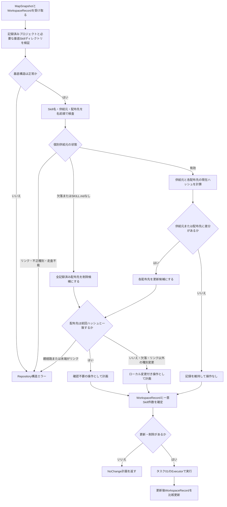
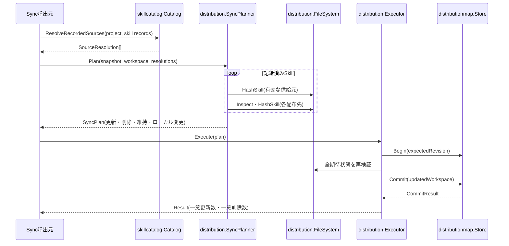

# 記録済みSkillの同期計画と更新・削除を実行する

- **ステータス**: レビュー中 (Under Review)
- **対象ストーリー**: ST-001, ST-002, ST-003, ST-004およびST-005

## 1. 処理フローチャート (Flowchart)

配布先経路または対象自身がシンボリックリンクの場合は、ローカル変更として承認可能にせず、安全性エラーで計画作成を停止する。

## 2. シーケンス図 (Sequence Diagram)

## 3. ファイル配置・責務定義

- `[MODIFY]` [internal/skillcatalog/catalog.go](../../../../internal/skillcatalog/catalog.go): 記録済みプロジェクトの実在と、必要な `projects/<project>/skills`・`utils/skills` 基底ディレクトリを厳格に検証するAPIを追加する。個別Skillを「有効」「欠落」「`SKILL.md` 欠落による無効化」に分類し、不正種別やリンクはエラーにする。候補列挙は行わない。
- `[MODIFY]` [internal/skillcatalog/catalog_test.go](../../../../internal/skillcatalog/catalog_test.go): 基底ディレクトリの欠落・リンク・非ディレクトリ、個別Skill欠落、manifest欠落、manifestリンク、配下の未対応種別を区別して検証する。
- `[MODIFY]` [internal/distribution/model.go](../../../../internal/distribution/model.go): 同期入力、解決済み供給元、同期計画、操作種別、ローカル変更一覧、一意Skill単位の更新・削除結果を表すモデルを追加する。既存 `Plan` とExecutorで共有できる操作情報は重複定義しない。
- `[NEW]` [internal/distribution/sync_planner.go](../../../../internal/distribution/sync_planner.go): 解決済み供給元とWorkspace記録から更新・削除・維持を決定する。供給元不変かつ配布先のみ変更された場合も更新とし、全操作と確認対象を決定的な相対パス順に並べる。
- `[NEW]` [internal/distribution/sync_planner_test.go](../../../../internal/distribution/sync_planner_test.go): 供給元更新、供給元不変・配布先編集、配布先欠落、配布先が通常ファイル・FIFO等へ変化、親経路または末端のシンボリックリンク、個別の供給元の消失・無効化、複数配布先、全Skill消失、差分なしをテーブル駆動で検証する。
- `[MODIFY]` [internal/distribution/error.go](../../../../internal/distribution/error.go): 既存エラー定義ファイルに、同期の事前条件、Repository構造、未管理Workspace、承認必須のローカル変更、競合を `errors.Is` / `errors.As` で判定できる種別を追加する。
- `[MODIFY]` [internal/distribution/executor.go](../../../../internal/distribution/executor.go): 同期計画の更新と削除を既存トランザクションで実行し、Workspaceの全Skill消失時も空の記録をCommitへ渡す。一意Skill名単位の更新数・削除数を結果へ返す。
- `[MODIFY]` [internal/distribution/executor_test.go](../../../../internal/distribution/executor_test.go): 同期更新、削除、複数配布先、一意件数、Workspace記録削除、コミット失敗とロールバック、コミット済み後処理失敗を検証する。
- `[MODIFY]` [internal/distributionmap/store_test.go](../../../../internal/distributionmap/store_test.go): 空のWorkspace記録をコミットした際に対象Workspaceだけを削除し、他Workspaceとスキーマを保持する既存契約を回帰検証する。実装変更は契約不足が判明した場合に限り [internal/distributionmap/store.go](../../../../internal/distributionmap/store.go) へ加える。

## 4. 実装チェックリスト

- [x] 記録済み供給元の状態分類をテストから実装する
- [x] 基底構造破損と個別Skill消失を異なるエラー・結果として扱う
- [x] 同期モデルと `SyncPlanner` のテーブル駆動テストを追加する
- [x] 更新・削除・維持、配布先ローカル変更、一意件数を計画へ反映する
- [x] 欠落とリンク以外の末端種別変化を承認可能、シンボリックリンクを拒否として分類する
- [x] 同期計画をExecutorへ接続し、空Workspace記録の比較更新を実行する
- [x] 計画後の供給元・配布先・Mapリビジョン変更を競合として拒否する
- [x] `gofmt` と関連内部パッケージの単体テストを実行する

## 5. テスト・検証計画

- **結合テスト方法**: `go test ./internal/skillcatalog ./internal/distribution ./internal/distributionmap` を実行し、供給元解決から同期計画、Executor、map比較更新までを確認する。
- **単体テスト対象**: 供給元の状態分類、ハッシュ比較、更新・削除・維持判定、ローカル変更判定、決定的な順序、一意件数。
- **異常系**: プロジェクトまたは基底Skillディレクトリ欠落、個別Skillリンク、manifest不正、配布先の親経路・末端リンク、Mapリビジョン変更、供給元・配布先の計画後変更、各I/O失敗。
- **種別マトリクス**: 配布先末端が実ディレクトリ、通常ファイル、FIFO、ソケット、デバイス、欠落、シンボリックリンクの場合について、更新・削除の計画分類を確認する。リンク以外はローカル変更、リンクは拒否とする。
- **ロールバック**: 更新のみ、削除のみ、混在、全Skill削除、通常ファイル・FIFO等からの置換についてコミット前失敗時の元種別への復元とコミット後失敗時の非復元を確認する。

## 6. 依存関係

- タスク01の安全なファイル操作とExecutor処理順を前提とする。
- タスク03は本タスクの供給元解決、`SyncPlanner`、同期結果モデルを利用する。
