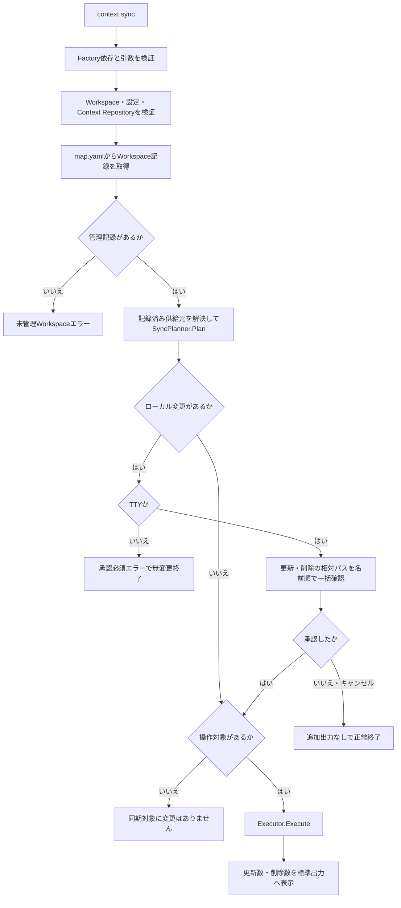
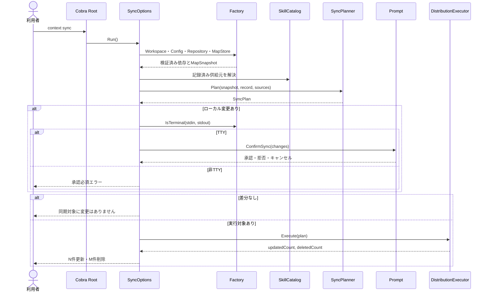

# context syncコマンドと利用者フローを提供する

- **ステータス**: レビュー中 (Under Review)
- **対象ストーリー**: ST-001, ST-002, ST-003, ST-004およびST-005

## 1. 処理フローチャート (Flowchart)

## 2. シーケンス図 (Sequence Diagram)

## 3. ファイル配置・責務定義

- `[NEW]` [pkg/cmd/sync.go](../../../../pkg/cmd/sync.go): 5要素テンプレートに従い `SyncOptions`、`NewCmdSync`、`Validate`、`Run` を実装する。引数なしをCobraで検証し、Workspace・Config・Repository・MapStoreの準備、未管理判定、供給元解決、Planner呼出し、TTY確認、Executor呼出し、結果出力だけを担当する。
- `[NEW]` [pkg/cmd/sync_test.go](../../../../pkg/cmd/sync_test.go): Cobraを経由せず `SyncOptions.Run` を呼び、競合なしのTTYや非TTY、差分なし、更新・削除件数、未管理Workspace、事前条件エラーをテーブル駆動で検証する。また、TTYの承認・拒否・キャンセル、非TTYの競合、出力失敗も検証する。
- `[MODIFY]` [pkg/cmd/factory.go](../../../../pkg/cmd/factory.go): 記録済み供給元解決、`SyncPlanner`、Executorを注入する境界を追加する。CLIテストがOSファイルシステムや利用者設定へ触れないよう、全依存をFactory経由にする。
- `[MODIFY]` [pkg/cmd/prompt.go](../../../../pkg/cmd/prompt.go): 更新・削除別の相対パス一覧を受ける `ConfirmSync` を追加する。表示順は呼出元の決定順を維持し、初期値を拒否にする。
- `[MODIFY]` [pkg/cmd/prompt_test.go](../../../../pkg/cmd/prompt_test.go): 更新・削除見出し、相対パス、拒否初期値、承認、キャンセル、Promptエラー変換を検証する。
- `[MODIFY]` [pkg/cmd/root.go](../../../../pkg/cmd/root.go): `context sync` をルートコマンドへ登録する。
- `[MODIFY]` [pkg/cmd/root_test.go](../../../../pkg/cmd/root_test.go): `sync` 登録と位置引数拒否を確認する。
- `[NEW]` [test/e2e/sync_test.go](../../../../test/e2e/sync_test.go): 実バイナリとケース別のContext Repository、Workspace、`XDG_CONFIG_HOME` を使用する。プロジェクト固有・共通Skill、Codex向け・Claude向け・両方、非TTY更新、差分なし、各供給元の消失による削除、未選択Skill不変、擬似TTYでのローカル編集承認・拒否・キャンセルを検証する。
- `[MODIFY]` [test/e2e/harness_test.go](../../../../test/e2e/harness_test.go): syncシナリオで再利用できるmap fixture作成と、非TTY・擬似TTYプロセス実行補助を必要最小限に抑えて追加する。
- `[MODIFY]` [test/e2e/README.md](../../../../test/e2e/README.md): syncのシナリオID、事前条件、操作、期待結果、対応テスト名、実行方法を追記する。

## 4. 実装チェックリスト

- [ ] `SyncOptions.Run` の失敗・差分なし・成功テストを先に追加する
- [ ] Factoryへ同期用依存を追加し、既存コマンドの生成を維持する
- [ ] `ConfirmSync` の表示と拒否初期値を実装する
- [ ] `context sync` をルートへ登録し、引数・追加フラグなしの契約を固定する
- [ ] 非TTYは競合なしなら実行し、ローカル変更時だけ承認必須エラーにする
- [ ] 拒否・キャンセル時はExecutorと出力を呼ばず正常終了する
- [ ] 差分なし・成功時の標準出力を仕様の完全一致で検証する
- [ ] 独立fixtureを使う実バイナリE2EとREADMEシナリオを追加する
- [ ] E2E成功指標マトリクスと未選択Skillの内容・mtime・管理記録不変を検証する
- [ ] 全品質ゲートを実行する

## 5. テスト・検証計画

- **CLI単体テスト**: `go test ./pkg/cmd -run Sync`。`SyncOptions.Run` を直接呼び、注入したstubで呼出し順、実行抑止、標準出力を確認する。
- **E2Eテスト**: `go test -v ./test/e2e -run Sync`。以下を独立したシナリオIDで別プロセス確認する。
  - プロジェクト固有SkillをCodexだけへ非TTY更新する。
  - 共通SkillをClaudeだけへ非TTY更新する。
  - プロジェクト固有・共通SkillをCodexとClaudeの両方へ更新し、一意Skill件数を確認する。
  - 差分なしで配布先と `map.yaml` が更新されない。
  - プロジェクト固有Skillと共通Skillをそれぞれ供給元から消失させて削除する。
  - すべての記録済みSkill消失でWorkspace記録を削除する。
  - Context Repositoryへ追加した未選択Skillが配布・管理されず、既存の未選択配布物がある場合も内容・mtime・管理記録が不変である。
  - 擬似TTYでローカル編集を承認、拒否、キャンセルする。
- **出力契約**: `同期対象に変更はありません` と `<更新件数>件のSkillを更新し、<削除件数>件を削除しました` の改行を含む完全一致を確認する。
- **無変更保証**: 未管理Workspace、Repository構造不正、非TTY競合、TTY拒否・キャンセル、ロック競合で配布先と `map.yaml` の内容・リビジョンが変化しないことを確認する。
- **品質ゲート**: `gofmt`、`go vet ./...`、`golangci-lint run`、`govulncheck ./...`、`go test ./...`。

## 6. 依存関係

- タスク01とタスク02の完了後に実施する。
- 本タスク完了により、仕様の利用者向けフローとE2E検証が完結する。
