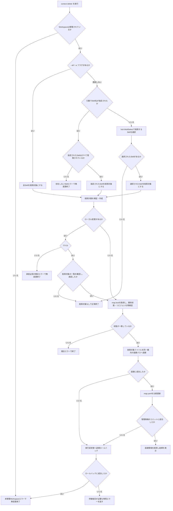
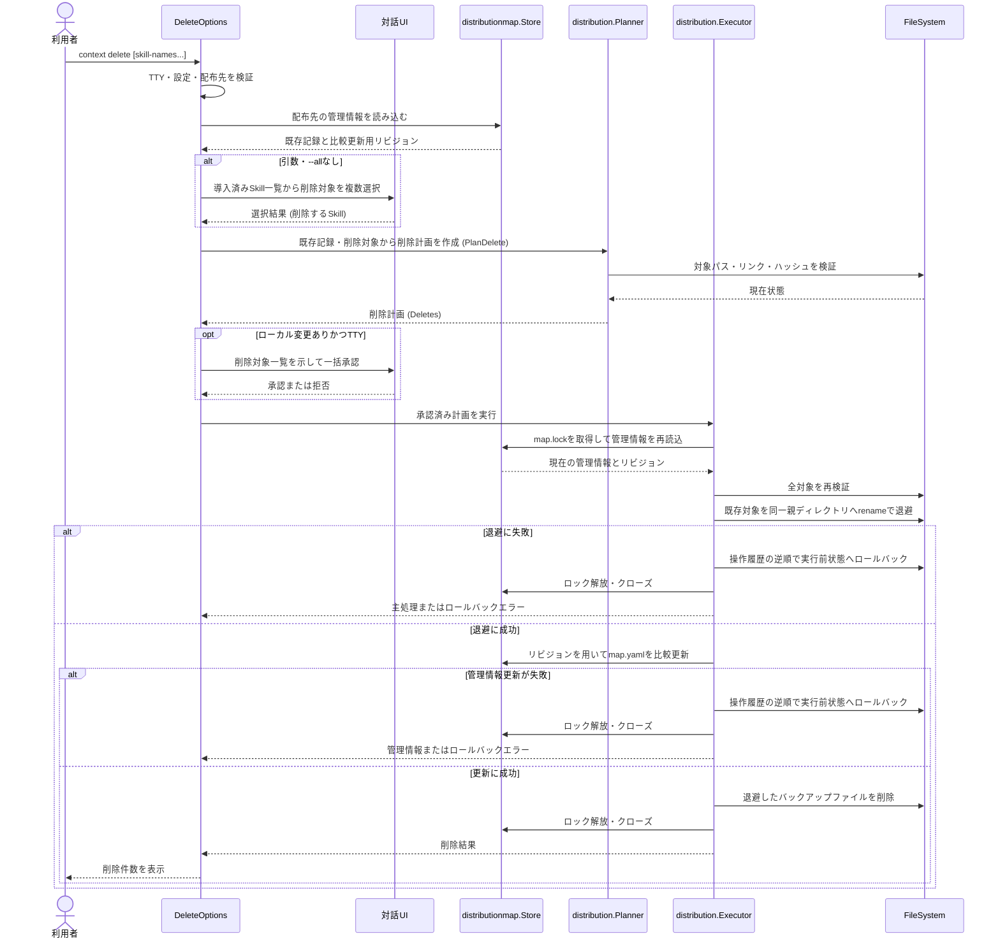

# Skillの削除

仕様書ID: spec-005-delete-skills。

## ゴール

`context delete` コマンドで、Workspaceに配布された特定のSkillを安全に削除し、すべてのSkillが削除された場合はWorkspaceの登録自体を完全に解除（クリーンアップ）できるようにする。

## 課題

複数の開発リポジトリでAIコーディングエージェントを利用する個人開発者は、不要になったSkillや不要になったWorkspace登録を削除するために手作業でファイルを消し、`map.yaml` を手動で編集する必要がある。この手作業はミスを誘発し、ローカルで変更を加えたファイルを誤って消してしまったり、`map.yaml` の整合性が壊れてしまう原因となる。

## 対象ユーザー

ローカルのContext Repositoryを設定済みで、カレントディレクトリのWorkspaceにすでにSkillが配布されており、その一部または全部を削除したい個人開発者。

## ユーザー価値

不要になったSkillを安全に、ローカルの変更を保護しながら一括または個別に削除できる。すべてのSkillを削除した場合は、Workspace管理自体も完全にクリーンアップして未管理状態に戻すことができる。

## 成功指標

- 指標: 指定されたSkillだけがWorkspaceから物理的に削除され、`map.yaml` に反映される。
  - 評価方法: 単体テストおよびE2Eテストで、一部のSkillが削除された場合と、すべてのSkillが削除されてWorkspace登録が解除された場合を検証する。
  - 観測時期: 実装完了時
- 指標: 削除対象のSkillにローカル編集がある場合、明示的な承認なしに削除されない。
  - 評価方法: 単体テストとE2Eテストで、TTYにおける確認プロンプトを経由した削除承認・拒否・キャンセルと、非TTYでのエラー終了を検証する。
  - 観測時期: 実装完了時

## スコープ

- `context delete [skill-name...]` コマンドの追加
- `--all` / `-a` フラグによる全Skillの削除
- 引数なし実行時の対話選択（現在配布中のSkillのみを `huh.MultiSelect` に表示）
- 指定されたすべてのSkill名がWorkspaceの管理情報に実在するかの厳格検証（存在しないSkillがあれば、一切のファイル操作をせずにExit 1エラー）
- 全Skill削除完了時のWorkspace記録の `map.yaml` からの完全削除
- ローカル編集（ハッシュ差異、欠落、ファイル種別変化）の検出と確認プロンプトによる一括承認
- 非TTY環境におけるローカル編集検知時のエラー終了
- 削除前の一時退避、`map.yaml` 更新失敗時のロールバック（実行前状態への復元）
- ロック取得、再検証、原子的な管理情報の更新

## スコープ外

- `AGENTS.md` や `CLAUDE.md` の削除（これらは `map.yaml` の管理対象外であり、Skillとして扱われていないため）
- 選択肢の追加、配布先の変更（これらは `context add` の担当）
- 複数Workspaceの同時削除
- `--force` などの確認バイパスフラグ
- 自動マージ

## ユーザーストーリー

- ST-001: 利用者として、不要になった特定のSkillの名前を指定して、Workspaceから一括して安全に削除したい。
- ST-002: 利用者として、対話式で現在配布されているSkillの中から不要なものを選択して削除したい。
- ST-003: 利用者として、Workspaceに配布されたすべてのSkillを一括で削除し、管理対象からも完全に解除したい。
- ST-004: 利用者として、削除対象のSkillにローカル変更がある場合、削除する前に確認し、安全に退避またはキャンセルしたい。
- ST-005: 利用者として、削除の途中に失敗した場合でも、ファイルを削除前の状態にロールバックしてほしい。
- ST-006: 利用者として、存在しないSkillを指定した場合は誤操作を防ぐためエラーとなり、一切のファイル変更をしないでほしい。

## 完成条件

- ST-001: `context delete <skill-name...>` は指定されたすべてのSkillが現在のWorkspaceに存在する場合、それらを削除対象とする。
- ST-001: 存在しないSkill名が引数に1つでも含まれる場合、`skill "xxx" is not distributed in this workspace` のような判定可能なエラーを返し、ファイルや管理情報を一切変更しない。
- ST-002: `context delete` のように引数や `--all` フラグを省略した場合、`map.yaml` に記録されている現在のWorkspaceのSkill名を名前順で重複排除して `huh.MultiSelect` に表示する。
- ST-002: 選択画面でキャンセル（`huh.ErrUserAborted`）された場合は、無変更で正常終了する。
- ST-002: 選択されたSkillを削除対象とし、選択されなかったSkillは維持する。
- ST-003: `context delete --all` / `-a` が指定された場合、現在のWorkspaceに配布されているすべてのSkillを削除対象とする。
- ST-003: 全Skillが削除対象となり、かつ実行に成功した場合、Workspace内の全Skillファイルが削除され、`map.yaml` から該当Workspaceの記録自体が完全に削除される。
- ST-004: 削除対象のSkillが前回配布時とハッシュが異なる場合や、種別が変化している場合、あるいは欠落している場合は、ローカル変更として検出する。そして、TTYで `huh.Confirm` による一括確認を求める。
- ST-004: 削除される各Skillの実ファイルパスに対して `Inspect` を行い、ローカルで変更されたファイルを削除する前に、同一親ディレクトリの退避パスへ `rename` し、処理成功後に削除する。
- ST-004: 競合確認を拒否またはキャンセルした場合は一切変更せず正常終了する。
- ST-004: 非TTY環境でローカル変更を検出した場合は、承認が必要であることを示す判定可能な競合エラーを返し、一切変更しない。
- ST-005: 削除処理の途中で失敗した場合、退避されたファイルを元の最終パスへ `rename` して復元し、実行前の状態へロールバックを試行する。
- ST-005: `map.yaml` の原子的置換の成功をコミット点とし、コミット後はロールバックしない。
- 全般: `map.yaml` にカレントディレクトリのWorkspace記録が存在しない場合は、判定可能な未管理Workspaceエラー（`ErrUnmanagedWorkspace`）を返し、変更しない。
- 全般: 削除計画の作成時および実行時には、`map.lock` のグローバル排他ロックを取得し、期待状態とリビジョンを再検証する。

## インターフェース・入出力仕様

### CLIコマンド / 引数 / フラグ

- `context delete [skill-name...] [flags]`
- 引数の詳細:
  - `[skill-name...]`: 削除対象のSkill名 (文字列スライス, 任意)
- フラグの詳細:
  - `--all` (`-a`): 現在のWorkspaceに配布されているすべてのSkillを削除対象とする (bool, デフォルト値: `false`, 任意)

### 入力 (標準入力 / ファイル / 対話UI)

- **標準入力 (stdin)**: 通常は使用しない。TTYでローカル変更が検出された場合のみ、確認入力に使用する。
- **設定ファイル**: `map.yaml` から現在のWorkspaceのSkill配布記録を読み込む。
- **対話UI (TTY)**:
  - 引数および `--all` が指定されない場合、`huh.MultiSelect` で現在導入されているSkill名一覧を提示し、削除対象を選択させる。初期状態では何も選択されていない（＝選択したものが削除対象となる）。
  - ローカル変更が検知された場合、`huh.Confirm` で一括上書き/削除確認を求める。

### 出力 (標準出力 / 標準エラー出力 / 終了コード / ファイル変更)

- **標準出力 (stdout)**:
  - 削除成功時: `<削除件数>件のSkillを削除しました` と表示する。
  - 削除対象なし時: `削除対象のSkillはありません` と表示する。
  - 競合確認の拒否またはキャンセル時: 追加メッセージを表示せず正常終了する。
- **標準エラー出力 (stderr)**: CLI境界で既存のエラー出力規約に従い、エラー内容を一度だけユーザー向けメッセージへ変換して出力する。
- **終了コード (Exit Code)**:
  - `0`: 削除成功、対象なし、または競合確認の拒否・キャンセル
  - `1`: バリデーションエラー（未管理Workspace、存在しないSkill名指定、非TTYでのローカル変更検出など）
  - `2`: システム/環境エラー（ロック取得失敗、I/Oエラーなど）
- **ファイル変更 / ディレクトリ操作**:
  - `.codex/skills/<skill-name>/` および `.claude/skills/<skill-name>/` の削除。
  - `$XDG_CONFIG_HOME/context/map.yaml` の更新、またはWorkspace全体の削除。

## 制約事項

- Goソースコード内のコメントは日本語で記述すること。
- [AGENTS.md](../../../AGENTS.md) に適合するパッケージ依存関係およびエラーハンドリングを行うこと。

## 非機能要件

- テストは `t.TempDir()`、テスト専用の設定ディレクトリ、注入した入出力と対話境界を使用し、利用者の実設定と開発リポジトリを変更しないこと。
- ロック取得時間は極力短くし、待機なしで取得すること。

## リスク

- 削除対象外のSkillを誤って削除したり、ローカル編集データを誤って消去したりしないよう、削除前の退避とトランザクション中の再検証を徹底する。

## 前提条件

- `spec-003-add-skills` および `spec-004-sync-skills` が実装完了し、`main` に統合されていること。

## 未解決事項

- なし。

## 技術設計ドラフト（全体概要）

### 処理フローチャート（概要）

### シーケンス図（概要）

### ファイル配置方針

- `[NEW]` [`pkg/cmd/delete.go`](../../../pkg/cmd/delete.go) : `DeleteOptions`、Cobraコマンド定義、引数およびフラグの検証、対話選択、計画構築、Executor実行、結果表示。
- `[MODIFY]` [`pkg/cmd/root.go`](../../../pkg/cmd/root.go) : `context delete` コマンドを登録。
- `[NEW]` [`pkg/cmd/delete_test.go`](../../../pkg/cmd/delete_test.go) : Cobraを経由せず `DeleteOptions.Run` を直接実行する単体テスト。正常系、引数あり、対話選択、ローカル変更検知、エラー系などを網羅。
- `[NEW]` [`internal/distribution/delete_planner.go`](../../../internal/distribution/delete_planner.go) : `Planner.PlanDelete` メソッドの実装。他のSkillの状態に干渉せず、指定されたSkillだけを安全に `Deletes` 計画へ抽出する。
- `[NEW]` [`internal/distribution/delete_planner_test.go`](../../../internal/distribution/delete_planner_test.go) : `PlanDelete` の単体テスト。
- `[NEW]` [`test/e2e/delete_test.go`](../../../test/e2e/delete_test.go) : 実バイナリを起動して `context delete` の引数実行、対話選択、`--all` 実行、ローカル変更警告などの動作を検証するE2Eテスト。
